# ALLPLAN 2020 Manual

This documentation has been produced with the utmost care.

ALLPLAN GmbH and the program authors have no liability to the purchaser or any other entity, with respect to any liability, loss, or damage caused, directly or indirectly by this software and its documentation, including but not limited to, any interruptions of service, loss of business, anticipatory profits, or consequential damages resulting from the use or operation of this software and its documentation. In the event of discrepancies between the descriptions and the program, the menu and program lines displayed by the program take precedence.

Information in this documentation is subject to change without notice. Companies, names and data used in examples are fictitious unless otherwise noted. No part of this documentation may be reproduced or transmitted in any form or by means, electronic or mechanical, for any purpose, without the express written permission of ALLPLAN GmbH.

Allfa $\textcircled{ R}$ is a registered trademark of ALLPLAN GmbH, Munich.   
Allplan $\textcircled{ R}$ is a registered trademark of the Nemetschek Group, Munich. Adobe $\textcircled{ R}$ and Acrobat PDF Library™ are trademarks or registered   
trademarks of Adobe Systems Incorporated.   
AutoCAD $\textcircled{ R}$ , DXF™ and 3D Studio MAX $\textcircled{ R}$ are trademarks or registered trademarks of Autodesk Inc., San Rafael, CA.   
BAMTEC $\textcircled{ R}$ is a registered trademark of Häussler, Kempten, Germany. Microsoft $\textcircled{ R}$ and Windows $\textcircled{ R}$ are either trademarks or registered trademarks of Microsoft Corporation.   
MicroStation $\textcircled{ R}$ is a registered trademark of Bentley Systems, Inc.   
Parts of this product were developed using LEADTOOLS, (c) LEAD   
Technologies, Inc. All rights reserved.   
Parts of this product were developed using the Xerces library of 'The Apache Software Foundation'.   
fyiReporting Software LLC developed parts of this product using the   
fyiReporting library, which is released for use with the Apache Software license, version 2.   
Allplan update packages are created using 7-Zip, (c) Igor Pavlov.   
CineRender, render engine and parts of this documentation; copyright 2014 MAXON Computer GmbH. All rights reserved.   
All other (registered) trademarks are the property of their respective owners.

# Contents

# Welcome ......

Introduction...   
Sources of information............................................. ........................ 3   
Documentation .......... ..3   
Additional help .. .... 4   
Training, coaching and project support.. ..... 5   
Feedback on the documentation ...................................................................... 6

# Installation ....... 7

Read the following before installing . Installation documentation ............. System requirements for Allplan 2020 ................................................................. 8   
Installing ......................... First-time installation on a stand-alone workstation ..................................11 First-time installation on a network... ..14

# Allplan's user interface ................. ... 15

Welcome screen... .. 16   
Default configurations ............................................... ......... ............. 19   
Working area ........ ........ 19   
Quick Access Toolbar .............................. ......21   
Menus............................................................................................................... .............. .23   
Actionbar............................................ ..... 24   
Structure ................................ ..................................................................................25   
Actionbar - role, tasks, task areas .... ........................ ......26   
Actionbar - task area, group of tools, tool....... ............................... .......28   
Actionbar - finding tools....   
Actionbar Configurator .................................................................................................30   
Palettes .......   
Arranging palettes ........................................... ................ ......................... .........34   
The palettes in detail.. ....36   
Viewports ..... ..... 67   
Viewport toolbar.... ......69   
Tools for arranging viewports .................................................................................. 72   
Setting up viewports...................................................................................................... 73   
Floating viewports freely ........ ........74   
Placing viewports in front of or behind the Allplan window ....................74   
Docking viewports to the Allplan window ... ....... 75   
Shortcut menu ............   
Shortcut menu in design mode ........... ..................................................... ........78   
Shortcut menu in navigation mode....................................................................... 80   
Shortcut menu for entering points ...... .........83   
Shortcut menu for creating and modifying elements ................................ 87   
Dialog line......................................... ..................................................88   
Status bar ....... ...89   
Input options ............ ...90

# Basic approach ..... ... 91

Using the mouse.. 91   
Using the mouse (no tool is activated) . ......92   
Using the mouse (a drafting tool is activated) ... .....93   
Using the mouse (an edit tool is activated) .......................................................94   
Using a mouse with a wheel... ........................................ ...95   
Activating and closing tools .. .. 96   
Correcting errors ........ ......97   
Saving your work . .... 98   
Using .bak files ... .. ......99   
Using the clipboard... ...... 101

# Controlling what’s on your screen ......... ..... 105

Design mode and navigation mode . .. 106   
View, perspective and scale.. ...107   
Controlling the view by using the mouse.........   
Controlling the view by using the keyboard..................   
View types for displaying models... ...................................................... 109   
Selecting and displaying elements.. . 109   
Rules defining how elements look on the screen............... .. 109   
Display sequence of elements.. ........111   
'Sequence' property .......... .............112   
Values defining the display sequence ........... ................113   
Modifying the “sequence” property.............. .......114

# Using format properties ........ .... 115

Basics ..... ...115   
Defining an element’s pen thickness, line type and line color ................115   
Modifying format properties .. ........116   
Using pen thickness .. ........................ ......116   
Using line types.. ... 117   
Using colors..... ...... 117   
Pen thickness and line color of text ......................................................................118   
Pen thickness and line type of dimension lines and dimension text..119   
Layers and format properties......... ...120

# Selecting elements .......... .... 123

Selecting elements, overview . . 123   
Overview of tools for selecting elements . ..125   
Selecting elements by clicking .. .....125   
Selecting elements by entering a region................................................ ...126   
Selecting elements by using the brackets .................... .............. 127   
Selection preview and element info ........... . 128   
Working with filters ........ ...... 129   
Overview of filter options .................... .....130

# Precision drawing ............ ..... 133

Basics...... ..... 133   
Overview.... ......133   
Entering length values and coordinates . ......133   
Using drawing aids and a cursor snap angle ...................................................135   
Snapping to points ... ....136   
Using CursorTips.... ..... 137   
Snapping to points with the left mouse button...... .....138   
Linear snap .................... ................................................139   
Precision drawing with the grid... .....140   
Point snap methods... .....142   
Precision drawing....... .....145

# Using track lines ........... .... 153

Track lines.. ..153   
Possible track lines....... .... ......... ...... 154   
Extension .......   
Orthogonal track lines ... ....154   
Polar track lines ...............................................................................................................155   
Perpendicular .............................. ...........................................................155   
Parallel line ... ......156   
Assumed point of intersection ............ ..........156   
Entering lengths by using track lines........ ............................................157   
Turning on and customizing track tracing .............................................. 158

# Modifying objects directly ............ ..... 159

Basics .... .... 160   
Selecting direct object modification.......... .........160   
Selecting elements.. ......160   
Controls for direct object modification............... .......161   
Modifying objects generally.. ...........168   
Modifying objects individually.. ...........168

# Using wizards ........... ..... 169

Organizing wizards................ ..170   
Using elements from wizards...... .171

# Entering polylines and areas ............. .... 173

Polyline entry tools ................................................................................................173   
Basic polyline entry rules ...................................................................................174   
Input options for entering polylines, overview.............................. ......174

# Applying surface elements ............ ..... 179

Hatching, pattern, fill, bitmap area and style area ... ..179   
Hatching and scale... ....................................... 181   
“Constant in layout” hatching setting......   
“Adjust to scale in layout” hatching setting... ................... ......183   
Applying hatching to architectural components ........................................ 184   
Pattern and scale.. ..185   
“Constant in layout” pattern setting .....185   
“Adjust to scale in layout” pattern setting .. ......... 187   
Applying patterns to architectural components ........ .....188

# Working efficiently thanks to libraries and defaults ........... ..... 189

Saving default settings in dialog boxes .................................................... 189   
Saving and loading parameters as favorites ........................................ 190   
Using symbols ........ ........... 191   
Inserting profiles from Bimplus in the Allplan library...... ..... 192   
Using smart symbols ....... .......... 193   
What are smart symbols?... ........193   
Smart symbol properties......... .........194   
Components of a smart symbol.. .......195   
General approach for defining smart symbols..... .......196   
Using SmartParts................................................................................................... 197   
What are SmartParts?.. ..... 197   
Using SmartParts........ ....... ........198   
Selecting and placing SmartParts .. .....199   
Creating your own SmartParts ... ......200   
SmartPart technology for modeling objects.... ....201   
Using PythonParts .................. .............................................. 202   
What are PythonParts?... ........................................................................... .......202   
Placing a PythonPart...................................................................................................202   
Allplan Visual Scripting ....................................................................................... 203   
Paths ..... ....204   
Using and importing content.............................. ..... 205

# Using OLE objects ......... .... 207

Using OLE objects....... .........207   
Linking and embedding OLE objects ...................... ....... 208   
Transparency of OLE objects... ..... 209   
Editing OLE objects... ... 209   
Restrictions when using OLE objects in Allplan................................... 210

# Using XRefs ....... ... 211

Using XRefs.. ...211   
Editing XRefs ................. ..212   
Comparison between normal and advanced XRefs... ..... 213   
Restrictions when using normal XRefs in Allplan ............ .. 214

# Structuring and managing data ........... ... 215

Structuring and managing data .. . 215   
Overview of projects, building structure, drawing files and   
layouts ...... ..217   
Working with projects. .. 218 Using project templates .. .......................... ..218   
Working with drawing files .. ............ . 219 Open on a project-specific basis: drawing files from fileset/building structure... ......219 Understanding drawing files . .......................................................................... ....220 Drawing file status ........... Information on the active drawing file ..............................................................223   
Using the building structure .. .......................... .. 224 What is the building structure? . Advantages of the building structure........................ ................................225 Example of a building structure.............................................................................226

Creating a building structure .................................................................................. 227   
Using structural levels to apply a logical structure to a building........ 227   
Restrictions of building structure ... ....228   
Building structure and fileset structure .................. .................................228   
Selecting structural levels......... ...............................................229   
Displaying the height settings of default planes...... .......230   
Attributes for the building structure...... ........231   
Keyboard shortcuts in the building structure...............................................232   
Overview of administration files for the building structure .................234   
What is the plane model?.. ...235   
Working with layers ......... ..... 238   
Understanding layers................. .......238   
Advantages of data organization with layers......... .......238   
Disadvantages of data organization with layers......... .........239   
Relationship between layers and drawing files ...........................................240   
Defining the current layer........... ................240   
Using privilege sets ......................................................................................................242   
Using print sets ......... .......242   
Layer dialog box...... .......243   
Setting layer visibility in drawing files ..... ......244   
Managing layers and layer structures ... ......245   
Layer access rights....... ......246   
Defining format properties based on layers..... ...... 247   
Managing data with ProjectPilot .................... .............................. .......248   
What is ProjectPilot?....... .........248   
User interface .... .....248   
Common approaches in ProjectPilot .................................................................250

# Exchanging data with other programs ......................... 255

DWG, DXF, DGN interfaces . ...................... .. 255   
Available file types for export and import... ................................... ....255   
Conversion (overview).. ........................................... .......255   
Importing files with large coordinates............................................................... 257   
Adjusting units and lengths ....... ....................................................................258   
General information on assignments.................................................................260   
Using configuration files ................   
Using exchange favorites . .......261   
Using prototype files .......... .................262   
Exporting bitmap areas, bitmaps and scanned images ..........................262   
General information on exporting layouts.............................................. ......263   
IFC interface ............................................................................................................. 265   
IFC import (new interface) . ......266   
IFC export (new interface)... ..................................................................... ..... 267   
IFC BaseQuantities ....................................................................................................... 267   
IFC object type ... ................................................. .......268   
Importing and exporting PDF data ...................... ........................ 269   
Exchange formats for Allplan.............. ....270

# Layouts and printing ........... ...275

Output options.... ...275   
Print Preview palette .................................................................................................. 277   
Loading settings for print preview..................................................................... 280   
Saving settings for print preview .........................................................................281   
Assembling and outputting layouts ..... ...... 282   
Printer-independent page format .. ...283   
Using Windows drivers or Allplan vector drivers... ... 285   
Allplan raster drivers ........................................................................................... 286   
Using raster drivers ....... ... 287   
Defining raster driver properties . ... 287   
Components of a layout ........ .....288   
Placing portions of a document in a layout... ... 289   
Sequence in which elements print.. ... 290   
Printing color layouts....... ..... 293   
Creating print files............................ ................................ 295   
PDF files instead of print files ..... ....295   
Using print profiles... ... 297   
Printing in batch mode ......... ....... 298   
Printing several layouts with Windows drivers (batch mode)...........298

Index ...... ... 301

# Welcome

Welcome to Allplan 2020, the high-performance CAD program for architects and civil engineers.

In this manual, you will familiarize yourself with the user interface and the basic tools of Allplan 2020.

You will quickly learn how to use Allplan 2020, and you will find that within a short time you will be in a position to carry out common operations with ease to accomplish your daily tasks.

This chapter covers the following:

 Contents of this manual   
 Documentation for Allplan 2020   
 Additional help on Allplan 2020   
 Where to turn for training, coaching and project support

# Introduction

This manual consists of two parts:

• The installation of Allplan 2020 • An introduction to the basic concepts of Allplan 2020.

This manual assumes that you have a working knowledge of Microsoft Windows programs Basic CAD knowledge is helpful; however, this manual will provide both the experienced CAD user and the newcomer to CAD with a solid foundation in the methods used by Allplan 2020.

# Sources of information

Documentation

Documentation for Allplan consists of the following parts:

The Help is the main source of information for learning about and using Allplan. While Allplan is running, you can get Help on the current tool by selecting F1, or activate $\textcircled{3}$ What’s This in the $\textcircled{7}$ Help dropdown list (right side of the title bar) and click the icon on which you need Help. The Manual consists of two parts. The first part shows how to install Allplan. The second part is designed to provide an overview of basic concepts and terms in Allplan and introduce approaches for entering data in Allplan.   
• The Basics Tutorial guides you step by step through the most important tools for designing and modifying elements in Allplan.   
• The Architecture Tutorial guides you step by step through the process of designing a building. In addition, you will learn how to analyze the building data in reports and to print the results.   
• The Engineering Tutorial guides you step by step through the process of creating key plans, general arrangement drawings and reinforcement drawings and shows you how to print the results. New Features in Allplan 2020 provide information on what's new in the latest version. Each volume in the Step-by-Step series deals with a specific concept or series of tools or modules in Allplan in detail. The areas covered include data exchange, system administration, geodesy, presentation, 3D modeling and so on. As a Serviceplus member, you can download these guides as PDF files from the Training - Documentation area of Allplan Connect (http://connect.allplan.com).   
• You can also find numerous publications on social networks.

# Additional help

# Tips for efficient usage

The $\textcircled{7}$ Help drop-down list (right side of the title bar) provides Tips for Efficient Usage. This topic provides practical tips and tricks showing you how to use Allplan efficiently and how to carry out everything with ease.

User forum (for Serviceplus customers)

Allplan forum in Allplan Connect: Users exchange information, valuable tips relating to everyday work and advice on specific tasks. Register now at   
connect.allplan.com

On the internet: solutions to frequently asked questions

You can find solutions to numerous questions answered by Technical Support in the comprehensive knowledge database at connect.allplan.com/faq

Feedback on the Help

If you have suggestions or questions on the Help, or if you come   
across an error, send an email to:   
dokumentation@allplan.com

# Training, coaching and project support

The type of training you are given is a decisive factor in the amount of time you actually spend working on your own projects: A professional introduction to the programs and advanced seminars for advanced users can save you up to $3 5 \%$ of your editing time!

A tailor-made training strategy is essential. Our authorized seminar centers offer an extensive range of programs and are happy to work out a custom solution with you that will address your own needs and requirements:

Our sophisticated, comprehensive seminar program is the quickest way for professional users to learn how to use the new system.

• Special seminars are designed for users who want to extend and optimize their knowledge.

One-on-one seminars are best when it comes to addressing your own particular methods of working.

One-day crash courses, designed for office heads, convey the essentials in a compact format.

We are also happy to hold seminars on your premises: These include not only Allplan issues but also analyses, process optimization and project organization.

For more detailed information on the current training program, please consult our online seminar guide, which you can find on our home page (http://www.allplan.com/training).

# Feedback on the documentation

We are always trying to improve the overall quality of our program documentation. Your comments and suggestions are important to us, and we welcome feedback.

Please do not hesitate to contact us to express criticism or praise concerning the documentation. Feel free to contact us as follows:

Documentation

ALLPLAN GmbH Werinherstr. 79, Eingang 32 d 81541 Munich, Germany

Email: dokumentation@allplan.com

# Installation

# Read the following before installing

Installation documentation

You can find documentation on installing Allplan 2020 in a number of places:

The manual describes the procedure for a first-time installation at a stand-alone workstation and covers the essentials for firsttime installation on a network. While installing, you can open the help by pressing F1. The installation help provides additional, up-to-date and detailed information on installing Allplan for the first time and upgrading Allplan on stand-alone workstations and on networks. This help is also available online (http://help.allplan.com/Allplan/2020- 0/1033/Allplan/152880.htm). The Allplan 2020 DVD includes the install.chm help file, which you can find in the programs\x64\Allplan\HelpFiles\English\ folder.

# System requirements for Allplan 2020

Tip: You can download a system test from connect.allplan.com/suppor t/sysinfo/2020.html. By running this system test, you can check whether your computer meets the system requirements for Allplan 2020.

Before you begin, make sure all the computers where you want to install Allplan 2020 meet the minimum requirements.

Hardware requirements

# Minimum requirements

• Intel processor or compatible   
• 4 GB of RAM   
• 10 GB of available hard-drive space   
• OpenGL 4.2-compatible graphics card with 2 GB of RAM and a resolution of $1 2 8 0 \times 1 0 2 4$

# Recommended

• Intel Core i9, i7 or i5 processor or compatible

• 16 GB of RAM

Display resolution of up to $2 5 6 0 \times 1 6 0 0$ (for 4K resolutions and higher resolutions, you can use the scaling options provided by the operating system (Windows 8.1 or later); if you work with several monitors, make sure they all have the same resolution.)

OpenGL 4.2-compatible graphics card with 8 GB of RAM; use a   
certified graphics card:   
www.allplan.com/info/graphiccards

# Supported operating systems

# Supported operating systems:

• Windows 10 64-bit, version 1809\* • Windows 8.1 64-bit • Windows 7 64-bit, Service Pack 1 (not recommended) • Windows Server 2019, Standard Edition (for Citrix) • Windows Server 2016, Standard Edition (for Citrix)

# Supported data servers:

• Windows Server 2019   
• Windows Server 2016   
• Windows Storage Server 2016 for NAS

# Notes

• Recommended operating system: Windows 10 64-bit, version $1 8 0 9 ^ { \star }$ • Recommended data server: Windows Server 2019

• \* LTSB/LTSC version excluded

Further information

connect.allplan.com/support/sysinfo/2020.html

• provides further information, such as the system test tool.

# Some notes on the data structure

# Allplan data can be classified as follows:

Program folder: Program files are always installed locally on every workstation. Normally, you can accept the folder proposed by the program.

Central file storage folder: Projects and the office standard are saved to this folder. If the workgroup option is installed, the folder also contains the data for network administration in the \Net folder. The central file storage folder can be installed locally or on a file server. When you install the program with the workgroup option, the folder you specify here acts as the central file storage folder of the workgroup. Please read the notes on the central file storage folder with network installations.

Local file storage folder: This folder is used to synchronize the data of the central file storage folder and the data of online projects. If you do not specify a local file storage folder, the program synchronizes the data of online projects with the LocalData subfolder of the central file storage folder. You must specify a local file storage folder on the local computer if you want to access Allplan online projects from a mobile computer (for example, when you work from home or as a freelancer). You do not need to do this if you use a stationary computer that can always access the central file storage folder.

Prior to installing, decide on the folders where you want to install the program. If you need to change this later, you usually have to uninstall the program and then re-install it again. It is a good idea to keep the data files and program files in two separate, central locations. This will facilitate backup operations later.

By default, Allplan 2020 is installed to the following folders:

• Program files: C:\Program Files\Allplan\ • Central file storage: C:\Data\Allplan\ • Local file storage: C:\Local Data\Allplan\

# Installing

# First-time installation on a stand-alone workstation

This section shows how to install Allplan 2020 on a stand-alone workstation. Any existing Allplan installations will not be affected.

# To install Allplan 2020 on a stand-alone workstation

 Read the following before installing:

• System requirements for Allplan 2020 (on page 7) • Some notes on the data structure (on page 9)

1 Sign in to the operating system as the administrator for the local machine or as a user with administrator privileges.

2 Start installing Allplan in one of the following ways:

If you are installing Allplan from DVD: Insert the Allplan 2020 DVD in the DVD drive. Click Allplan 2020 and then Start Installation.

If you downloaded Allplan: Unzip the zip file. This results in an exe file (for example, allplan2019-0-cad.exe). Doubleclick this exe file and specify the path to which you want to copy the temporary setup files.

3 Select the language for setup and click Next.

4 Click Next to confirm the welcome screen.

5 The License Agreement dialog box opens, displaying the terms of the software license agreement. If you agree to the terms of the agreement, click Yes.

6 In the Installation Options dialog box, select First-time installation or First-time installation and copy data. Click Next.

7 If you selected the First-time installation and copy data option: Select the data you want to transfer to the new version and click Next.

8 Select the type of licensing in the Installation Option dialog box:

Use active license: Select this option if you want to install Allplan with the current license. You can only see this option if you have activated a license on this computer before or Setup has automatically found a license provided by a license server. Setup automatically detects all license servers on the network. This function is particularly useful if you have a license server or if you update Allplan.

License activation: Select this option if you want to install Allplan by entering a Product Key. You should use this option if you install Allplan for the first time or on a stand-alone workstation. You can enter your Product Key in the next dialog box. Important: You must have Internet access and the computer must be online.

License selection: Select this option if several licenses are available and you want to select the license manually. You can only see this option if you have activated a license on this computer before or Setup has automatically found a license provided by a license server. Setup automatically detects all license servers on the network.

Use viewer: Select this option if you want to install Allplan as a viewer. You also need to select this option if you want to install Allplan on a computer without Internet access.

9 Click Next.

10 Select the paths where you want to install the programs and files of Allplan 2020.

Program folder: Program files are always installed locally on every workstation. Normally, you can accept the folder proposed by the program.

Central file storage folder: Projects and the office standard are saved to this folder. If the workgroup option is installed, the folder also contains the data for network administration in the \Net folder. The central file storage folder can be installed locally or on a file server. When you install the program with the workgroup option, the folder you specify here acts as the central file storage folder of the workgroup. Please read the notes on the central file storage folder with network installations.

Local file storage folder: This folder is used to synchronize the data of the central file storage folder and the data of online projects. If you do not specify a local file storage folder, the program synchronizes the data of online projects with the LocalData subfolder of the central file storage folder. You must specify a local file storage folder on the local computer if you want to access Allplan online projects from a mobile computer (for example, when you work from home or as a freelancer). You do not need to do this if you use a stationary computer that can always access the central file storage folder.

11 Select a setup type in the Setup type dialog box. Click Next.

Default: Installs the program with the most commonly used options. Recommended for most users.

Minimum: Installs the program with minimum options.

Custom: Installs the files you specify. You can deactivate the components you do not want to install in the Select Features dialog box.

12 Check the settings in the Ready to install Allplan dialog box. If the settings are correct, click Next to start the installation.

13 After installation, the system may prompt you to restart the computer. Log on as the administrator for the local machine or as a user with administrator privileges.

# First-time installation on a network

# To install for the first time on a network

1 Read the following before installing:

• System requirements for Allplan 2020 (on page 7) • Some notes on the data structure (on page 9) • Data backup, overview

2 Install Allplan 2020 on all the workstations as described in Installing for the first time on a standalone workstation (see "First-time installation on a stand-alone workstation" on page 11).

3 Check every workstation to see whether Allplan 2020 starts correctly.

# Allplan's user interface

When you start Allplan, you see the Allplan window with the Allplan user interface.

Allplan comes with the following configuration of the user interface:

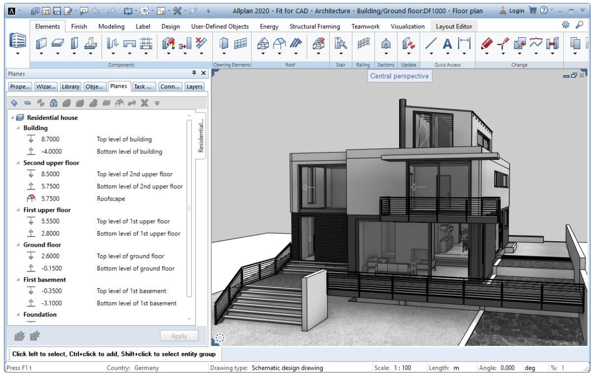

Basically, Allplan’s user interface consists of the elements explained on the following pages.

# Welcome screen

The Welcome screen combines tools you need frequently when you start Allplan.

Creating, opening projects

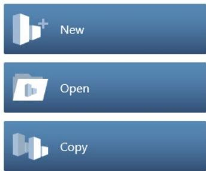

# New

Use this to create a new project.   
You can find more information in the Allplan Help; see "Creating a new project".

# opening

Use this to open a project.   
You can find more information in the Allplan Help; see "Selecting the current project".

#

Use this to create a new project as a copy of an existing project. The contents, structure and settings of the existing project will be copied to the new project.

You can find more information in the Allplan Help; see "Creating a new project as a copy".

# Most recent projects

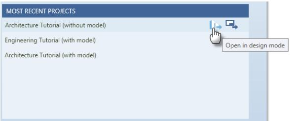

You can see the most recent projects you have worked on. Specify whether you want to open the project in design mode or in layout mode by clicking the corresponding symbol. Double-clicking the project name opens the project in the mode you used last.

# Information, Hotinfo, Updates

First Steps - Allplan QuickStart i ★New Features in Allplan Architect..

# First Steps - Allplan QuickStart

This takes you to the Allplan website of the QuickStart CAD Tutorial, which provides a quick and practical introduction to the world of Allplan.

# New features in Allplan architecture, new features in Allplan engineering

This takes you to the Allplan website, where you can find information on what's new in Architecture and Engineering. As an alternative, you can select New Features in the $\textcircled{7}$ Help drop-down list (right side of the title bar).

# Hotinfo - Support Tool

Use this to generate a support request with Hotinfo. You can find more information in the Allplan Help; see "Hotinfo".

# Updates - Settings

Use this to open the Allplan Update Settings dialog box. You can find more information in the Allplan Help; see "Allplan update".

# Internet

<table><tr><td>CONNECT</td><td>EXCHANGE</td><td>BIMPLUS</td></tr></table>

# Allplan Connect

This takes you to the website of Allplan Connect, the service portal of Allplan.

# Allplan Exchange

This takes you to the website of Allplan Exchange, the tool for distributing electronic documents over the internet.

# Bimplus

This takes you to the website of Bimplus, the openBIM platform developed by ALLPLAN GmbH for exchanging everything all building data between all disciplines.

Social media

#

This takes you to the Allplan areas of the most important social networks.

Border of the Welcome screen

Show this window on startup

You can use this option to turn off the Welcome screen. In this case, the most recent project opens automatically when you start Allplan.

You can open the Welcome screen at any time by clicking Welcome screen $\textcircled{7}$ Help drop-down list on the right side of the title bar).

# Information on Allplan

You can see information on the Allplan version, customer number and seat.

About Allplan $\textcircled{7}$ Help drop-down list on the right side of the title bar) provides advanced information.

# Default configurations

Allplan comes with several default configurations for the user interface.

The Actionbar configuration is the default setting. This configuration consists of the Actionbar structured by role, task and task area. The title bar of the Allplan window provides more tools

(Allplan icon, Quick Access Toolbar, Bimplus Login and $\textcircled{7}$ Help). In addition, this configuration comes with the Properties, Wizards, Library, Objects, Planes, Task Board, Connect and Layers palettes.

Apart from this configuration, the Default Configuration - Classic, Palette Configuration (see "Palettes" on page 33) and Basic Configuration are also available. To switch to a different configuration, open the View menu, point to Default Configurations and select the configuration you want to use.

# Working area

The working area is the part of the Allplan window where you can place the Allplan controls docked to the Allplan window.

This illustration shows the Allplan window after you have floated all controls. All that is left is the empty working area (gray area):

<table><tr><td>①</td><td>---X = Alpla2-ftforCAD-Archtecue-Buildng/Groundflor:DF0-Florplanoin </td><td></td><td></td><td></td><td></td><td></td><td></td><td></td><td></td><td></td><td></td><td></td><td></td><td></td><td></td></tr><tr><td></td><td></td><td></td><td></td><td></td><td></td><td></td><td></td><td></td><td></td><td></td><td></td><td></td><td></td><td></td><td></td><td></td><td></td><td></td><td></td><td></td><td></td><td></td><td></td><td></td><td></td><td></td><td></td><td></td><td></td><td></td><td></td><td></td><td></td><td></td><td></td><td></td><td></td><td></td><td></td><td></td><td></td><td></td><td></td><td></td><td></td><td></td><td></td><td></td><td></td><td></td><td></td><td></td><td></td><td></td><td></td><td></td><td></td><td></td><td></td><td></td><td></td><td></td><td></td><td></td><td></td><td></td><td></td><td></td><td></td><td></td><td></td><td></td><td></td><td></td><td></td><td></td><td></td><td></td><td></td><td></td><td></td><td></td><td></td><td></td><td></td><td></td><td></td><td></td><td></td><td></td><td></td><td></td><td></td><td></td><td></td><td></td><td></td><td></td><td></td><td></td><td></td><td></td><td></td><td></td><td></td><td></td><td></td><td></td><td></td><td></td><td></td><td></td><td></td><td></td><td></td><td></td><td></td><td></td><td></td><td></td><td></td><td></td><td></td><td></td><td></td><td></td><td></td><td></td><td></td><td></td><td></td><td></td><td></td><td></td><td></td><td></td><td></td><td></td><td></td><td></td><td></td><td></td><td></td><td></td><td></td><td></td><td></td><td></td><td></td><td></td><td></td><td></td><td></td><td></td><td></td><td></td><td></td><td></td><td></td><td></td><td></td><td></td><td></td><td></td><td></td><td></td><td></td><td></td><td></td><td></td><td></td><td></td><td></td><td></td><td></td><td></td><td></td><td></td><td></td><td></td><td></td><td></td><td></td><td></td><td></td><td></td><td></td><td></td><td></td><td></td><td></td><td></td><td></td><td></td><td></td><td></td><td></td><td></td><td></td><td></td><td></td><td></td><td></td><td></td><td></td><td></td><td></td><td></td><td></td><td></td><td></td><td></td><td></td><td></td><td></td><td></td><td></td><td></td><td></td><td></td><td></td><td></td><td></td><td></td><td></td><td></td><td></td><td></td><td></td><td></td><td></td><td></td><td></td><td></td><td></td><td></td><td></td><td></td><td></td><td></td><td></td><td></td><td></td><td></td><td></td><td></td><td></td><td></td><td></td><td></td><td></td><td></td><td></td><td></td><td></td><td></td><td></td><td></td><td></td><td></td><td></td><td></td><td></td><td></td><td></td><td></td><td></td><td></td><td></td><td></td><td></td><td></td><td></td><td></td><td></td><td></td><td></td><td></td><td></td><td></td><td></td><td></td><td></td><td></td><td></td><td></td><td></td><td></td><td></td><td></td><td></td><td></td><td></td><td></td><td></td><td></td><td></td><td>Angle: 0.000%:5</td><td></td><td></td><td></td><td></td><td></td><td></td><td></td><td></td><td></td><td></td><td></td><td></td><td></td><td></td><td></td><td></td><td></td><td></td><td></td><td></td><td></td><td></td><td></td><td></td><td></td><td></td><td></td><td></td><td></td><td></td><td></td><td></td><td></td><td></td><td></td><td></td><td></td><td></td><td></td><td></td><td></td><td></td><td></td><td></td><td></td><td></td><td></td><td></td><td></td><td></td><td></td><td></td><td></td><td></td><td></td><td></td><td></td><td></td><td></td><td></td><td></td><td></td><td></td><td></td><td></td><td></td><td></td><td></td><td></td><td></td><td></td><td></td><td></td><td></td><td></td><td></td><td></td><td></td><td></td><td></td><td></td><td></td><td></td><td></td><td></td><td></td><td></td><td></td><td></td><td></td><td></td><td></td><td></td><td></td><td></td><td></td><td></td><td></td><td></td><td></td><td></td><td></td><td></td><td></td><td></td><td></td><td></td><td></td><td></td><td></td><td></td><td></td><td></td><td></td><td></td><td></td><td></td><td></td><td></td><td></td><td></td><td></td><td></td><td></td><td></td><td></td><td></td><td></td><td></td><td></td><td></td><td></td><td></td><td></td><td></td><td></td><td></td><td></td><td></td><td></td><td></td><td></td><td></td><td></td><td></td><td></td><td></td><td></td><td></td><td></td><td></td><td></td><td></td><td></td><td></td><td></td><td></td><td></td><td></td><td></td><td></td><td></td><td></td><td></td><td></td><td></td><td></td><td></td><td></td><td></td><td></td><td></td><td></td><td></td><td></td><td></td><td></td><td></td><td></td><td></td></table>

You have the following options to arrange the Allplan controls in the working area:

• You can dock the Actionbar (on page 24) to the top of the working area.

You can also dock the Palettes (on page 33) to any edge of the working area. There, you can lock them into position or configure the program to show and hide them automatically.

You can place the Viewports (on page 67) in the remaining, empty space of the working area. In addition, you can move, arrange and resize them as you like (unless you have maximized a viewport).

You can dock the Dialog line (on page 88) to the top or bottom of the working area.

The status bar (on page 89) is always at the bottom of the working area. It is the bottom line of the Allplan window. You can show or hide the status bar, but you cannot float it.

# Title bar

You can see the current project, fileset, building structure and document in the middle of the title bar of the Allplan window. You can find the Bimplus Login on the right side. To go to the Allplan Shop, click the Open Allplan Shop icon. Click the Help icon to open a drop-down menu, where you can activate the Allplan Help and get information on the Allplan version installed. Click the Allplan icon on the left side of the title bar to open important tools such as save, copy, import and export. Furthermore, you can show the Quick Access Toolbar (on page 21), which provides frequently used tools. You can use a drop-down list to turn these tools on or off or arrange these tools in the required sequence. Furthermore, you can show or hide the menu bar. Click Customize User Interface... to open the Customize dialog box.

# Quick Access Toolbar

You can open a drop-down list on the title bar of the Allplan window. By selecting tools in this list, you can define a Quick Access Toolbar. The size of this Quick Access Toolbar is defined by the number of tools you select.

By using the drop-down list, you can also define the sequence of the tools on the Quick Access Toolbar and open the Customize dialog box - Actionbar tab. If you use the menu bar regularly, you can click "Show menu bar" to show it all the time (as opposed to the ALT key, which shows the menu bar for a short time only).

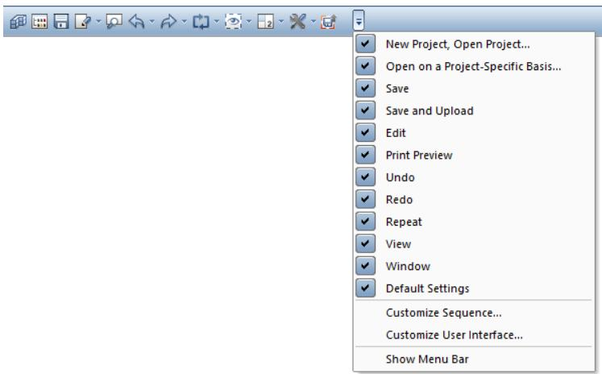

<table><tr><td colspan="2">Use</td><td>By default,the Quick Access Toolbar contains the following tools:</td></tr><tr><td>Tool 田</td><td></td><td>New Project, Open Project You can usethis toolto open the New Project,Open Project dialog box, where you can select a project,create new projects,assign attributes to projects and change the path setting for the resources (office-specific or</td></tr><tr><td></td><td>Open on a Project- Specific Basis</td><td>project-specific). You can use this toolto opena dialog box where you can change the status of drawing files and create fileset structures and building structures, for example.</td></tr><tr><td>圆</td><td>Save</td><td>You can use this tool to save the current drawing file and the files open in edit mode or the current layout.If the active viewport isan NDW file, the</td></tr></table>

Tool

# Use

program saves only this file.

Edit

You can use this tool to open a drop-down list with general edit tools you know from other Windows applications.

Print Preview

You can use this tool to open print preview. The printout will be an exact match of what you see in print preview. You can define printer settings and margins, select the scale, add headers and footers and specify how the elements look. In addition, you can change the paper size and orientation of the page.

Undo

You can use this tool to undo one or more actions. You cannot undo changes in dialog boxes.

Redo

You can use this tool to redo actions you have undone.

Repeat

You can use this tool to repeat the last tool you selected or one of the tools you selected most recently.

View

You can use this tool to open a drop-down list with tools for controlling what’s on your screen.

Window

You can use this tool to open a drop-down list with tools for using and arranging viewports (on page 67).

Defaults

You can use this tool to open a drop-down list with tools for defining office standards and default settings for your daily work with Allplan. In addition, you can open a dialog box in which you can define keyboard shortcuts for all Allplan tools.

Save and Upload

You can use this tool to save the current drawing file and the files open in edit mode or the current layout and upload the data to Allplan Share at the same time.

Customize Quick Access Toolbar

You can use this tool to open a drop-down list for arranging the tools on the Quick Access Toolbar (on page 21).

In addition, you can customize the user interface or show and hide the menu bar (see "Menus" on page 23) allthetime. Remember: You can use the ALT key to show the menu bar for a shorttime.

# Menus

If the configuration (see "Default configurations" on page 19) you use is not the Actionbar configuration, you can find the menus in the top border of the Allplan window. When you install for the first time or work with the Actionbar Configuration, the menu bar is hidden by default. You can show or hide the menu bar on the Quick Access Toolbar (on page 21). Use the ALT KEY to show the menu bar for a short time.

All the tools can be activated via the menus, regardless of the role or task you are working on.

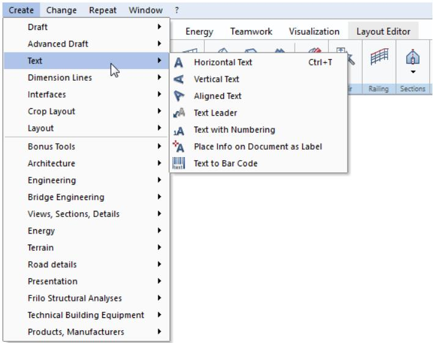  
Tip: To open a menu, you can also select the underlined letter in the menu name while selecting and holding the Alt key.

# Actionbar

You can find the Actionbar above the workspace (see "Working area" on page 19).

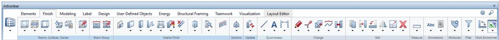

The Actionbar contains all Allplan tools in groups of tools. The groups of tools are combined into task areas, which are combined into tasks. You can find the tasks required for each discipline in a role.

To see the Actionbar, you must select the Actionbar Configuration. You can show or hide the Actionbar at any time

Note: To find out which tools are in the task areas, tasks and roles, see Orientation in the program – the tasks and their task areas in the Allplan Help.

# Structure

The Actionbar is docked to the top of the working area. If you want, you can drag the Actionbar to the bottom of the workspace and dock it there. You can also make the Actionbar float anywhere on your screen. By double-clicking, you can dock it to the place where it was docked last.

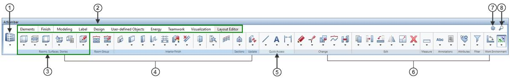

Components of the Actionbar:

1 - Role (see "Actionbar - role, tasks, task areas" on page 26)

2 - Tasks (see "Actionbar - role, tasks, task areas" on page 26) arranged on tabs

3 - Task area (see "Actionbar - task area, group of tools, tool" on page 28)

4 - Varying task areas (see "Actionbar - role, tasks, task areas" on page 26)

5 - Quick Access task area

6 - Fixed task areas (see "Actionbar - role, tasks, task areas" on page 26)

Actionbar Configurator

8 - $\boldsymbol { \mathscr { P } }$ Find (see "Actionbar - finding tools" on page 29)

Note: When you work with a default Actionbar that you have not changed, an Allplan update always replaces the Actionbar with the latest version of the Actionbar. This ensures that the Actionbar always contains new tools.

# Actionbar - role, tasks, task areas

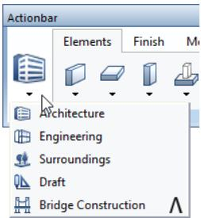

The role is the area where you can find the tasks to be worked on. The drop-down list contains all the roles that are available to you (both the roles you purchased and the roles you configured yourself).

The tasks that are available to you change with the selected role. To open a task, click the corresponding tab. Each task is subdivided into appropriate task areas. You can find areas in different colors, indicating varying task areas (blue) and fixed task areas (gray). The varying task areas change with the selected task, such as the Components task area of the Elements task. You can find the fixed task areas in all roles and tasks, such as the Work Environment and Filter task areas. The Quick Access task area contains tasks with tools used frequently.

The first time you open Allplan the task areas are collapsed. To open the flyout menu of the tools, click the downward arrow. You can then see all the tools in the collapsed area.

When you point to the name line of a task area, the cursor changes to .

You can maximize or minimize a task area by double-clicking within the name line of a task area. A maximized task area shows more tools, which can also have flyout menus.

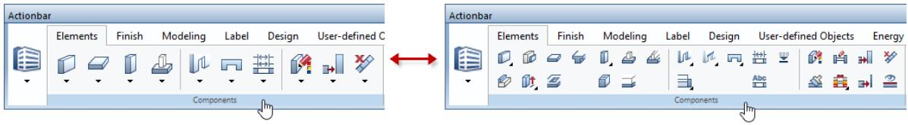

Note: You can expand or collapse all task areas of the task currently selected by selecting and holding the Ctrl key while double-clicking within the name line of a task area.

You can expand or collapse all areas across tasks and roles by selecting and holding Ctr $| + \rrangle$ Shift while double-clicking within the name line of a task area.

The width of the Allplan window defines how many task areas can be expanded. If the window is not wide enough, Allplan starts on the left side, expanding as many task areas as possible.

Actionbar - task area, group of tools, tool

An expanded task area (1) contains one or more groups of tools (2). Different groups of tools are separated by vertical lines (= separators). The tools are grouped by topic (Create (2); Create in context (3); Modify in context (4)). Some tools have flyout menus (6) where you can find similar tools.

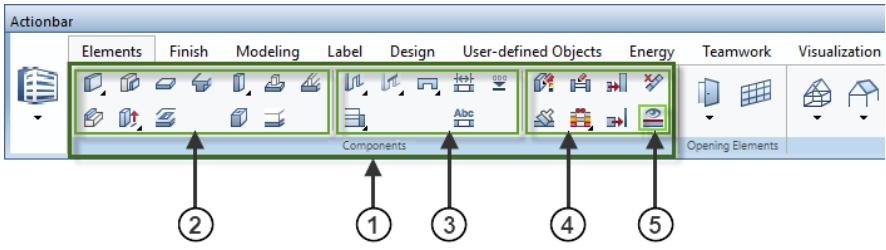

1 - Task area   
2 - Create group of tools   
3 - Create in context group of tools   
4 - Modify in context group of tools   
5 - Tool

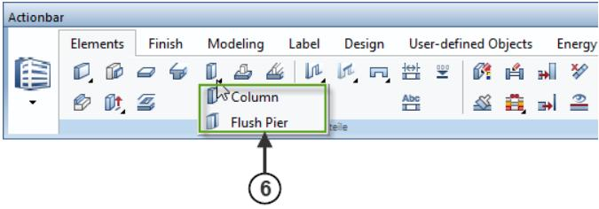

6 - Tool menu $=$ flyout menu of a tool

When you open the Customize User Interface tool on the Actionbar tab, you can define whether a flyout menu always shows the preset tool on top or the last tool selected.

# Actionbar - finding tools

By selecting the $\mathcal { P }$ Find tool in the upper-right corner of the Actionbar, you can find tools across tasks and roles on the Actionbar.

Enter the name of the tool or parts thereof in the Find: box. If you want, you can select options and define the search direction. Click Continue. If Allplan has found the text you entered in the box in the name of a tool, you can see the result in the lower part of the Find... dialog box. At the same time, the Actionbar opens the role and task with this tool and highlights the tool. Click Continue to find more tools whose names contain the text entered. Once again, the Actionbar opens the role and task that contain the tool, highlighting the tool.

You can access the tool found straight from the Find... dialog box by clicking the icon of the tool. Of course, you can also click the tool on the Actionbar.

# Actionbar Configurator

You can find Actionbar Configurator on the right side of the Actionbar.

By using Actionbar Configurator, you can customize the Actionbar to suit your needs and requirements or define a new Actionbar. You can also export and import Actionbar configurations.

Click

to open the Actionbar Configuration dialog box.

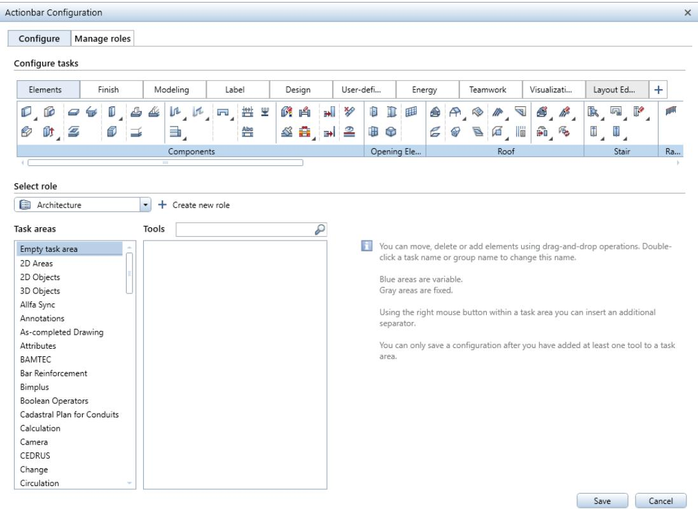

Use the Configure tab to specify whether you want to create a new role or select and modify a role you have already configured.

Click Create new role to open the Create new role dialog box. You can choose between creating the new role based on a template (in line with the roles coming with the program) and clicking Empty template to get an empty role you can design yourself.

To design the role, you can move, delete or add elements by using the drag-and-drop feature. By double-clicking a task or task area, you can change the name of this task or task area. You can also create flyout menus. To do this, click a tool on the Actionbar or in the right column of the table and drag the icon of the tool onto another tool. Then release the mouse button. This results in a flyout menu containing the moved tool.

Finally, save the new role. Without prompting you, Allplan saves all roles available in Actionbar Configurator as a   
configuration.actb file in the \Usr\Local\Actionbar folder. The Actionbar Configuration dialog box closes. You can now select the new role in the drop-down list of the roles on the left side of the Actionbar.

ATTENTION: If you change roles in Actionbar Configurator and click the Save button, Allplan overwrites the configuration.actb file without displaying a prompt.

To avoid this, save the role in a folder of your choice. You can export and import roles. To do this, use the Manage roles tab of the Actionbar Configuration dialog box.

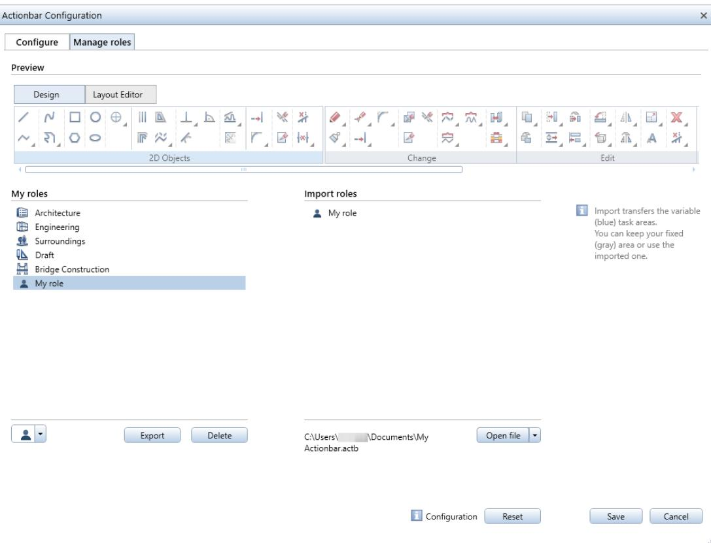

To save the selected role in any folder, click the Export button. After you have selected the folder, Allplan saves the role as an \*.actb file in this folder. You can also export several roles in a single step. Allplan saves these roles together in a configuration file in \*.actb format. To import roles to the Actionbar, you can use the Open file button in Actionbar Configurator. After having imported the required file (in \*.actb or Actionbar_\*.xml format), you can see the contents in the Import roles area. So that the imported roles are available to you on the Actionbar after you have closed Actionbar Configurator, you must drag the roles from the Import roles area into the My roles area.

Of course, you can also customize imported roles to suit your needs and requirements. To do this, switch to the Configure tab, select the role you want to change in the My roles area and modify the role.

You can find more information on how to use Actionbar Configurator in the Allplan Help - "Actionbar Configurator".

# Palettes

Palettes are important controls of Allplan, making the user interface simple and easy to use.

The following palettes are available in each configuration (see "Default configurations" on page 19):

• Properties palette (on page 36) to modify the properties of elements.

• Wizards palette (on page 39): to select and manage wizards.

• Library palette (on page 41) to select and manage symbols, smart symbols, SmartParts, and PythonParts.

Objects palette (on page 49) to quickly check your design by showing or hiding elements or element groups or by making them transparent.

• Planes palette (on page 53): to check and edit the plane models of the current building structure.

Task Board palette (on page 58) to check and edit the tasks of Bimplus projects directly in Allplan.

Connect palette (on page 60) to directly access content on Allplan Connect.

• Layers palette (on page 60) to keep sight of the layer status and to quickly change it.

If the configuration you use is notthe Actionbar configuration, the following two palettes are also available:

• Modules palette (on page 64): to quickly switch between task areas.

• Tools palette (on page 65) to quickly activate tools.

By default, Allplan displays the palettes as tabs in a separate window - the palette window. But you can float or dock each palette individually.

In addition, you can arrange the palette window or individual, freefloating palettes around the edge of the workspace (see "Working area" on page 19) or make them float anywhere on your screen. You can even configure Allplan to automatically show or hide the palette window or palettes arranged around the edge.

# Arranging palettes

Displaying palettes

You can use keyboard shortcuts to bring the palettes to the front. For example, you can assign the following keyboard shortcuts:

A (Wizards palette) B (Library palette) C (Connect palette) E (Properties palette) F (Tools palette) L (Layers palette) M (Modules palette) O (Objects palette) T (Task Board palette)

Palettes that are already on top close when you select the relevant keyboard shortcut.

Note: The Planes palette has no predefined keyboard shortcut. You can assign a keyboard shortcut to the Planes palette in Customize User Interface ... - Customize tab - More tools with icons. You can also use this tool to change the keyboard shortcuts of palettes.

# Hiding palettes automatically

You can use the and icons on the title bar of a palette to specify how the palette behaves:

Hide automatically on ( ): The palette opens and closes automatically when you hover over it, regardless of whether the palette is docked or not.

• Hide automatically off $\textcircled{4}$ : The palette is always open.

You can define settings for this feature in the Customize dialog box - Palettes tab (shortcut menu of a palette or drop-down list of the Quick Access Toolbar or Tools menu - Customize User Interface).

Floating or docking palettes or the palette window

You can arrange individual palettes or the entire palette window around the edge of the workspace or make them float anywhere on your screen. Click the title bar of the palette or the palette window and drag it to one of the arrows in the workspace.

As long as you hold the mouse button, you can move the palette or palette window freely in the workspace. This is indicated by a transparent preview. The palette or palette window will dock to its current position as soon as you release the mouse button. To minimize the palette, turn on Hide automatically. To float the palette or palette window again, turn off Hide automatically.

Floating or docking palettes to the palette window

To float a single palette and arrange it separately, click the tab of the palette and drag it to its new position outside the palette window.

To combine palettes into a palette window again, click the title bar of the palette and drag it to the title bar of the palette or the palette window with which you want to combine it.

Note: You can arrange a single palette or the entire palette window around the edge of the working area or make it float anywhere on your screen.

# The palettes in detail

Properties palette

The Properties palette displays the most important properties of objects or components that are currently selected. You can change the properties straight in the palette.

When you open the $8$ Options - Desktop environment - General area, you can specify whether double-clicking an object or component or clicking Properties on the shortcut menu of the object or component displays the element properties in the Properties palette or the Properties dialog box.

Note: Regardless of this setting, the program always displays the properties of text and dimension lines in the Properties dialog box When you select and hold the Shift key while and double-clicking an element, the program always displays the properties in the Properties dialog box.

The Properties palette has the following areas:

# Element or object selection

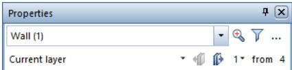

# “Elements” list box

Select the elements whose properties you want to display or modify. You can modify only the properties of the elements selected in this list box.

In addition to the element types, you can select the following settings:

Hide all selected:   
Hides the properties of allelements; the number in parentheses shows how many elements are included in the objects or   
components currently selected.

# • Shared element properties:

Only shows the property categories that are common to all elements of the objects or components currently selected. \*varied\* indicates properties with different values in the categories.

Elements whose properties cannotbeediteddirectlyin the Properties palette are grayed out. However, you can edit the properties of a singleelement. To do this, select this element in the list box and click Change the properties of the selected object.

Zoom in on selected objects

Defines the section on the screen so that all the selected objects are visible.

Filter step by step

Opens the Filter Step by Step dialog box you can use to apply a filter to the objects or elements you want to select.

Change the properties of the selected object

Opens the ‘Properties’ dialog box of the object or element. You can use this tool to modify the properties of elements grayed outin the Elements list box. All you need to do is select a grayed-out element in the list box and click this icon.

# “Selection mode for layers” list box

Only for multilayer components.

You can define which layers are visible in the palette and how changes affect these layers.

Previous layer / Next layer

Only for multilayer components.

If Current layer is selected for Selection mode for layers, you can switch between the layers of the component.

Selection of current layer list box / number of available layers Only for multilayer components.

If Current layer is selected for Selection mode for layers, you can directly select the layer you want to edit.

# Properties

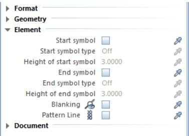

The Properties area displays the properties of the selected elements. You can change all properties directly in this area except the properties thatare grayed out,Use the $\hat { \rho }$ match buttons to match properties of existing elements. You can use the shortcut menu of the Properties palette to show or hide the $\hat { \delta } ^ { \eta }$ match buttons.

In addition, the shortcut menu of a property provides several tools for applying the properties of existing elements to the elements selected:

• Match property: Matches a single property; clicking $\hat { \delta } ^ { \eta }$ has the same effect. Match group: Matches all the properties of the group. Match all (without geometry): Matches all the properties except geometric properties.

Note: There are some particular issues to bear in mind when you use components from architecture and engineering. You can find more information in the Help. For example, for further information about architectural components, see "Editing properties of architectural components via the Properties palette".

# Document

Document

The Document area displays the number and name of the drawing file or the path and file name of the custom NDW file including the elements selected.

# Description

Pattern Line

The Description area describes the property to be defined. You can use the shortcut menu of the Properties palette to show and hide this area.

Bar at the bottom

#

Match parameters

Applies the properties of the element clicked to the current selection (if this is possible).

Load favorite

Loads the properties from a favorite file (\*.prop).

Save as a favorite

Saves the current properties as a favorite file (\*.prop).

Wizards palette

The Wizards palette has the following areas:

# List box

<table><tr><td> Wizards</td></tr><tr><td> My wizards</td></tr></table>

You can choose a wizard group in the list box at the top. You can use the shortcut menu to create new groups, add existing groups to the palette, rename the current group and remove it from the palette.

Note: The wizards that come with Allplan are in the \etc\Assistent folder. You can find them in the Allplan group. You cannot change the wizards in this group. If you want to define your own wizards, you must create a new wizard group first. When you open a country-specific project, Allplan displays the countryspecific wizards, adding the country code to the group name (for example, Allplan.eng)

Tabs

The tabs show the wizards in the current wizard group. You can use the shortcut menu to add wizards and to remove, replace and rename tabs.

# Workspace

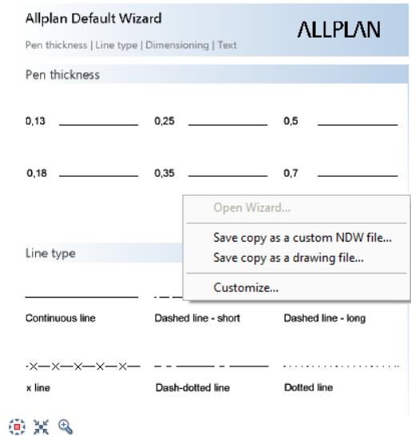

The workspace displays the elements in the selected wizard. When you right-click in the empty space, Allplan presents a shortcut menu with a number of options. For example, you can open a wizard or save the current wizard as a drawing file or as an NDW file. You can use drag-and-drop editing or $C { \mathsf { t r } } \| + C$ and $\mathsf { C t r } | + \mathsf { V }$ to copy elements from the wizard into the document. To place these elements, you can use the same tools as for symbols.

# Library palette

The Library palette contains library elements of the following types:

• Symbols (see "Using symbols" on page 191) • Smart symbols (see "Using smart symbols" on page 193) • SmartParts (see "Using SmartParts" on page 197) • PythonParts (see "Using PythonParts" on page 202)

This palette has the following areas:

# Navigation field

# Library

←Library Default → Architecture

The navigation field at the top shows the open folder in the library.

Back takes you up one level in the hierarchy.

You can use Find to find library elements in the current folder and all subordinate folders. The program then lists all elements with names matching the letters you entered. When you point to one of the elements found, you can see a ToolTip with information on the name, the date the file was saved, the element type and the folder where the file was saved. You can open this folder by using the shortcut menu.

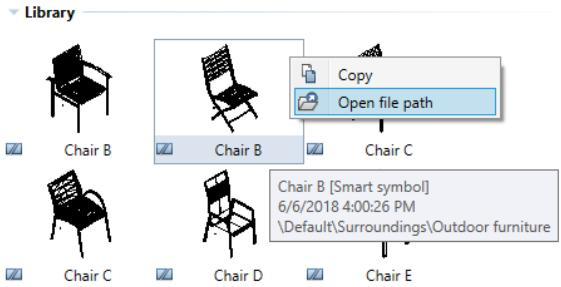

# Selecting and filtering library elements

# 1

Use $\bigtriangledown$ Filter to show or hide specific types of library elements (symbols, smart symbols, SmartParts, PythonParts).

Use $\downarrow _ { 2 } ^ { \mathsf { A } }$ Sort criterion to sort the library elements alphabetically or by date in ascending or descending order.

Use

Hide empty folders to hide folders without library elements.

Use Show active project only to display the selected project only, hiding all the other projects. When selected, the icon changes to

and appears pressed in.

Library

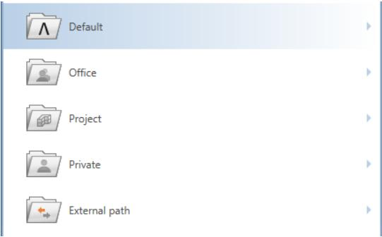

This is where you open the libraries in the Default, Office, Project, Private and External paths and go to the required folder.

As soon as you select a folder, you can see the library elements in this folder. A folder can contain Symbols, Smart symbols, SmartParts and PythonParts.

Just look at the small symbol indicating the type of library element:

Symbol or

Symbol with resources

• Smart symbol or Smart symbol with resources

SmartPart

PythonPart

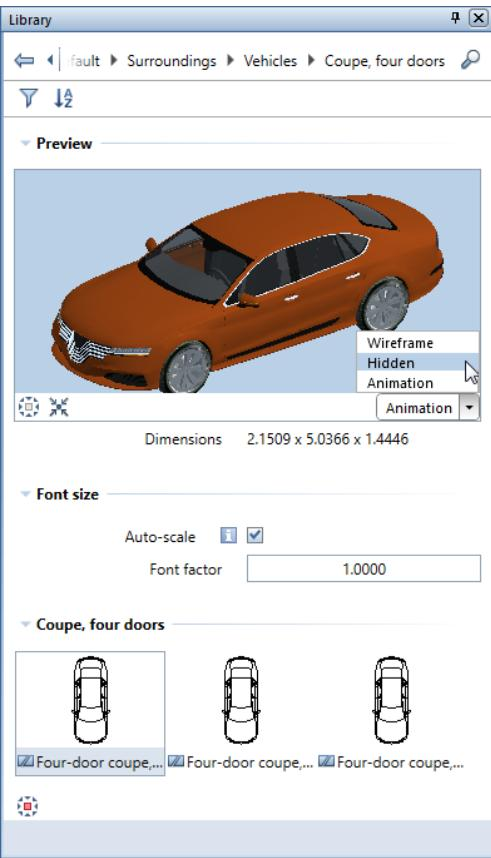

# Preview area

You can see a preview of the selected element. You can define the

View and View type (Wireframe, Hidden, Animation).

Except for fixtures, you can see the Dimensions of the library element. The program calculates the dimensions from the min-max box of the library element.

# Font size area

Use this to define whether a label in the library element will be resized automatically (Auto-scale) or by a factor you enter (Font factor).

# Selection area

You can see illustrations of the library elements in the selected folder. You can select a $^ { \circ } _ { \circ } \tilde { \mathbf { \Gamma } } _ { \circ } ^ { \circ }$ View for 3D elements. 2D symbols are only visible in plan view.

To select an element, double-click it or drag it into the workspace and place it there. To place the element, use the tools in the input options.

The Selection area provides a shortcut menu you can use to define the size of the illustrations. You can even hide them by selecting the Text only option. Clicking an entry displays the illustration in the Preview area.

Clicking Customize User Interface... opens the Customize dialog box, where you can customize the palettes to suit your needs. To do this, open the Palettes tab.

<table><tr><td>+</td><td> New group</td></tr><tr><td rowspan="6">√</td><td> Text only</td></tr><tr><td> Small icons</td></tr><tr><td> Medium icons </td></tr><tr><td> Large icons</td></tr><tr><td> Customize User Interface..</td></tr></table>

# Shortcut menu or icon

The

icon appears when you point to folders and library elements.

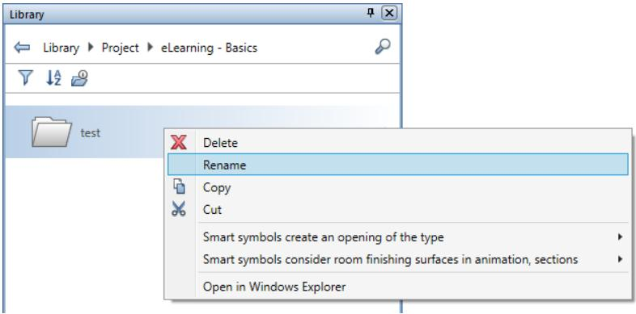

Folders in the default path offer the following options:

#

Copies the folder to the clipboard; you can then insert the folder into a different path (except the Default path).

Smart symbols create an opening of the type Assigns an opening type to each smart symbol in the folder.

• Smart symbols consider room finish surfaces in animation, sections

Defines how each smart symbol in the folder adapts to room finishing surfaces.

Modifiable folders offer the following additional options:

# Delete

Deletes the selected folder.

• Rename

Renames the folder.

#

Pastes a folder from the clipboard into the selected folder.

# •

# Cut

Copies the selected folder to the clipboard and deletes the folder.

# • Open in File Explorer

Opens the selected folder in File Explorer.

Library elements in folders in the default path offer the following options:

#

Copies the library element to the clipboard; you can then paste the library element into a folder you created yourself (this folder must not be in the Default path).

• Open file path

Opens the folder with the library element in File Explorer.

Library elements you created yourself (in the office, project and private folders) offer the following additional options:

# Delete

Deletes the selected library element.

• Rename

Renames the library element.

# Paste

Pastes a library element from the clipboard into the selected folder.

# •

# Cut

Copies the selected library element to the clipboard and deletes the library element.

# • Replace

Replaces the selected library element with a new one selected by you.

Resources included (symbols and smart symbols only) Defines whether Allplan is to save the resources together with the library element or take the resources from the current project. When you select this option, Allplan saves the current resources with the library element. As a result, the library element will always look the same even if you use it in other projects.

# Bar at the bottom

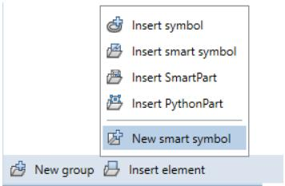

Depending on the path and folder, the toolbar at the bottom offers more tools.

# Nemetschek profile catalog

Opens the Nemetschek profile catalog in Bimplus, adding selected profile groups or profiles as symbols to the office folder of the Allplan library.

# New group

Creates a new group in the selected folder.

# Insert element

Saves library elements to the current library folder and adds library elements placed in the workspace to the current library folder.

# Insert symbol

Saves a new symbol to the current library folder.

# Insert smart symbol

Adds a smart symbol placed in the workspace to the current folder.

•

# Insert SmartPart

Adds a SmartPart placed in the workspace to the current folder.

# •

# Insert PythonPart

Adds a PythonPart placed in the workspace to the current folder.

# •

# New smart symbol

Creates a smart symbol and saves it to the current library folder.

# Add path

Creates a path in the External path folder so that you can access more files with library elements.

Objects palette

The Objects palette lists all objects in the currently open drawing files (current or open in edit mode or open in reference mode). You can sort these objects according to certain criteria. It is possible to show or hide selected objects and to define their transparency. You can also activate or deactivate objects in the Objects palette.

The Objects palette has the following areas:

# “Sort criterion” buttons

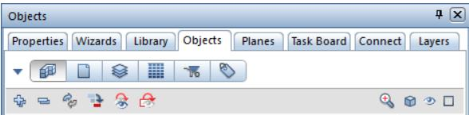

Custom or

Predefined

Click this button to change the sort sequence. You can choose from different categories for each sorting criterion.

After you have selected custom sorting by clicking $\blacktriangledown$ Custom, you can use a shortcut menu (see "Shortcut menu - custom sorting" on page 53) to turn on or off sorting criteria and several categories. In

addition, you can save custom sorting

# Save sorting favorites)

and load a sorting favorite

Load sorting favorites).

The $\blacktriangle$ Predefined setting provides the following six sorting criteria:

Sort by building structure

This criterion combines all objects in the currently open drawing files into groups, listing the groups alphabetically. You can find the objects at the lowest level in each group. The details from the building structure are at the top level in the hierarchy.

Sort by drawing file

The drawing files containing the objects are at the top level in the hierarchy.

# Sort by layer

The layers are at the top level in the hierarchy. If an object (for example, a window opening) consists of several elements (for example, sill and window SmartPart) that are assigned to different layers, you can find this object in the \*varied\* list.

Sort by material

The materials assigned to the objects are at the top level in the hierarchy. If an object does not have a material attribute, you can find this object in the \*not defined\* list.

Sort by trade

The trades assigned to the objects are at the top level in the hierarchy. If an object does not have a trade attribute, you can find this object in the \*not defined\* list.

Sort by attribute

The attributes assigned to the objects are at the top level in the hierarchy. Open the shortcut menu (see "Shortcut menu - custom sorting" on page 53) of custom sorting to use a second, freely definable attribute for sorting. If an object does not have an attribute, you can find this object in the \*not defined\* list.

“Control” buttons

# Expand selected entries

Expands the view so that you can see all subentries of the selected node.

# Collapse all entries

Hides all subentries.

# Update palette

Updates the contents in palette.

Go to next active element (Shift $+ \mathsf { A }$ ; backward: Shift $\cdot + 5$ )

Marks the next active element in the hierarchy.

# Invert visibility

Inverts the visibility.

# Hide everything that is not selected

Shows active elements only.

# Zoom in on selected objects

Zooms in on active objects.

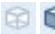

Everything without transparency / Everything

transparent

Switches between Everything transparent and Everything without transparency.

Note: This setting affects the animation view type only. Make sure the Use OpenGL for all viewports option is selected in the Hardware acceleration - graphics area on the Desktop

environment - Display page in the

Options.

indicates that not all objects are transparent or without

transparency.

When you point to the symbol, you can define the transparency

setting

$\boxed { 1 } \boxed { 1 } \boxed { 2 } \boxed { 1 } \boxed { 2 } \boxed { 1 } \boxed { 2 }$ = from $0 \%$ to $100 \%$ (by steps of $20 \%$ ). You

can define the same transparency setting for all objects in one go.

# All invisible / All visible

Switches between All invisible and All visible.

indicates that not all objects are visible or invisible.

Everything inactive / Everything active

Switches between Everything inactive and Everything active.

indicates that not all objects are active or inactive.

# Objects

Depending on the sorting criterion selected, this section lists all objects in the currently open drawing files (current or open in edit mode or open in reference mode).

You can change the transparency, visibility and selection of objects listed in each row. When you have selected several objects of a hierarchical level, these changes apply to all objects selected.

Use the following buttons:

Transparency : = from 0% to 100% (by steps of $2 0 \%$ )

Note: The transparency setting affects the animation view type only. Make sure the Use OpenGL for all viewports option is selected in the Hardware acceleration - graphics area on the Desktop environment - Display page in the $8$ Options.

When you point to the symbol, you can define the transparency setting.

indicates that this hierarchical level includes both objects with transparency and objects without transparency.

indicates that all objects of this hierarchical level have transparency settings of $100 \%$ , which means that these objects are not visible in animation.

When you point to objects that cannot be made transparent (for example, 2D objects), you can see the following note: Transparency not available for these objects.

Note: Some 3D objects (for example, SmartParts for opening elements) cannot be made transparent for the time being. When you make a component (for example, a wall) transparent and this component contains such objects, Allplan hides these objects (for example, SmartParts for opening elements). As soon as you turn transparency off, all objects are visible again.

# Visibility:

$=$ visible / invisible

indicates that this hierarchical level includes both visible objects and invisible objects.

indicates that the layer of this object or object group is hidden or that this object is not selected in "Show/Hide".

Selection: / $=$ active / inactive

indicates that this hierarchical level includes both active objects nd inactive objects.

Objects on frozen layers or objects in reference drawing files cannot be made active.

Click to switch between visible and invisible and between active and inactive. When you double-click the Selection button in the

lowest level in the hierarchy, Allplan zooms in on the corresponding object in plan view.

# Bar at the bottom

# Settings

Opens the Options - Object navigator. You can specify how you want to list rooms within the Objects palette. You can choose between Object name, Name and Function.

Shortcut menu - custom sorting

After you have selected custom sorting by clicking $\blacktriangledown$ in the Objects palette, you can right-click a category to open a shortcut menu:

<table><tr><td></td><td> Topology</td></tr><tr><td></td><td> Drawing file number, name</td></tr><tr><td></td><td> Layer</td></tr><tr><td></td><td> Group (object group)</td></tr><tr><td>√</td><td>Type (object type)</td></tr><tr><td></td><td> Material</td></tr><tr><td></td><td> Trade</td></tr><tr><td></td><td> Attribute 1</td></tr><tr><td></td><td> Attribute 2 </td></tr></table>

You can turn on and off the sorting criteria and the two categories (group and type). At least one entry remains selected on the shortcut menu.

Note: You can save custom sorting ( Save favorites for sorting) and load a sorting favorite ( Load favorites for sorting).

Planes palette

The Planes palette displays the plane models of the current building structure; each plane model gets its own tab. While creating components, you can keep track of the default planes and all other objects on which the heights of the components can be based.

In the Planes palette, you can create new plane models, modify plane models and insert or replace roofscapes. These tasks are similar to

those provided by the

Floor Manager dialog box of the building structure. But if you want to insert reference surfaces and offset planes in a plane model, you must use the palette.

When Modification mode is on, the planes of the plane model are visible in all viewports. When you point to or select an entry of the plane model in the tree structure, this entry is highlighted in the detection color in all viewports. So, you can immediately check the position of the plane and see the effects of changes.

The Planes palette has the following areas:

Toolbar

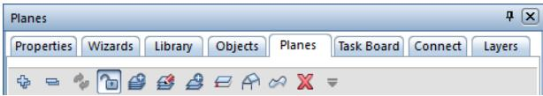

# Expand all entries of active model

Expands the tree structure so that all subordinate entries of the active plane model are visible.

# Collapse all entries

Hides all subentries.

# Update model

Updates the plane model in the palette so that the plane model is up to date.

# Modification mode on/off

Activates modification mode and opens the palette for entries. When modification mode is on, the planes of the plane models are visible in all viewports. When you point to or select an entry of the plane model in the tree structure, this entry is highlighted in the detection color in all viewports. You can also find this tool on the shortcut menu.

# New model

Opens the New model palette, where you can create a new plane model.

# Modify model

Opens the Modify model palette, where you can modify the plane model on the current tab. You can also find this tool on the shortcut menu.

# Insert pair of planes

Inserts a pair of planes as the top story in the current plane model. Allplan takes the offset values from the top pair of planes, incrementing the story name by one. You can change the heights and names in the palette. You can also find this tool on the shortcut menu.

Note: By using the Insert Pair of Planes dialog box of Floor Manager in the building structure, you can also take the default planes from a drawing file or an NDW file.

# Insert offset plane

Inserts an offset plane in the plane model. The offset plane is linked with a default plane at an offset you define. When you change the linked plane, the offset plane adapts automatically, including all elements that are attached to this offset plane. When defining the offset plane, you can select the Applies to all floors option to apply this offset plane to all stories of the plane model. When an offset plane applies to all stories, you can see the symbol in floor manager.

# Insert or replace roofscape

Inserts a roofscape in the pair of planes selected or replaces the roofscape selected. Use the Input Options to specify how you want to insert the roofscape in the current plane model (compared with the source):

• Do not change roofscape (compared with source). The bottom level of the roofscape is equivalent to the bottom of the story; top levels do not change. The roofscape as a whole is moved to the height of the bottom of the story.

Select a roof plane or a custom plane in an active drawing file. Replacing a roofscape does not change the reference to all drawing files that use this roofscape. You can also find this tool on the shortcut menu of a story node.

# Insert or replace reference surface

Inserts a local reference surface in the plane model or replaces the reference surface selected. The height of the reference surface is defined by the z-value of the lowest point in the reference surface. You can also find this tool on the shortcut menu of a story node.

Use the symbol between height and name to specify how you want to connect the reference surface with the upper or lower plane of the structural level to which you have added the reference surface. Click the symbol to switch between the following settings:

Do not connect (default setting)

Connect with bottom level

Connect with top level

Note: By selecting Extract reference surface on the shortcut menu of a reference surface, you extract the reference surface from the plane model and insert the reference surface in the current drawing file.

# Delete selected entry

Deletes the selected entry. You can also find this tool on the shortcut menu.

# Restore previous model state

Opens a list of all changes in the plane model including date, time and name of the changed plane model. Click Apply to restore the model state selected.

Note: Use the

Restore previous model state tool to undo

changes in the Planes palette. You cannot use

Undo or

Redo.

# Tree structure, shortcut menu

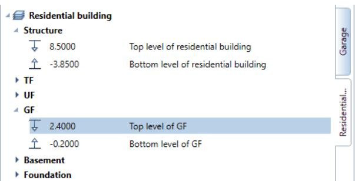

Displays all components of the plane models. Each plane model has its own tab.

When Modification mode is on, you can change all height settings by clicking in the palette. As an alternative, you can use the handles or boxes in all viewports, views and sections. In the Adjust height of planes dialog box, you can define how the planes above and below behave:

• Move up / down: The height settings of the planes above or below change so that the distance between the planes stays the same. Retain height: The height settings of the planes above or below do not change; the slab thickness changes. If this resulted in overlapping pairs of planes, the Retain height option would not be available.

You can find these tools, which you can select by clicking or by clicking symbols, on the shortcut menu of the tree structure too.

Bar at the bottom

# Save

Saves the current setting as a favorite.

#

Saves all the changes and updates the plane model in the active drawing files. $\fallingdotseq$ Modification mode is still on. After you have changed the height of a plane, the Behavior of drawing files dialog box opens.

When you select the Esc key to close $\fallingdotseq$ Modification mode, Allplan asks whether you want to apply the changes to the plane model.

Task Board palette

You can use the Task Board palette to communicate with all those involved in a Bimplus project. In Allplan, you can access the tasks of the currently loaded Allplan project straight from Bimplus. In addition, you can use Allplan to create new tasks for Bimplus or edit existing tasks. You can also import or export tasks in BCF format or export the complete task list as an Excel table.

This is only possible if you have used the Allplan workstation to sign in to Bimplus and if the Allplan project is linked with a Bimplus project, that is to say, the Allplan project data has been uploaded to Bimplus at least once.

Note: See Handling projects using Allplan Bimplus in the Allplan Help for more information on handling projects in a BIM-compliant manner using Bimplus, the web service offered by ALLPLAN GmbH.

# Preview

Displays a preview of the view of the building model saved for a task.

Go to the Tasks area and click within the Name column of a task to display the view of the building model for this task in the preview and in the active viewport.

By selecting

Set view or clicking within the preview, you can

restore the view saved for the task in the active viewport while editing the building model in Allplan.

You can see spots in the preview. These spots are markers, visually linking tasks and objects.

# Tasks

# New Task

Creates a new task on Bimplus for the project you are currently editing in Allplan. Use the Details palette to enter detailed information about this task.

The new task is then available to all those involved in the project.   
They can use Allplan or Bimplus to access this new task.

Clear Selection

Removes element marking you defined in the Details palette.

Import BCF file to Bimplus

Imports a task in BCF format to the task list currently loaded in Allplan, automatically synchronizing this list with the task list on Bimplus.

Export task to BCF file

Exports the task currently selected in the task list to a file in BCF format, saving this file on Bimplus.

The other project participants can then download this file directly or you can send an email with the corresponding link.

Export all tasks to Excel file

Exports the currently loaded task list to an Excel file.

# Task list

Displays the tasks of the project you are currently editing in Allplan, automatically synchronizing the tasks with the tasks on Bimplus.

Click within the Name column of a task to display the view of the building model for this task in the Preview and in the active viewport.

The Priority column of the task list indicates the priority rating of each task. You can define the priority rating in the Details palette, where you can also find and edit all other details of a task.

Click within the right column of a task or double-click a task to open the Details palette, where you can see, enter or edit the details of this task.

# Bar at the bottom

# Settings

Opens the Settings for ... dialog box, which provides information on the Bimplus project linked with the current Allplan project.

Connect palette

By using the Connect palette, you can access content on Allplan Connect straight from Allplan. You can enter the username and password directly in the palette. However, these entries will be lost as soon as you close Allplan. If you want to keep the entries, open the drop-down list on the Quick Access Toolbar and select Customize User Interface... - Customize dialog box - Palettes tab. As an alternative, show the menu bar and click Tools - Customize User Interface... - Palettes.

Layers palette

The Layers palette displays the entire layer hierarchy. You can select the current layer and define the visibility and status of layers.

The Layers palette has the following areas:

List box

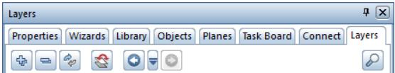

# Expand selected entries

Expands the view so that you can see all subentries of the selected node.

# Collapse all entries

Hides all subentries.

# Invert layer visibility

Inverts the layer visibility.

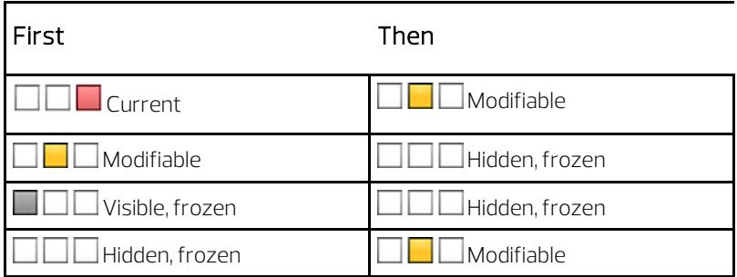

The Default layer becomes the current layer.

Note: To restore the original layer visibility, use Back in layer visibility.

# 0=0

Undoes changes made to the layer visibility or restores changes you have undone. Use $\Bumpeq$ Layer visibility to see the changes made to the layer visibility. You can undo up to 30 changes. This setting is user-specific; it is saved separately for each project.

# Update Layer Structure

Updates the layer structure. If, for example, you have selected List layers used in open documents on the shortcut menu and you delete the last element that uses one of the layers listed, the contents of the list box will not adapt automatically to the new situation. Click $\boldsymbol { \phi } _ { \infty }$ to display the layers that are used in the document.

# Find

Opens the Find... dialog box, where you can find short names or full names of layers or parts thereof.

# Layers

Use the check boxes to define the status of layers:

• DOUBLE-CLICK a layer to make it Current

SHIFT+CTRL+DOUBLE-CLICK makes the selected layer Current and changes all the other layers to Hidden

# Shortcut menu

<table><tr><td>Current</td></tr><tr><td>Modifiable Visible, frozen</td></tr><tr><td>Hidden, frozen</td></tr><tr><td>Select all (Ctrl+A) Cancel selection (Shift+Ctrl+A)</td></tr><tr><td>Isolate selected layers (Shift+Ctrl+double-click) Scroll to current layer</td></tr><tr><td>List layers assigned to currently selected tool List layers used in open documents</td></tr><tr><td>√ List entire layer hierarchy √ Show modifiable layers √ Show visible, frozen layers</td></tr></table>

# Select all $( C _ { \mathsf { t r } 1 + A } )$

Selects all the layers you can see in the palette. The program does not select layers that are not visible, because the corresponding level is collapsed.

# Cancel selection (Shift+Ctrl+A)

Cancels the selection of elements.

Isolate selected layers (Shift+Ctrl+double-click)

Sets all the selected layers to Modifiable. The layer selected last is set to Current; all the other layers are set to Hidden.

# Scroll to current layer

Takes you to the current layer.

# List layers assigned to currently selected tool

Displays only the layers that are assigned to the active tool.

# List layers used in open documents

Displays only the layers in the current drawing file and in drawing files open in edit mode. If all layers are on the default layer, this option is not available.

# List entire layer hierarchy

Lists all the layers.

Show modifiable layers / Show visible, frozen layers / Show hidden, frozen layers

Filters the layers.

# Customize...

Opens the Customize dialog box, Palettes tab. You can choose to display the upper and lower structural levels of the layer hierarchy and define the layer properties (short name, full name, combined format properties, pen, line, color) you want to display. You can also use the shortcut menu of the table header to specify which properties you want to display.

# Bar at the bottom

# Match current layer

When you click this icon, the dialog box will close temporarily; you can click an element in the workspace. The layer of this element becomes the current layer.

# Load favorite

You can retrieve layer settings you have saved as favorite files.

# Save favorite

You can save the current layer setting as a favorite file $( ^ { \star } \cdot \mathtt { l f a } )$ .

# Modify layer status

Opens the Modify Layer Status dialog box.

Set all layers to modifiable - retain current layer

Sets all layers to modifiable without changing the current layer.

# Select Layer Print Set

Use this to select a defined print set (see "Using print sets" on page 242).

# Select Layer Privilege Set

You can select the current privilege set.

# >> Expand

Opens the Layer dialog box (on page 243).

Modules palette

If the configuration (see "Default configurations" on page 19) you use is not the Actionbar configuration, you can use the Modules palette to switch between task areas.

Tip: In this case, you can also switch between task areas without opening the Modules palette. All you need to do is right-click in the workspace, point to Switch Module on the shortcut menu and click the task area you want to open. This is only possible in design mode (see "Design mode and navigation mode" on page 106).

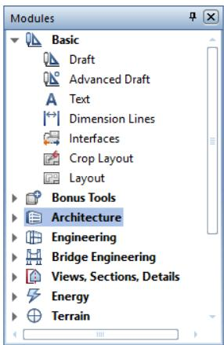

This palette has its own shortcut menu, which provides tools for defining how this palette looks: text only, icons only or text $^ +$ icons. In addition, you can hide the $" + "$ and ‘-‘ signs.

Tools palette

If the configuration (see "Default configurations" on page 19) you use is not the Actionbar configuration, you can select most tools directly in the Tools palette.

The Tools palette has the following areas:

List box

You can choose a family in the list box at the top.

You can use $\mathcal { P }$ Find to find a tool by entering its name or a part thereof. When the Scan text on status bar option is selected, the program also scans the text that the status bar displays for each tool. If the program finds a tool, you can activate this tool straight from the Find dialog box.

Tabs

You can use the tabs to select a task area in the current family. You can use Customize... on the shortcut menu to define the position of the tabs. In addition, you can choose to display the tabs with or without text.

#

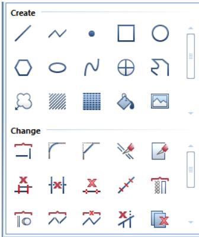

The Tools area shows the tools of the currently selected task area. You can use Customize... on the shortcut menu to define the icon size and choose to display the icons with or without text

The tools in this palette are the same as those on the Create, Create II and Change toolbars. By changing these toolbars, you can also change the contents of the Tools palette.

# Viewports

You edit your model in viewports. Here, you create or modify the required design entities. While doing so, you identify distinctive points and select the view type and view appropriate to the current status of your work.

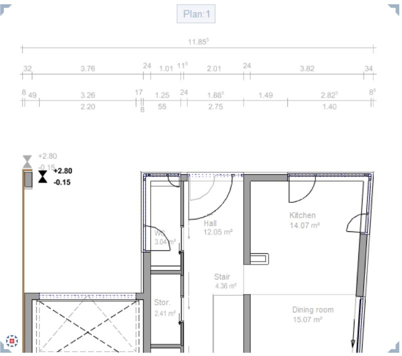

To maximize the workspace, you can float all viewports freely. If you have a second monitor, you can leave the Allplan window on one monitor, using it as a "toolbox", while editing your model in the independent viewports you place on the second monitor.

By opening several viewports in parallel and arranging them as you need, you can display your model by using different views, scales and view types. You can display a different view in each viewport. For example, you can display a section, the entire design or an isometric view.

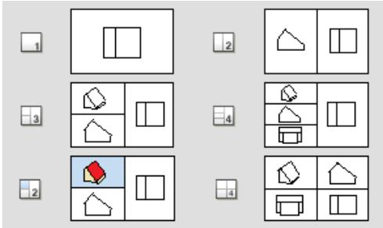

You can find the tools for using and arranging viewports in the Window (see "Tools for arranging viewports" on page 71) dropdown list on the Quick Access Toolbar (on page 21). You can also select one of the standard viewport arrangements and then modify this arrangement to suit your needs.

With the Connected option, you can specify how the viewports interact when they are docked to the Allplan window.

If this option is active, the viewports are connected: As soon as you change the size of a viewport, all the other viewports adapt automatically; new viewports will be fitted into the arrangement. If this option is not selected, you can place and resize the viewports independently of each other within the Allplan window.

# Viewport toolbar

You can find the viewport toolbar at the bottom of the viewport. When you work with multiple viewports, each viewport has its own viewport toolbar.

You cannot see the viewport toolbar until you point to the lower border of the viewport, guaranteeing as large a workspace as possible.

Tip: You can also show the viewport toolbar all the time. To do this, open the View menu, point to Toolbars and click Show Viewport toolbar. To move the viewport toolbar to the top of the viewport, open the View menu, point to Toolbars and click Viewport Toolbar at the Top.

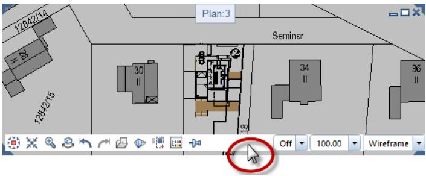

The viewport toolbar contains the following tools:

Use

# Left area:

View flyout menu

#

You can use this tool to choose between plan view and any of the predefined standard views.

Zoom All

You can use this tool to select the display scale so that you can see all the elements in the visible files.

Note: If you have loaded a view by using Save, Load View, you can see this view only.

Zoom Section

You can use this tool to zoom in on a section. To do this, enclose the elements you want to zoom in a selection rectangle.

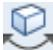

Navigation Mode

You can use this tool to turn navigation mode (see "Design mode and navigation mode" on page 106) on or off in the active viewport. In this mode, you can use the mouse to view a 3D model.

Note: You can move in sphere mode or in camera mode (while selecting and holding CTRL KEY).

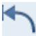

Previous View

You can use this tool to restore the previous view or display scale (if you had selected a different view or scale before you selected the current setting).

Next View

You can use this tool to restore the next view or display scale (if you have already selected a subsequent view or scale).

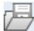

Save, Load View

You can use this tool to save the current view under a name of your choice or retrieve a view you saved beforehand.

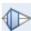

3D View

You can use this tool to display 3D models in three-dimensional space in a perspective view by entering an eye point (observer) and a target point. You can choose between parallel projection and central projection for the perspective view. You can also use this tool to create a view based on the building structure.

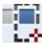

Element Selection

Drawing File Selection

You can use this tool to select the design entities you want to display in the active viewport. The program temporarily hides all the other design entities.

You can use this tool to temporarily hide drawing files that are currently visible in the active viewport.

# Tool

#

# Always on Top

You can use this tool to place the viewport so that it is always on top (that is, in front of) the other ones.

You can only use this tool if you have not selected the Connected option and the viewport is notmaximized.

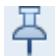

Right area:

Exposure (only for the Animation and RTRender view types)

You can use this box to control the brightness in viewports of the Animation or RTRender view type. You can enter a value between $- 2 5$ and 25.

# Important!

This setting only changes the way elements look in the active viewport. It has no effect on rendering.

Section Display

You can use this tool to display your design in an architectural section for a which you have already defined the Clipping Path.

Display Scale

You can use this tool to select the scale for displaying the model on the screen.

The display scale governs the ratio between the model on the screen and its real-life dimensions. The scale therefore changes automatically if you change the size of sections on the screen. You can see the current display scale on the viewport toolbar (on page 69) in the lower border of a viewport.

Wireframe

View Type

You can use this list box to select one of the predefined view types (Wireframe, Hidden, Animation, Sketch or RTRender) for the active viewport. Of course, you can also select a view type you defined yourself.

Click $\boldsymbol { \mathcal { S } }$ to modify various settings of the view types. The settings apply to all the viewports that use this view type. Click New view type to define and save your own view types.

When Layout Editor is open, you can switch between Design view and Print view ( $=$ preview of resulting printout).

# Tools for arranging viewports

This table gives you an overview of the tools you can use to arrange the viewports (on page 67) on the screen. You can find these tools in the Window drop-down list on the Quick Access Toolbar (on page 21).

# Tool

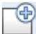

<table><tr><td>Use</td><td></td></tr><tr><td>Full Screen</td><td>You can use this tool to hide screen elements such as toolbars (except custom toolbars),the menu bar and the border of the viewport.This maximizes your workspace.</td></tr><tr><td>New viewport</td><td>You can use this tool to open a new viewport for the current document.</td></tr><tr><td>Animation Window</td><td>You can use this tool to open a new viewport displaying your 3D modelin Animation. Navigation mode(see"Design mode and navigation mode" on page 106)isactive by default.</td></tr><tr><td>1Viewport</td><td>You can use this tool to divide the workspace into a number of different preset viewports.For instance,you might have three viewports,each</td></tr><tr><td>2 Viewports</td><td>showing a different view of the design.</td></tr><tr><td>3 Viewports</td><td></td></tr><tr><td>4 Viewports (1)</td><td></td></tr><tr><td>4 Viewports (2)</td><td></td></tr><tr><td>2+1 Animation Window</td><td>You can use this tool to divide the workspace into three viewports. The upper-left viewport automatically shows the Animation view type.</td></tr><tr><td>right</td><td>Arrangement-To theleft， You can use this toolto define where the viewports are arranged when you 田Arrangements.You can choose between To select one of these the left and To the right.</td></tr><tr><td>Save,Load Arrangement</td><td>You can use this toolto save the current arrangement or load an arrangement you saved beforehand.</td></tr><tr><td>Arrange Icons</td><td>You can use this tool to arrange the icons of minimized viewports at the bottom of the viewport.</td></tr><tr><td>Tile Horizontally</td><td>You can use this toolto show all open viewports stacked. All viewports are the same size.If more than three viewports are open,the program arranges the viewports in several columns.</td></tr><tr><td>Tool</td><td>Use</td></tr><tr><td>Tile Vertically</td><td>You can use this tool to show allopen viewports side by side. All viewports are the same size.If more than three viewportsare open, the program arranges the viewports in several rows.</td></tr><tr><td>Connected</td><td>Note: You can only select this tool when Connected is not selected. Select Connected to connect allopen viewports,displaying boundary lines between the viewports.When you change the size of a viewport,all the</td></tr><tr><td>List of viewports</td><td>otherviewportsadapt automatically.New viewports willbe fitted into the arrangement. Lists the viewports that are currently open.If ten or more viewports are open, you can use More Viewports to access those viewports.</td></tr><tr><td>More Viewports</td><td>Click the viewport to which you want to switch. If more than nine viewports are open, you can find More Viewports...in</td></tr></table>

# Setting up viewports

# To use several viewports

1 Go to the Quick Access Toolbar (on page 21) and click Window.

2 Click one of the standard viewport arrangements.

Or:   
Open a new viewport by clicking New Viewport or Animation Window.

# Floating viewports freely

You can float viewports freely on the screen, making them independent of the Allplan window. You can use free-floating viewports as you would in any other Windows program.

Note: When you exit Allplan, the program closes all viewports, including the free-floating ones.

# To float a viewport

1 Point to the title of the viewport you want to float.   
2 Select and hold the left mouse button.   
3 Drag the viewport to its new position outside the Allplan window. Then release the mouse button. Note: It is the position of the cursor that is important. To float a viewport, you must position the cursor outside the working area (on page 19).

# Placing viewports in front of or behind the Allplan window

You can place free-floating viewports in front of the Allplan window without docking them.

By selecting ALT $^ +$ TAB, you can then switch between the Allplan window and the free-floating viewports as you would between independent Windows programs.

This option is particularly useful for workstations with a single monitor.

# To place a viewport in front of or behind the Allplan window

1 Select the CTRL KEY.   
2 Drag the viewport to its new position in front of the Allplan window.   
3 Release the mouse button and then the CTRL KEY.   
4 Select and hold the ALT KEY.   
5 Select the TAB KEY to select the viewport you want to bring to the front.   
6 Release the ALT KEY.

# Docking viewports to the Allplan window

The setting of the Connecting option (Quick Access Toolbar - Window menu) controls how Allplan arranges the viewports in the working area:

If this option is selected, Allplan automatically defines the size and position of the viewport to be docked in accordance with the number and configuration of the other viewports that are currently open in the working area. If this option is not active, Allplan places the viewport to be docked exactly where the cursor and thus the title of the viewport is located when you release the mouse button. In doing so, Allplan does not change the size of the viewport.

# To dock a free-floating viewport to the Allplan window

1 Point to the title of the free-floating viewport. 2 Select and hold the left mouse button. 3 Drag the viewport into the working area (on page 19) of the Allplan window. Then release the mouse button.

# Shortcut menu

When you right-click, the shortcut menu opens where you clicked.

Depending on where you click (in the empty workspace, on a design entity, within a palette and so on) and what you are currently doing, the shortcut menu offers the tools you need for the task at hand.

The tools on the shortcut menu differ depending on the following criteria:

• Clicking within a palette: If you right-click within a palette, you can define how the palettes and the icons therein look. In addition, you can define further palette-specific parameters. Clicking within the Actionbar or in the Allplan window somewhere beyond the workspace: If you right-click within the Actionbar or in the Allplan window somewhere beyondthe workspace, you can control how the toolbars look and what they contain.

• Clicking within a viewport:

In Design Mode (see "Design mode and navigation mode" on page 106) ( Navigation Mode is off):   
If you right-click in the empty workspace without having selected a tool, you can choose from a wide range of edit tools and a number of frequently used general tools.   
But if you right-click a design element, the shortcut menu presents relevant edit tools (see "Shortcut menu in design mode (on page 78)").   
If you have selected a tool which expects you to enter a point, right-clicking opens the shortcut menu for entering points (on page 82).

In Navigation Mode (see "Design mode and navigation mode" on page 106) ( Navigation Mode is on): Regardless of where you click, the shortcut menu provides tools you can use to present the 3D model (see "Shortcut menu in navigation mode (on page 80)"). In navigation mode, you cannot click or select design entities.

Examples of tools on the shortcut menu:

<table><tr><td>Small icons Medium icons</td></tr><tr><td> Large icons</td></tr><tr><td> Very large icons</td></tr><tr><td>Icons only</td></tr><tr><td>Icons + text</td></tr><tr><td> Customize...</td></tr></table>

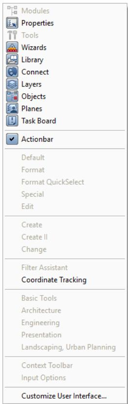

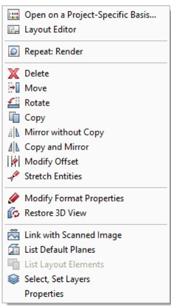

Initial situation:

Initial situation:

Clicking within a palette

Initial situation:

Clicking within the   
Actionbar or   
somewhere beyond the   
workspace

Design mode on Clicking in the empty workspace

# Shortcut menu in design mode

You work in Design Mode (see "Design mode and navigation mode" on page 106) as long as you have switched off Navigation Mode.

If the cursor is within a viewport and you right-click while you are working in design mode, the tools on the shortcut menu differ depending on the following criteria:

# • Clicking in the empty workspace

If you right-click in the empty workspace, you can choose from a wide range of edit tools and a number of frequently used general tools. For example, you can switch to Layout Editor.

# • Clicking a design entity

If you right-click a design entity, the shortcut menu presents relevant edit tools. As soon as you select one of these tools, the program automatically selects the element clicked.

# • Entering points

If you have selected a tool which expects you to enter a point, right-clicking opens the shortcut menu for entering points (on page 82).

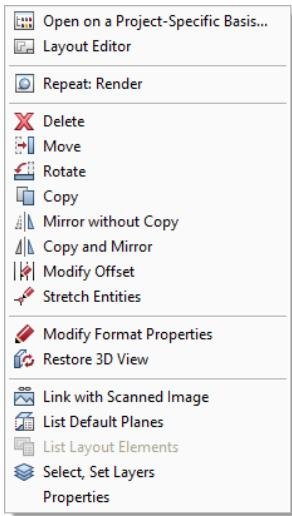

Examples of tools on the shortcut menu when working in design mode:

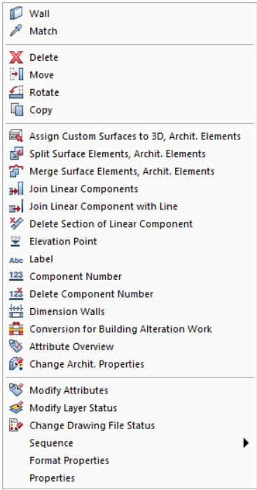

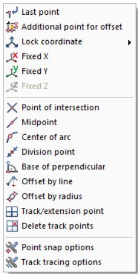

Initial situation:

Initial situation:

Initial situation:

• Design mode on Clicking in the empty workspace • Design mode on Clicking a design entity (for example, a wall)

• Design mode on • Active tool expects you to enter a point Cursor in viewport

You can also find all these tools on the menus or toolbars, where they are described in detail.

# Shortcut menu in navigation mode

If you have activated Navigation Mode and placed the cursor within a viewport, you can open the following shortcut menu by right-clicking.

Using the tools on this shortcut menu, you can modify and manipulate the scene without having to select other tools or switching navigation mode off.

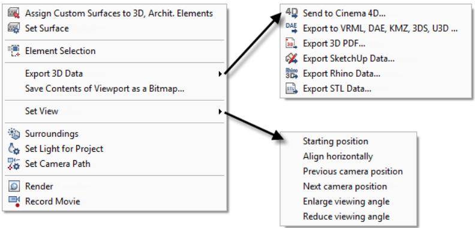

Initial situation:

• Navigation mode on • Cursor in viewport

# Assign Custom Surfaces to 3D, Archit. Elements

Assigns custom surfaces to 3D surfaces, 3D objects and architectural elements. To assign a surface, simply drag the surface to the relevant object.

# Set Surface

Opens the properties of the surface or background clicked. You can then change these properties.

The following dialog boxes open:

• If you click in the background, the Define Surfaces dialog box opens. The same dialog box appears when you select Set Surface.   
• If you click an element, the Modify Surfaces dialog box opens.

# Element Selection

Using Element Selection, you can select the design entities you want to display in the current viewport. The program temporarily hides all the other design entities.

Click

Element Selection again to switch it off.

# Export 3D Data

Opens a submenu where you can select the following tools:

$^ { 4 9 }$ Send to Cinema 4D   
Export to VRML, DAE, KMZ, 3DS, U3D   
Export 3D PDF   
Export SketchUp Data   
Export Rhino Data   
Export STL Data

# Save Contents of Viewport as a Bitmap

Saves the contents of the current viewport as a bitmap.

# Set View

Opens a submenu where you can select the following tools:

• Starting position • Align horizontally • Previous camera position • Next camera position • Enlarge viewing angle • Reduce viewing angle

Note: The first four tools apply to the current camera path (see

Setting the camera path)! If you have not defined a camera path, these tools have no effect.

# Surroundings

Defines natural lighting conditions (location, season, position of north, position of sun and so on) for the 3D model.

# Set Project Light

Sets artificial light sources for the 3D model. These light sources can be both inside and outside the model.

# Set Camera Path

Defines camera positions, thus creating the story board for a movie. You can play back this movie immediately or later. If you want, you can also record it.

# Render

Calculates photo-realistic bitmaps from the current view of the 3D model, taking into account the selected lighting properties and surface properties.

# Record Movie

Calculates a sequence of animated or rendered bitmaps from a 3D model, saving this sequence as an AVI movie.

# Shortcut menu for entering points

Tip: When you point to an element and right-click, the program automatically applies the tool selected on the shortcut menu to the element clicked and places the point.

When you open the shortcut menu in the workspace, just click the element to which you want to apply the tool.

# Tools and options on the shortcut menu

Right-click to access the tools and options on the shortcut menu, helping you place and snap to points.

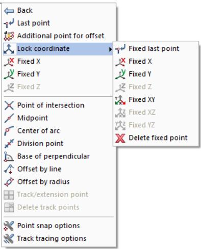  
Figure: Tools and options on the shortcut menu

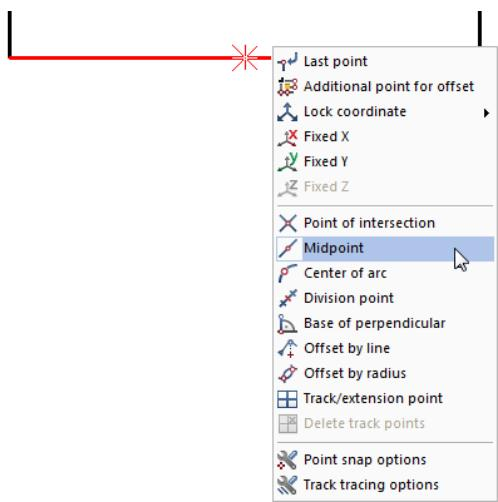  
Figure: Identify the midpoint of an existing line by opening the shortcut menu directly on the element

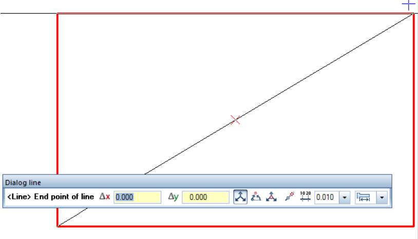  
Figure: Midpoint of diagonal by clicking the endpoints of a box

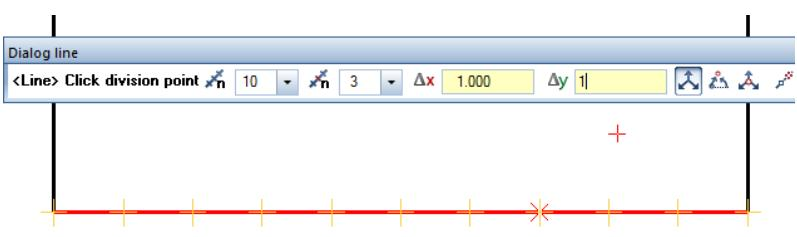  
Figure: Division point

Context-sensitive tools and options

The shortcut menu and dialog line offer only functions and options that are appropriate to the currently active tool:

• Only when you have selected

Enter at right angles or

Cursor snap will the system prompt for the dx and dy values or length values.

The $\mathbb { A }$ Use coordinate option is available with $\mathbb { A }$ Global coordinates only.

When you have selected Enter at right angles, $\lneq$ Change direction is available on the shortcut menu.

# Tools and options on the shortcut menu, overview

Use

# Last point

Uses the last point entered.

# Additional point for offset

The point snapped is fixed; the offset values entered in the x-direction, y-direction and z-direction apply to this point even if the crosshairs snap to other points.

# Lock coordinate

Uses the current coordinate as the fixed coordinate. You can select the x-coordinate, y-coordinate or zcoordinate or a combination thereof on a submenu.

# Point of intersection

Finds the point of intersection of two elements like lines, circles, and ellipses. This tool also finds virtual points of intersection between elements obtained by extending the elements.

# Midpoint

Finds the midpoint of an element or a line that you enter.

# Center of arc

Finds the midpoint of an arc, circle or curve.

# Division point

Uses temporary markers to divide an element (or a line that you enter) into an equal number of sections and snaps to these points.

# Base of perpendicular

Snaps to the base of a perpendicular on an element by dropping a perpendicular from a point onto the element or the extension of the element. The element can be a line, polyline, splines, circle, ellipse, and so on.

# Reference point

Places a point on an element that is at a precise distance from a reference point. The reference point can be the end point of an element or a point that you enter.

# Offset by radius

Finds a point obtained from the point of intersection of two new circles that you enter.

# Track, extension point

Places a track point.

# Delete track points

Deletes all the track points placed; the track lines will be recalculated.

# Point snap options

Opens the Options dialog box, displaying the Point snap page. You can specify the kinds of points the program is to scan the workspace for. You can also turn on CursorTips. These are small symbols that appear at the center of the crosshairs to indicate the type of point (midpoint, intersection, grid point, ...) the system will snap to when you click.

In addition, you can define general snap options.

# K

# Track tracing options

Opens the Options dialog box, displaying the Track tracing page. You can turn track tracing on and off. In addition, you can define (display) settings for track tracing.

# 田

# Terrain point definition

Perpendicular through Station (Actionbar

- Surroundings role - Landscaping task - Site Plan task area), you can define the primary point number and the secondary point number.

# Shortcut menu for creating and modifying elements

Right-click to open the shortcut menu. Depending on where you click and what you are currently doing, the shortcut menu offers the tools you need for the task at hand.

If you open the shortcut menu in a viewport and you work in design mode (see "Design mode and navigation mode" on page 106), the shortcut menu offers tools you can use to create and modify elements (see "Shortcut menu in design mode (on page 78)"):

When you right-click an element, you can see edit tools appropriate to the element clicked. As soon as you select one of these edit tools, Allplan automatically selects the element.

If you double-click an element with the right mouse button, Allplan starts the tool that was used to create the element clicked and automatically copies its current parameters.

• If you right-click in the empty workspace, you can choose from various edit tools and general tools. You can also switch to Layout Editor.

Creating similar elements by using the shortcut menu

Right-clicking an element while you are working in design mode (see "Design mode and navigation mode" on page 106) will open a shortcut menu. The tool at the top is the tool that was used to create the element. When you click this tool on the shortcut menu, the program opens this tool, but it does not adopt the parameters of the element clicked.

# To create similar elements with the shortcut menu

• Double-click the element with the right mouse button. Allplan adopts all the properties of the element clicked. Or: Right-click the element. Then click the tool at the top of the shortcut menu. Allplan will not adopt the properties of the element clicked.

Editing elements by using the shortcut menu

# To edit and modify elements by using the shortcut menu

Right-clicking an element in design mode (see "Design mode and navigation mode" on page 106) opens a shortcut menu with a selection of appropriate edit and modification tools. The shortcut menu shows the element type together with a number of general and special (element-specific) edit tools.

You can find the following tools on the shortcut menu:

Use Format Properties to modify the general properties of an element (for example, pen, line color, layer).

• Use Properties to modify the special properties of an element. You can do this in the same way as you define the properties.

# Dialog line

The dialog line below the workspace is where the program prompts you to enter values. Alternatives are indicated by commas or the word ‘or’.

Note: You can also do basic calculations in the dialog line. In addition, you can transfer values obtained with $\boxdot$ Measure directly to the dialog line. By using $C { \mathsf { t r } } { \mathsf { l } } + { \mathsf { C } }$ and $\mathsf { C t r } | + \mathsf { V }$ , you can copy and paste text into the dialog line.

# Status bar

<table><tr><td></td><td>The status bar is the bottom line of the Allplan window.You can hide it on the View menu - Toolbars - Status Bar. Various types of information on the current drawing file are visible here- such as the reference scale and unit of length. You can also modify these values by clicking them.</td></tr><tr><td>Coordinate tracking</td><td>Overview of elements on the status bar: Shows the coordinates of the crosshairs in the X-direction,y-direction and Z-direction and the absolute distance to the last point entered.You can show and hide coordinate tracking when you open the shortcut menu in the Allplan</td></tr><tr><td>Country</td><td>window somewhere beyond the workspace. Shows the country selected for the current project.</td></tr><tr><td>Drawing type</td><td>Shows the current drawing type.</td></tr><tr><td>Scale</td><td>Shows the current reference scale. You can change the scale by clicking.</td></tr><tr><td>Length</td><td>Shows the current unit of length. You can change the unit by clicking.</td></tr><tr><td>Angle</td><td>Shows the current system angle and the current unit of angle.By clicking the angle,you can switch the system angle to predefined default values. To</td></tr><tr><td>%</td><td>specify any angle,click Define and enter the required angle.You can change the unit by clicking. Shows how much of the memory reserved for documents has already been allocated (asa percentage).</td></tr></table>

# Input options

The toolbar with the input options appears when a tool offers several implementation options. You can dock the input options to the top or bottom of the window.

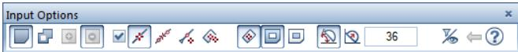

Input options for entering polylines

# Basic approach

Using the mouse

The functions of the three mouse buttons change with the task at hand in Allplan. There are three different states.

Note: The information in the tables is based on a 3-button mouse. If you work with a 2-button mouse, you can simulate the middle mouse button by selecting and holding the Ctrl key and the left mouse button at the same time.

# Using the mouse (no tool is activated)

<table><tr><td>Mouse button</td><td>This ...</td><td>Does this...</td></tr><tr><td>Left 西</td><td>Click element</td><td>Selects the element with handles.</td></tr><tr><td rowspan="8"></td><td>Shift+click element</td><td>Selects an additional element with handles or cancels its selection.</td></tr><tr><td></td><td>Selects an entity group or a symbol with handles.</td></tr><tr><td>Ctrl+click element Double-click</td><td>Selectsan additional element with handles. Displays the element&#x27;s properties.</td></tr><tr><td>element</td><td></td></tr><tr><td>Ctrl+double-click element Click and drag in</td><td>Displays the element&#x27;s format properties. Selects elements with handles.Selects intersected elements depending on</td></tr><tr><td>workspace Shift+click and drag</td><td>the setting on the Actionbar -Work Environment or Filter task area. Selects elements in a region with handles or cancels the selection.</td></tr><tr><td>in the workspace Double-click in</td><td></td></tr><tr><td>workspace</td><td>Opens the Open on a project-specific basis: drawing files from fileset/building structure dialog box.</td></tr><tr><td>Middle</td><td>Ctrl+double-click in workspace</td><td>Opens the Layer dialog box.</td></tr><tr><td rowspan="5">面</td><td>Double-click</td><td>Sets the display scale so that you can see all visible elements in their</td></tr><tr><td>Ctrl+double-click</td><td>entirety. Redraws the current section that is visible on the screen.</td></tr><tr><td>Click and drag</td><td>Pans in the active viewport.</td></tr><tr><td>Shift+click and drag</td><td>Pans in the active viewport.</td></tr><tr><td>Ctrl+click and drag</td><td>Zooms in.</td></tr><tr><td></td><td></td><td></td></tr><tr><td></td><td>Alt+click and drag</td><td>Zooms dynamically (cursor = center). Move the cursor up to zoom in; move the cursor down to zoom out.</td></tr></table>

<table><tr><td>Right Click element 面</td><td>Displays the shortcut menu for the element clicked.The shortcut menu offers general toolsand edit tools that are specific to the element in question.</td></tr><tr><td>Click in workspace</td><td>Displays the general-purpose shortcut menu.</td></tr><tr><td>Ctrl+click an element or in</td><td>Opens the shortcut menu for selecting elements.</td></tr><tr><td>workspace Double-click</td><td></td></tr><tr><td>element</td><td>Opens the tool that was used to create the element and adopts all the parameters of the element.</td></tr><tr><td>Double-click in workspace</td><td>Opens the Layer dialog box.</td></tr></table>

Using the mouse (a drafting tool is activated)   

<table><tr><td>Mouse button</td><td>This..</td><td>Does this...</td></tr><tr><td>Left 白</td><td>Click in workspace or click an element Ctrl+Click</td><td>Places and snaps to points in the workspace. Places points in exact alignment with existing points (linear snap). After having placed the first point, you can create additional points so that</td></tr><tr><td></td><td>Shift+Click</td><td>theyare orthogonal ifEnter at rght anglesor Enter using cursor snap is not selected in the dialog line).</td></tr><tr><td></td><td></td><td>Sets the display scale so that you can see all visible elements in their</td></tr><tr><td>Middle 面</td><td>Double-click</td><td>entirety.</td></tr><tr><td></td><td>Click and drag</td><td>Pans in the active viewport.</td></tr><tr><td></td><td>Shift+click and drag</td><td>Pans in the active viewport.</td></tr><tr><td></td><td>Ctrl+click and drag Alt+click and drag</td><td>Zooms in. Zooms dynamically (cursor = center).Move the cursor up to zoom in; move</td></tr></table>

<table><tr><td>Right</td><td>Click in the Opens the shortcut menu for entering points. workspace</td></tr><tr><td></td><td>Confirms the entry when requested in the dialog line: &lt;confirm&gt;</td></tr><tr><td>Click a toolbar</td><td></td></tr><tr><td></td><td>Closes a tool(= ESC key).</td></tr></table>

Using the mouse (an edit tool is activated)

<table><tr><td>Mouse button</td><td>This...</td><td>Does this ...</td></tr><tr><td rowspan="3">Left 白</td><td>Click element</td><td>Identifies or selectsan element.</td></tr><tr><td>Shift+click element</td><td>Identifies or selectsan entity group.</td></tr><tr><td>Click and drag in workspace</td><td>Selects elements ina rectangular region.</td></tr><tr><td rowspan="3">Middle 面</td><td>Double-click</td><td>Sets the display scale so that you can see all visible elements in their</td></tr><tr><td>Click and drag</td><td>entirety. Pans in the active viewport.</td></tr><tr><td>Shift+ click and drag</td><td>Pans in the active viewport.</td></tr><tr><td rowspan="2">Right 西</td><td>Ctrl+click and drag</td><td>Zooms in.</td></tr><tr><td>Click in the workspace</td><td>Depends on the setting in Options- Desktop environment -Mouse and crosshairs page: Opens and closes the brackets or opens the shortcut menu for selecting elements.</td></tr><tr><td rowspan="2"></td><td>Ctrl+Click in workspace</td><td>Opens the shortcut menu for selecting elements.</td></tr><tr><td></td><td>Confirms the entry when requested in the dialog line: &lt;confirm&gt;</td></tr><tr><td></td><td>Click a toolbar</td><td>Closes a tool(= ESC key).</td></tr></table>

# MiddleLeft

Click element with middle mouse button and then left mouse button

Selects a segment.

MiddleRight

Click in workspace with middle mouse button and then right mouse button

Turns on the selection rectangle. Enclose the required elements in a selection rectangle.

# Using a mouse with a wheel

A mouse with a wheel is a conventional 2-button mouse with a mouse wheel between the left mouse button and the right mouse button. By turning this mouse wheel, you can zoom in on your design and move through dialog boxes.

# You can use the mouse wheel to do the following:

Zoom sections: Just move the wheel. You can zoom in (by turning the mouse wheel in a forward direction) and zoom out (by turning the mouse wheel in a backward direction). The zoom factor is $20 \%$ . The cursor defines the zoom center. In dialog boxes, you can scroll up and down by turning the mouse wheel accordingly.

# Activating and closing tools

Allplan offers you several options to select, run and close tools.

Activating tools

• You can click the relevant icon.   
You can double-click the element with the right mouse button. This activates the tool that was used to create the element, adopting all settings and parameters of the element you clicked.   
• You can select tools by using keyboard shortcuts. To get a list of all predefined shortcuts, click Shortcut Keys in the $\textcircled{7}$ Help dropdown list (right side of the title bar). In addition, the keyboard shortcut for tools where one has been defined is shown in the ToolTip.   
• You can use the shortcut menu.   
• You can activate tools on the menu bar.

Running tools

After you have clicked a tool, you can find instructions in the dialog line. For example:

• Point snap (for example, $\diagup$ Line tool: From point) Selecting elements (for example, $\mathbb { X }$ Delete tool: Select elements you want to delete).

When appropriate, you can see a dialog box or context toolbar so that you can make settings for the tool.

Closing tools

• Select the Esc key on the keyboard.   
• Right-click the Actionbar or a toolbar.   
• Activate a different tool.

# Correcting errors

When you make an error in Allplan, you can use $\nLeftrightarrow$ Undo (Quick Access Toolbar) to correct the error. The number of undo steps is unlimited. For example, if you inadvertently moved an element, you can annul the move. You can go back (undo) as many steps as you want, as far back as the last time the data was saved. Note that certain actions, such as switching between drawing files or switching to Layout Editor, make Allplan save the data automatically.

  
Tip: If you inadvertently deleted elements, you can quickly restore them by immediately right-clicking in the workspace twice (the Delete tool must still be active).

You can undo several steps in one go. Click the arrow beside the Undo icon and drag the cursor over all the steps you want to undo. Then release the mouse button.

Redo redoes operations that you have undone. Redo operations, however, are not possible if you have added new design entities in the meantime.

Note: You can also activate $\spadesuit$ Undo while another tool is active. The tool in question will close and all the entries you made while it was active are undone.

# Saving your work

When you exit Allplan, all open drawing files will be saved automatically. You do not need to save your data explicitly (as in other programs) before you exit Allplan. Exception: NDW files must be saved manually.

In certain circumstances, Allplan makes backup copies of your drawing files or layouts. For more information, see Using .bak files (on page 99).

While you are working in Allplan, you can save your data manually or you can have the program do so automatically after a certain number of steps. This applies to the data in the current drawing file and in drawing files that are open in edit mode. Some actions (for example, switching to Layout Editor) also make Allplan save the data automatically.

# Allplan saves the data when you

• Switch to a different drawing file, fileset, layout or project.

• Switch to Layout Editor.

Exporting data from Allplan

Save manually with Save (Quick Access Toolbar or CTRL $. + 5$ ) or Save and Compress (Allplan icon on the title bar).

Save automatically. You can activate this tool and define the number of steps between saves in the $8$ Options on the Desktop environment page. Allplan will not save the data until you close the current tool.

Allplan does not compress the data saved automatically or manually with Save. In other words, the document size will not be smaller although you have deleted data. The reason for this is that the data you have deleted is still in the memory so that you can restore the data even after saving. Use $\oplus \frac { 3 } { 4 }$ Save and Compress to compress the data when you save manually. All the other actions that save data also compress the data.

Using .bak files

Specific actions cause Allplan to make backup copies (files ending in .bak) of the drawing file or layout. The .bak files and the original drawing files and layouts are stored in the same folder; that is, the project folder. You can choose to create .bak files in the $8$ Options on the Desktop environment page.

If you have selected the wrong tool, you can use the .bak file to restore the original data of a drawing file or layout. All you need to do is rename the drawing file or layout in File Explorer.

# Allplan creates .bak files

When you select the Copy, Move Elements between Documents tool.

• When you delete drawing files and layouts by using Del Document....

When you delete the contents of drawing files and layouts in the Open on a project-specific basis: drawing files from fileset/building structure or layouts dialog box.

• Before you import data to drawing files by using

• Before you import data by using Add drawing files and layouts with resources to project.

Note: Note that these backup copies can increase the volume of data involved in backing up projects. Therefore, delete unnecessary .bak files before you start the backup.

To use .bak files

# For example: You have accidentally copied wrong elements to drawing file 4711.

1 Find out which folder contains the current project: Start the Services application, select the Service menu, choose Hotline Tools and double-click wopro.

2 Exit the Allplan project.

3 Delete or rename the file tb004711.ndw. You can name it tb004711.ndw.old, for example.

4 Rename the file tb004711.ndw.bak. Enter tb004711.ndw for the new name.

# For example: You have accidentally copied wrong elements to layout 815.

1 Find out which folder contains the current project: Start the Services application, select the Service menu, choose Hotline Tools and double-click wopro.

2 Exit the Allplan project.

3 Delete or rename the pb000815.npl file (for example, pb000815.000.old).

4 Change the name of the pb000815.000.bak file to pb000815.npl.

# Using the clipboard

In Allplan you can copy elements to the clipboard and insert them in any drawing file or application. The input options provide numerous tools that help you place elements.

Note: You cannot use the clipboard when you define patterns and fonts.

Allplan features

You can use the clipboard in Allplan just as you would in any other Windows application. Note, however, that there are some special elements and properties:

Layer: Elements retain their layers. Elements on frozen layers (visible and hidden) will not be copied. Default planes: You must use $\mathsf { C t r l + A }$ to select default planes. See also "Behavior of default planes when copying or moving elements between documents" in the Allplan Help. Group number: Elements get new group numbers when you place them. Elements that had the same group numbers still have the same group numbers. Document size: The program displays an error message if the file size is too large after you have inserted elements.   
• Texts: If the application from which you have copied texts to the clipboard is an OLE server (such as Microsoft Word or Microsoft Excel), the contents of the clipboard will be pasted as an OLE object into Allplan. To paste the contents of the clipboard as normal text, use Paste Contents – Unformatted (Unicode) Text. Text of this kind gets the current text parameters. FEA and Allfa elements: FEA and Allfa elements cannot be copied to the clipboard.

#

Use this tool to copy selected elements to the clipboard. You can then paste these elements from the clipboard as often as you need. To do this, use Paste and Paste to Original Position. The elements can also be pasted into other applications. This command is not available when no element is selected.

# Cut

Use this tool to delete selected elements and move them to the clipboard. You can then paste these elements from the clipboard as often as you need. To do this, use Paste and Paste to Original Position. The elements can also be pasted into other applications. This command is not available when no element is selected.

# Paste

You can paste Allplan elements, text (for example, from a wordprocessing program) and bitmaps from the clipboard into Allplan. This tool is only available in plan view. This command is not available if the clipboard is empty or contains elements that cannot be pasted into Allplan.

If the application from which you have copied text to the clipboard is an OLE server (such as Microsoft Word or Microsoft Excel), the contents of the clipboard will be pasted as an OLE object into Allplan. Use Paste Contents to paste the contents of the clipboard as normal text.

Note: Allplan elements can only be pasted from the clipboard into the same type of document from which they were copied to the clipboard. The contents of the clipboard will always be pasted into the active document even if the data was copied from a file open in edit mode.

Pasting elements from the clipboard into Allplan

The input options provide a number of tools that help you place elements.

Allplan elements are inserted as original data (in other words, with attributes and properties). In the case of text, the current text parameters apply. You can also use the clipboard to insert bitmaps. The following settings are used:

• Color depth: several colors • Transparency: off; color: black. • Width: 100 pixe $S = 1 0 0$ 0mm

The clipboard supports the following bitmap formats: DIB (or BMP) and WMF.

Note: When the clipboard contains several formats supported by Allplan, you can use the Paste Contents tool to select a format.

Pasting Allplan elements into other applications

When you paste Allplan elements into another application by using $\mathsf { C t r } | + \mathsf { V }$ , the elements are inserted as Windows Enhanced Metafile. But when the clipboard contains text elements (for example, normal text lines, paragraph text, component numbers, labels), these elements will always be pasted as ”pure” text into other applications.

Paste to Original Position

You can use Paste to Original Position to insert Allplan elements in their original position. This command is not available if the clipboard is empty or does not contain any Allplan elements.

Note: If you insert these elements in the same document, they exist twice in the same position.

Paste Contents

You can use this tool to specify the contents of the clipboard you want to insert into Allplan. You can use this tool when the clipboard contains several formats supported by Allplan (for example, bitmap and pure text).

# Controlling what’s on your screen

Allplan offers various tools you can use to control how your model and its design elements appear on the screen. Thus, you can always choose the tool best suited to the task at hand.

You can access these tools from various places in Allplan. For example, you can use the View and Window (see "Tools for arranging viewports" on page 71) drop-down lists on the Quick Access Toolbar (on page 21). You can also use the shortcut menu (see "Shortcut menu in navigation mode" on page 80) or the viewport toolbar (on page 69). You can even use the keyboard and mouse to control what's on your screen.

# Design mode and navigation mode

Depending on whether you are designing or you want to get an impression of the model, you can use two different modes for controlling the display of your model on the screen: design mode and navigation mode.

Each mode has its specific properties:

In design mode, you can find the most important tools for drafting and designing directly on the shortcut menu (see "Shortcut menu in design mode" on page 78). You must select this mode if you want to identify points and design entities. In design mode, you usually use the mouse for drafting and designing

You are working in design mode as long as $\circledcirc$ navigation mode is notactive.

Navigation mode, on the other hand, focuses on motion. In other words, the model itself moves or the observer moves around the model, viewing it. Here, you use the mouse and the tools on the shortcut menu (see "Shortcut menu in navigation mode" on page 80) to move around the 3D model and to visualize it. Therefore, you cannot click or select individual design entities in navigation mode.

You are working in navigation mode as soon as you selectthe

As you can select the mode separately for each viewport, you can quickly and easily switch from one viewport in design mode to another viewport in navigation mode and check your design there.

# View, perspective and scale

In each viewport, you can zoom in on any section as close as you want $\mathrm { . } =$ enlarging the section). In addition, you can display the entire design with just one click, pan or move around your model in three dimensions.

The easiest way to do this is to use the mouse and the tools on the viewport toolbar (on page 69). Of course, you can also use the tools on the menus or keyboard shortcuts.

Allplan saves the individual perspective views and scales so that you can undo and redo your steps.

# Controlling the view by using the mouse

You can use the mouse to control the parameters defining the view of your model. These parameters include the (perspective) view, viewing angle, viewing direction, display scale and many more. Whether you want to zoom in, pan or change the viewing angle - you can achieve all these tasks just with the mouse.

The mouse buttons have different functions depending on whether you work in design mode (see "Design mode and navigation mode" on page 106) or navigation mode (see "Design mode and navigation mode" on page 106).

# Controlling the view by using the keyboard

You can use the mouse to view or move through your model. In addition, you can use various keyboard shortcuts to move around step by step or to control camera positions you have already defined

If you work in navigation mode (see "Design mode and navigation mode" on page 106), you can also use the shortcut menu to access the bold keyboard shortcuts.

<table><tr><td colspan="2">Overview of keyboard shortcuts</td></tr><tr><td>Keyboard shortcut</td><td>Tool</td></tr><tr><td>F2</td><td>Render</td></tr><tr><td>F4</td><td>Opens a new viewport of the Animation view type</td></tr><tr><td>F5,double-click with middle mouse button</td><td>Zoom All</td></tr><tr><td>Shift+F5</td><td>Zoom All in All Viewports</td></tr><tr><td>F6,</td><td>Zoom Section</td></tr><tr><td colspan="2">Ctrl+middle mouse button</td></tr><tr><td>Alt+Left arrow</td><td>Takes you back to the previous view</td></tr><tr><td>Alt+Right arrow</td><td>Takes you to the next view</td></tr><tr><td>Shift+Ctrl+S</td><td>Save Contents of Viewport asa Bitmap</td></tr><tr><td>Left arrow,Right arrow, Up</td><td>Rotates the view about the target point</td></tr><tr><td>arrow,Down arrow Backspace</td><td>Takes you back to the previous view</td></tr><tr><td>Shift+Backspace</td><td>Takes you to the next view</td></tr><tr><td>Ctrl</td><td>Switches camera movement</td></tr><tr><td></td><td>from sphere mode to camera mode (while the key is pressed in)</td></tr><tr><td>Ctrl++ (on the numeric keypad)</td><td>Enlarge View</td></tr><tr><td>Ctrl+- (on the numeric keypad)</td><td>Reduce View</td></tr><tr><td>Ctrl+F4 Ctrl+F6</td><td>Closes the active viewport (animation viewport and design viewport) Switches between the active viewport</td></tr><tr><td>Ctrl+Tab Double-click element in</td><td>and viewports in the background (for example,between animation viewport and viewport in which you are drawing)</td></tr><tr><td>animation viewport</td><td>Opens the Properties dialog box of the element.You can modify the properties of the element.</td></tr><tr><td>Ctrl+double-click element in animation viewport</td><td>Opens the Format Properties dialog box of the element. You can modify the element&#x27;s format properties (pen thickness,line type,color,layer).</td></tr></table>

# View types for displaying models

You can select the view type separately for each viewport. You can use different rendering methods (Wireframe, Hidden, Shaded, Sketch or RT_Render) to display your model in many ways.

When Layout Editor is open, you can switch between Design view and Print view $\underline { { \underline { { \mathbf { \Pi } } } } } =$ preview of resulting printout).

# Selecting and displaying elements

In addition to the options described, you can control how design elements look on the screen. For example, you can hide groups of elements to speed up your computer or use a specific pen color or line thickness for all elements.

As opposed to some of the other options, these settings always apply to all viewports.

# Rules defining how elements look on the screen

Elements do not always appear on the screen with the format properties you have defined. In other words, an element to which you have assigned the color red does not necessarily appear in red. The way elements look on the screen depends on several settings controlled by priorities. Top priority is given to several general settings in the $8$ Options (Desktop environment page - General area) for example, followed by the actual format properties of the elements.

The following table shows the sequence in which elements appear on the screen. The Number column shows the priority; the lower the number, the higher the priority of the corresponding setting. If, for example, you have selected the Use same color for elements in reference files option (priority 1), Allplan always uses the color

selected for elements in reference files, regardless of all the other settings such as format properties, construction lines, color stands for pen option and so on.

# No. Setting

# Where?

Options - Display - Drawing file and NDW window

Select, Set Layers -

Select Layer/Visibility tab

Options - Display - Drawing file and NDW window

Show/Hide

1 Color for elements in reference drawing files   
2 Color for elements on frozen layers   
3 Construction-line color and line type   
4 Use color 1 for all elements   
5 Color stands for pen   
6 Default pen, color (for hatching, patterns, fonts)   
7 Text height defines pen thickness (for Allplan fonts)   
8 Pen, line, color from layer   
9 Format properties of the element

Show/Hide

Defaults - Pen Thickness $^ +$ Format QuickSelect

Options - Text

Select, Set Layers

Properties palette or Format toolbar

# Display sequence of elements

The display sequence of elements on the screen depends on several factors. The following table shows the sequence in which elements appear on the screen. The Number column shows the priority; the lower the number, the higher the priority of the corresponding setting. For example, elements in drawing files open in reference mode are always behind elements in the current document or in files open in edit mode, regardless of other settings.

No. Setting

# Explanation

<table><tr><td>1</td><td>Document status</td><td>Elements in the current document or in documents open in edit mode always appear in front of elements in reference drawing files.</td></tr><tr><td>2</td><td>Show/Hide -Surface elements in backgroundplaced behind other elements. option</td><td>When this option is selected,surface elements (hatching,pattern,fill) are</td></tr><tr><td>3</td><td>Sequence element property</td><td>See Sequence property (see&quot;&#x27;Sequence&#x27; property&quot;on page 111)</td></tr><tr><td>4</td><td>Time of creation/modification</td><td>Elements that were created or modified later are placed in front of other elements.</td></tr><tr><td></td><td></td><td>Note: For more information on the sequence in the layout,see &quot;Sequence in which elements print (on page 290)&quot;</td></tr></table>

# Sequence property

By default, elements are displayed in the sequence in which they were created or modified. This way, the element you created or modified last is always on top. Allplan provides several settings for changing the sequence so that you can prevent fills from hiding all the elements below, for example.

The Sequence property is saved as a number between -15 and $^ { + 1 6 }$ . The elements are displayed on screen in accordance with the value set: The greater the value, the further up the element. In other words, the element with the greatest value is on top of all the other elements. When two elements have the same value, the element you created last is displayed on top of the other one. New elements get a fixed default value, which depends on the element type. More information can be found in the Allplan help; see "Values for the display sequence (see "Values defining the display sequence" on page 113)".

Note: New elements or modified elements are always on top. Only

when you click

Refresh will Allplan rearrange the elements in accordance with the sequence defined.

In the case of elements consisting of subordinate elements (e.g. smart symbols, element groups, XRefs), the setting of the superordinate element has priority over the setting of subordinate elements. If, for example, you define that an element group is to be displayed on top of another element group, all the elements of which this element group consists are displayed on top of the elements of the other element group, regardless of the settings defined for subordinate elements.

# Values defining the display sequence

The following table displays the sequence defaults for various elements created in Allplan. You can modify these values in the

Options on the Desktop environment page.

The following table shows the defaults for creating elements.

Default value

Normal design entities (lines, circles, ...) 0

Dimension lines, texts without fills +10

Dimension lines, texts with fills +14

OLE objects +11

XRefs 0

Fills -7

Bitmap areas, bitmaps -5

Style areas -4

Hatching, patterns -3

# Architectural elements, bar reinforcement

Lines of architectural components +7 Note: So that the layers of multilayer walls do not overlap, the lines of every other, even wall layer automatically get the value $+ 8$ .

Surface elements of architectural components $+ 6$ Note: You cannot enter a value for surface elements. The program automatically uses the value of the associated line minus 1. The surface elements of every other, even wall layer automatically get the value $+ 7$ .

Lines of rooms, stories, areas -1

Surface elements of rooms, stories, areas $^ { - 8 }$

Bar reinforcement $+ 9$

# Notes:

Converting a surface element to different one with Convert Surface Element does not change the display priority.

• Elements in reference drawing files are always behind the elements in active drawing files.

• If Surface elements in background is selected in Show/Hide, fills are always behind other elements, regardless of the priority.

Modifying the “sequence” property

You have two options to modify the display sequence of elements:

• Select

Modify Format Properties (Actionbar - Change area

or Format Properties on the shortcut menu of an element) and enter a value between   
-15 and $^ { + 1 6 }$ .

• Right-click an element, choose Sequence on the shortcut menu and select the required tool:

This

# Does this...

Bring to front

Moves the element to the top. This element is assigned a priority value of $+ 1 6$ .

Send to back

Moves the element to the bottom. This element is assigned a priority value of -15.

One level to the front

Moves the element up one level. The priority value of this element is increased by a factor of 1.

One level to the back

Moves the element down one level. The priority value of this element is reduced by a factor of 1.

In front of another element

Behind another element

Moves the element behind another element. Compared with the selected element, the priority value of the modified element is reduced by a factor of 1.

# Using format properties Basics

Defining an element’s pen thickness, line type and line color

The Properties palette opens as soon as you select a tool for creating elements. Before you draw the element, you define its line thickness (pen thickness) and line type in the Properties palette. When Color stands for pen is on (it is off by default), Allplan automatically selects the color with the pen.

If you work with layers and you take the format properties from the layer, Allplan automatically selects the format properties in accordance with the current layer.

# Modifying format properties

Use Modify Format Properties (Actionbar - Change task area) to modify the pen thickness, line type and line color of an element. After selecting the tool, you can see a dialog box, where you can define which format properties you want to change. Click to match the format properties of an existing element.

Note: To change the format properties of a single element, you can also use the shortcut menu. Just click Format Properties.

# Using pen thickness

Allplan provides 15 pens of different thickness, which you can select by clicking a number between 1 and 15. To specify which number represents which pen thickness, select Defaults and choose Pen Thickness $^ +$ Format QuickSelect. An element you are drawing either gets the current pen thickness or it takes the pen thickness from the current layer. For more information, see Defining format properties based on layers (on page 121).

If the Color stands for pen option is turned on, each pen thickness is represented by a specific color on the screen and in printouts. You can also use Defaults - Pen Thickness $^ +$ Format QuickSelect to specify which color represents which pen thickness.

The different thickness settings are usually not visible on the screen. If you want to display the thickness, select the Thick line option in

# Show/Hide.

When printing, you can assign a thickness to each of Allplan's 15 pens in the Pen and Color Assignment dialog box (Print Layouts tool, Print profile tab, Pen and color assignments...).

Note: There are some particular issues to bear in mind when you assign pen thickness and line color to text and dimension text. in the Pen thickness and line color of text and Pen thickness, line type and line color of dimension lines and text sections in the Allplan Help.

# Using line types

A line type is a repetitive combination of line sections and empty spaces in between. Allplan provides 15 different line types, which can be addressed by their number. By using Defaults - Pen Thickness $^ +$ Format QuickSelect, you can modify the definition of the individual line types. Line type 1 cannot be changed; it is always defined as a continuous line.

An element you are drawing either gets the current line type or it takes the line type from the current layer. For more information, see Defining format properties based on layers (on page 121).

Using colors

Allplan provides 256 colors. An element you are drawing either gets the current color or it takes the color from the current layer. For more information, see Defining format properties using layers (see "Defining format properties based on layers" on page 121).

When the Color stands for pen option is switched on, the color of elements is defined by their pen thickness. Thus, the color displayed on screen is not the color of the element but the color assigned to the respective pen thickness. You can assign colors to pens using Tools – Defaults – Pen Thickness. Fills are always displayed using their own colors.

When printing, you can assign a color to each of Allplan's 256 basic colors in the Pen and Color Assignment dialog box (Print Layouts tool, Print profile tab, Pen and color assignments...).

For more information on color layouts, see Printing color layouts (on page 293).

# Pen thickness and line color of text

When you write text, Allplan displays the text with the pen thickness selected in the Properties palette and the text color defined in the Text dialog box or the settings for the current layer.

In the $8$ Options - Text page, you can configure the pen (and thus the color when Color stands for pen is active) used for text to depend on the text height. For example, you can have text that is between 2.15 mm and 3 mm high be drawn with pen 1 and text that is between 3.00 mm and 4.25 mm high be drawn with pen 2.

If the Text relative to character height - Use fixed pen option is not selected, the line color and thickness of text are based on the current pen thickness and line color in the Properties palette or on the settings for the current layer.

Line type no. 1 is always used to display text.

For more information, see Rules defining how elements look on the screen (on page 109).

Pen thickness and line type of dimension lines and dimension text

Dimension text and other dimension line texts in Allplan fonts

The pen thickness used for dimension text and other dimension line texts in Allplan fonts is defined in the same way as the pen thickness used for normal text in Allplan fonts. In other words, dimension text uses the pen thickness of the font used or the font height.

If both features are off, Allplan uses the settings currently defined in the Properties of the dimension line.

The pen thickness and line type used to display dimension text depend on the following factors:

Defaults - Fonts: You can specify that text always uses the pen thickness in the font defaults. Consequently, Allplan ignores all the settings described.   
To access the font defaults, go to the Tools menu, click Defaults and then Fonts.   
Options - Text: You can specify that the pen thickness of text depends on the font height by selecting the Text relative to character height - Use fixed pen option.   
To access the options for Text, go to the Quick Access Toolbar, click $8$ Options and then Text.

Dimension text and other dimension line texts in TrueType fonts and OpenType fonts

The pen thickness used for dimension text and other dimension line texts in TrueType fonts and OpenType fonts depends on the text size defined in the Properties of the dimension line. Boldface is possible.

# Layers and format properties

Using the "from layer" format property

Elements can assume the format properties (pen thickness, line type, line color) of the layer on which they are drawn. The relevant properties are then grayed out in the Properties palette and

Modify Format Properties dialog box. For more information, see Defining format properties based on layers (on page 121).

# Advantages of the “from layer” format property

The elements' format properties are linked with the layers'   
format properties. When you change the format properties of a layer, the format properties of all the elements to which this layer is assigned change automatically.   
You can work in a scale-independent manner when you use line styles.

Note: When working with pen thickness and line color of text and pen thickness, line type and line color of dimension lines and dimension text, you have to consider special conditions that control the assignment of pen thickness and line color and that override the “from layer” property.

# Defining format properties based on layers

In the Layer dialog box, you can specify that an element is to automatically assume the properties of the layer on which the element is drawn.

# This involves two steps:

Open the Format Definition tab and select one of the three options for matching the format properties of layers. This setting applies to the current project. It applies to all new elements and is valid until you explicitly change it. When you work with workgroup manager in a network environment, you must be signed in as the administrator. Otherwise, you cannot make any settings in this area.

Switch to the Select Layer/Visibility tab and specify the format properties (pen thickness, line type and line color) the program is to take from the layer.

Using line styles

You can use line styles to specify how elements look depending on the reference scale or drawing type. Requirements: You take the format properties from the layer in a fixed manner and use line styles.

The format properties (pen, line, color) you define for a layer can be saved to a named line style. Elements can then assume the format properties of this layer. You can define different line styles for various scale ranges or drawing types so that the way the elements look changes with the reference scale or drawing type.

The program comes with a number of predefined line styles that are based on DIN 1356-1.

Line styles are project resources. When creating a project, you can thus specify whether you want to use the line styles in the office standard or project-specific line styles.

You can also use the As construction lines setting for scale ranges or drawing types. Elements with this layer get the line type and line color of construction lines. However, these elements are not ‘real’ construction lines and therefore not found by the ConstructionLine Format filter.

Line styles cannot be hidden. To hide a line style, you must hide the layer. For example, you can define a print set with the same name as a line style. You can then use this print to hide the corresponding layers.

Important Line styles and different settings for various scale ranges and drawing types require a well-thought-out approach!

# Selecting elements

Selecting elements, overview

Tip: When you right-click an element and select an edit tool on the shortcut menu, Allplan selects the element automatically.

To edit elements, you must select the elements. In Allplan you usually select the edit tool (for example, copy) first and then the elements to which you want to apply this tool. This also works the other way round in most edit tools: Select the elements first and then the tool.

You can select elements either by clicking them or by defining a region around the elements you want to select. The tools in the Work Environment area of the Actionbar, the selection shortcut menu and the Filter Assistant toolbar help you select elements.

This table gives you an overview of selection options:

# To do this

# Do this

Select an element.

Click the element.

Select several elements or regions.

Open the Brackets, click the elements or specify the regions. Then close the brackets. You can also open and close these metaphorical brackets by right-clicking in the workspace.

Select elements in a region.

To specify a selection rectangle:

Use the left mouse button to open a selection rectangle.

In the Options - Desktop environment - Selection page - Selection area, you can specify that closing the selection rectangle requires a second click. When working with the selection rectangle, you can specify whether you want to select elements fully bounded by the region, fully bounded and intersected or intersected elements only.

# To specify a fence:

Click

Fence and enter the points defining the outline of the fence.

Select all elements.

In the case of some tools (for example, Export), you can select all the elements in the current document by clicking All in the input options. This also selects elements that are not visible such as default reference planes. See also "Behavior of default planes when copying or moving elements between documents" in the Allplan Help.

Reselect the elements that were selected last.

# Click

# Reselect (Actionbar – Work Environment area or Filter

Assistant toolbar).

Select elements with the same group number.

Click one of the elements in the group with the middle mouse button and then left mouse button. Alternatively, select and hold the Shift key.

# Overview of tools for selecting elements

Selection

# Use

Fully bounded

Selects elements that are fully bounded by the selection rectangle only.

Fully bounded and intersected

Selects the elements that are fully bounded or intersected by the selection rectangle.

# Intersected only

Selects elements that are intersected by the selection rectangle only.

Select elements based on direction

Selection depends on the direction in which you enter the selection rectangle:

From right to left - selects the elements that are fully bounded or intersected by the selection rectangle. With this method, the selection rectangle is shown as dashed lines. From left to right - selects elements that are fully bounded by the selection rectangle only.

ambiguous elements on/off

You can choose the element to be selected if there are congruent elements. When this option is not selected, the program always selects the element that was created first (that is, the older one).

Reselect / Undo

Reselects the elements that were selected last or restores elements you

have deleted as long as the e

Delete tool is selected.

Fence on/off

You can enter a selection fence. Click the first point again to close the polyline.

Brackets

Opens the brackets. All the elements you select after opening the brackets, whether selected in a rectangle, fence or individually, will be added to the selection. Click the brackets again to close them.

Note: You can also find the tools for selecting elements on the Filter Assistant toolbar or in the Work Environment task area of the Actionbar.

# Selecting elements by clicking

When you are prompted to select an element, you can click a single element to select it. To select several elements, turn on the

Brackets (Actionbar – Work Environment area or Filter

Assistant toolbar). All the elements you click will be added to the "selection" until you close the brackets.

# Selecting elements by entering a region

You can also select elements by specifying a region rather than clicking elements. When you use the selection rectangle, you can specify whether you want to select elements fully bounded by the region, fully bounded and intersected or intersected elements only.

The Selection area of the Actionbar and the Filter Assistant toolbar provide the following options:

Selects the elements that are fully bounded by the selection rectangle.

Selects the elements that are fully or partially bounded by the selection rectangle.

Selects the elements that are partially bounded by the selection rectangle.

• Selection depends on the direction in which you enter the selection rectangle:

Entering the region in the positive x-direction selects elements that are fully bounded by the region only. Entering the region in the negative x-direction selects all the elements that are fully or partially bounded by the region. With this method, the selection rectangle is shown as dashed lines.

Note: Select elements based on direction is the default.

The selection rectangle is a colored area, which is indicated by the icons. The color of the area changes with the selection option you activate.

The easiest way to enter the region is to select and hold the left mouse button and to enter two points that define diagonally

opposite corners of a selection rectangle. You can also use Fe to enter a freeform region.

nce

# Selecting elements by using the brackets

Tip: Depending on the settings in the $8$ Options - Desktop environment - Mouse and crosshairs page - Mouse area, you can also open and close these metaphorical brackets by right-clicking in the workspace.

You can use this tool to open the brackets. All the elements you select after opening the brackets, whether selected in a rectangle, fence or individually, will be added to the selection. Click the brackets again to close them.

To use the brackets to select elements

Open the brackets by clicking $\Sigma$ Brackets (Actionbar – Work Environment area or Filter Assistant toolbar).

• Click elements or open selection rectangles or fences.

• Close the brackets by clicking

# Selection preview and element info

When you point to an element but do not click, the entire element is displayed in the selection preview color in plan, elevation and perspective view. The default setting is orange. Selection preview is particularly useful for complex drawings, as you can see whether you have found the right element even before you select it.

Element info provides additional support: In addition to selection preview, the element name and layer (default setting) are displayed with the crosshairs.

Pressing the TAB key displays additional information on 2D and 3D elements.

Note: You can set the color, type and scope of Selection preview and Element info in the $8$ Options on the Selection page.

# Working with filters

By using filters, you can limit the selection of elements to specific types or properties. For example, you can use a filter that only selects elements of a certain color or walls of a specific thickness. Click the filter you want to use and define the properties by which you want to filter the elements. You always select the filter before you select the elements to which you want to apply the filter. Normally, you can select only element types that are available in the loaded drawing files.

Allplan always applies the filter to the properties of elements; what you see on the screen is irrelevant.

If you select several filters, they are linked by an AND connective. This means that Allplan selects only elements that match all filter criteria.

You can find the filter tools in the following places:

• Actionbar - Filter area   
• Selection shortcut menu Filter Assistant toolbar (not available with Actionbar configuration)

# Overview of filter options

Filter

# Use

Filter step by step

Applies a filter to elements you have already selected or filtered; you can define additional filter criteria. For more information, see Filtering step by step.

Most recent filters

Retrieves filter settings you have already used.

Match filter condition

Matches all or specific properties of an element and uses these as the filter criteria.

Show pixel’s RGB color info

Shows a pixel’s r(ed) g(reen) and b(lue) values and determines the precise values of a color.

Filters the elements by pen.

Filters the elements by line type.

Filters the elements by color. You can choose from 256 colors.

Fill

Filters the elements by fill or advanced fill (with color gradient, transparency and shading).

Filters the elements by layer. All layers in the active document and in the drawing files open in edit mode are available.

Construction line

Filters the elements by construction-line format.

Pattern line property

Filters the elements by pattern line property and a pattern with a specific number.

Attribute

Filters the elements by element with a specific attribute.

Building alteration category

Filters the elements by architectural element with the As-built, Demolition and New building attributes.

# Architecture

Filters the elements by architectural element. You can define the type of architectural element, thickness and material. For more information, see Filtering by architectural component.

Element

Filters the elements by element, such as lines, hatching, smart symbol.

Urban planning, landscaping

Filters the elements by element created with the tools of the Site Plan task area and Urban Planning task.

Allfa

Filters the elements by Allfa element.

DTM

Filters the elements by element created with the tools of the Terrain Model task area.

Layout element

Filters the elements by layout element. In addition, you can filter by scale and drop-in angle.

Structural framing object

Filters the elements by element created with the tools of the Structural Framing Objects task area.

Filters the elements by group number.

Filters the elements by hatching with a specific number.

Filters the elements by pattern with a specific number.

Filters the elements by style area with a specific number.

Filters the elements by point symbol with a specific number.

Reinforcing bar element Mesh element,

Lattice girder element

Filters the elements by element type.

Delete condition

Filter Step by Step only: Deletes the filter condition you defined last.

Find elements

Finds objects and architectural elements in the loaded documents based on criteria you specify. The elements found are highlighted and can be edited.

# Precision drawing

# Basics

Overview

With Allplan, you can quickly create precise and exact designs without even knowing the coordinates of points or the lengths of elements and without having to create complex designs in construction-line format. You can match length values and coordinates from existing elements. In addition, you can do calculations in the dialog line or use the measuring tools and then transfer the results you obtain into the dialog line.

# Entering length values and coordinates

General information

In Allplan, you always enter length values and coordinates as real values. In other words, you do not need to recalculate the length each time to take the reference scale into account. For example, when designing a wall that is $8 . 6 0 \mathsf { m }$ long, enter 8.6 (assuming that the unit of length is meters).

Doing calculations in the dialog line

You can also do calculations in the dialog line when the system prompts you to enter a length value.

Transferring measured values

Values obtained with $\boxdot$ Measure can be transferred directly to the dialog line. All you need to do is click the relevant value in the Measured values dialog box.

You can use to copy the result to the clipboard and paste it into other Windows applications $( C _ { \sf { t r } | + V } )$ .

# Using drawing aids and a cursor snap angle

When you draw linear elements (a wall or a line, for example), you can draw freely or you can restrict the direction in which you draw to a specific angle. You can make this setting on the right side of the dialog line.

You can restrict movement to horizontal and vertical (enter at right angles) or enter a cursor snap angle of your choice. The program considers the current setting for the system angle. If, for example, the system angle is $3 0 ^ { \circ }$ , then this is interpreted as being horizontal.

Note: A cursor snap angle has priority over any point snap settings, as well as any other settings on the shortcut menu. This means that only points in alignment with one of the cursor snap angles will be snapped.

You can use the following options in the dialog line to restrict cursor movement to a specific direction or angle:

<table><tr><td>Icon</td><td>Tool</td><td>Use</td></tr><tr><td></td><td>No icon pressed in</td><td>Theline can be drawn at any angle.This is the default setting.</td></tr><tr><td>P</td><td>Enterat right angles</td><td>The line can be drawn only at right angles to the current system angle.</td></tr><tr><td>A</td><td>Cursor snap</td><td>The line can be drawn only at specific angles.</td></tr><tr><td>15.00</td><td>Cursor snap angle</td><td>Definethecursor snap anglehere (only possible whenisturnedon).</td></tr></table>

# Snapping to points

While you are placing a point with the left mouse button, you can snap to points on existing elements. You can snap to the following types of points: end points, midpoints, division points and points of intersection. You do not need to know the coordinates of these points, nor is it necessary to work with construction lines. When CursorTips are selected, a symbol (known as a CursorTip) appears at the center of the crosshairs. The CursorTip shows the kind of point that has been detected in the snap radius. By using the $8$ Options - Desktop environment - Point snap, you can define the types of points the system is to snap and whether the system is to scan active, edit or reference drawing files for points.

By means of linear snap, you can align points exactly with existing points. Here, too, visual aids help you do this.

Note: A cursor snap angle has priority over any point snap settings, as well as any other settings you define in the design aids. This means that only points in alignment with one of the cursor snap angles will be snapped.

# Using CursorTips

When CursorTips are activated, CursorTips appear at the center of the crosshairs before you place points. These CursorTips indicate the type of point detected within the snap radius. CursorTips appear after you have selected a drawing tool (the "Line" tool, for example) and move the crosshairs across the workspace. You can specify which types of points the system is to look for in $\divideontimes$ Point snap options on the shortcut menu.

Allplan uses the following CursorTips to indicate different types of points:

Icon

Meaning

Free point: There is no defined point within the snap radius. The circle represents the size of the snap radius.

End point: Snaps to the nearest element endpoint. This option cannot be deactivated.

Intersection: Snaps to the point of intersection between two elements within the snap radius.

Midpoint: Snaps to the nearest midpoint of a line or polygon within the snap radius.

Tangential point: Snaps to the nearest tangential point of an arc, circle or ellipse.

Quadrant point: Snaps to the nearest quadrant point on an arc, circle or ellipse.

Grid point: Snaps to the nearest grid point within the snap radius. To define the grid, use Grid Settings. The grid is only visible when Grid on/off (View menu or Special toolbar) is selected. Grid points are snapped even when the grid is not visible.

Reference point of dimension lines: Snaps to existing reference points when you draw dimension lines.

Linear snap with Ctrl+left mouse button: Snaps to the nearest point within the snap radius while you are placing points. Thus, you can quickly draw mutually perpendicular lines. This option cannot be turned off.

Element: Snaps to the nearest point on an element within the snap radius.

# Snapping to points with the left mouse button

You can snap to points on existing elements. These points include endpoints, midpoints, division points and points of intersection. You do not need to know the coordinates of these points, nor is it necessary to work with construction lines.

Allplan scans for points within a defined radius about the crosshairs. This means that when you point or click in the workspace, the system ”snaps” to points within a specific distance (the snap radius), even if the center of the crosshairs is not positioned directly over the point. You can define the size of the snap radius in $\ltimes$ Point snap options (on the shortcut menu) in the Point snap area.

Depending on the setting in the $\ltimes$ Point snap options, the snap radius can apply to the active drawing files only or apply to drawing files open in reference mode too.

(A) Crosshairs   
(B) Snap radius   
(1) The program snaps to the coordinates of this point, because it is within the snap radius.

Note: In the $8$ Options - Desktop environment - Point snap page - Point snap area, you can configure the system to emit an acoustic signal whenever you click an undefined point.

# Linear snap

Use Linear snap to place points so that they are in direct alignment with existing points. To do this, use Ctrl+left mouse button. If the program finds a point within the snap radius, it places the point in such a manner that it is exactly aligned with the nearest point found inside the snap radius.

Alignment is based on the selected system angle.

If the Display CursorTips - Linear snap option is selected in the Point snap representation area of the $\ltimes$ Point snap options, the program highlights the points that are in perpendicular alignment before you select a button and creates temporary construction lines stretching to the point. This provides a better visual check when you use the linear snap tool.

  
Tip: Drafting with linear snap is mainly useful with drawings consisting of few design entities. It becomes more difficult to align with the correct point as the number of design entities increases.

(A) Crosshairs(B) Snap radius(1) Linear snap(2) Point snapped

# Precision drawing with the grid

When you turn on the grid by selecting $\nVDash$ Grid on/off (View menu or View drop-down list on the Quick Access Toolbar), you can see a dot grid in all viewports of the current project; this grid stretches across the entire workspace. The grid serves as a means of visual orientation, as well as for point snapping. The grid points themselves do not appear in printouts.

When the Grid point option is selected in the Point snap area of the

Point snap options, you can use the grid points as snap points. If you clear all the other check boxes and turn off point snap in all drawing files, the cursor will snap to grid points only.

Note: Grid points are snapped even when the grid is not visible.

Use Grid on/off to show and hide the grid. Use Grid Settings (View menu or View drop-down list on the Quick Access Toolbar) to define the spacing between grid points in the x-direction and ydirection. When creating the grid, the program takes the current system angle into account.

# Point snap methods

When snapping and entering points, you can find a number of helpful tools in the dialog line and on the shortcut menu (point assistant).

These tools and options are only available when the program expects you to enter a point, for example, after you have selected a tool for creating elements.

Tools and options on the shortcut menu

Icon Point snap Use

Last point

Uses the last point entered.

Additional point for offset

The point snapped is fixed; the offset values entered in the $\mathsf { X }$ -direction, ydirection and z-direction apply to this point even if the crosshairs snap to other points.

Lock coordinate

Uses the current coordinate as the fixed coordinate. You can select the xcoordinate, y-coordinate or z-coordinate or a combination thereof on a submenu.

Fixed X

All point entries you make apply to the x-coordinate snapped. Thus, you can place points in exact alignment with existing points.

Fixed Y

All point entries you make apply to the y-coordinate snapped. Thus, you can place points in exact alignment with existing points.

Fixed Z

All point entries you make apply to the z-coordinate snapped. Thus, you can place points in exact alignment with existing points.

Use coordinates

Uses the coordinates of the next point you click (only available if Global point is selected).

<table><tr><td colspan="2"></td><td>Point of intersectionSnaps to the point of intersection between two elements.</td></tr><tr><td colspan="2">Midpoint</td><td>Finds the midpoint of an element (for example,a line) or aline that you enter.When you apply this tool to circlesand elipses,the centers of these</td></tr><tr><td colspan="2">Center of arc</td><td>elementsare snapped. Finds the midpoint of an arc, ellipse,part of an ellipse or spline.</td></tr><tr><td colspan="2">Division point</td><td>Divides a line that you enter or an element into an arbitrary number of segments. The division points can be addressed by clicking or entering a</td></tr><tr><td colspan="2">Base of perpendicular</td><td>number. Finds the point on an element that is obtained by dropping a perpendicular line from an arbitrary point onto the element.</td></tr><tr><td colspan="2">Reference point</td><td>Places a point on an element that isat a specific distance froma (reference) point. The reference point appears as a direction symbol at either the start or the end of the element,depending on which is nearest to the point you</td></tr><tr><td colspan="2">Offset by radius</td><td>clicked.The dialog line shows the distance between the reference point and the contact point. Finds a point obtained from the point of intersection of two new circles that</td></tr><tr><td colspan="2">Track,</td><td>you enter. Places a point on a track line.</td></tr><tr><td colspan="2">extension point Delete track points</td><td>Deletes all the track points placed; the track lines willbe recalculated.</td></tr><tr><td colspan="2">H options - point snap</td><td>Opens the Options dialog box,displaying the Point snap page.You can</td></tr><tr><td colspan="2"></td><td>specify snap options and make settings for point snap and CursorTips. Track tracing options Opens the Options dialog box,displaying the Track tracing page.You can turn track tracing on and off.In addition,you can define (display) settings</td></tr><tr><td colspan="2">144</td><td>Basics</td></tr><tr><td colspan="4">Tools and options in the dialog line</td></tr><tr><td>Icon</td><td colspan="3">Point snap</td></tr><tr><td>A</td><td>Global point</td><td>Use You can enter absolute coordinates in the dialog line.These coordinates are relative to the origin (= global point) of the CAD system (0,0, O). You can</td><td>also get the coordinates of an existing point by clicking it or entering its</td></tr><tr><td>X</td><td>Global x-coordinate</td><td>point number. Finds a point based on its global x-coordinate (relative to the origin(= global</td><td></td></tr><tr><td>y</td><td>Global y-coordinate</td><td>point) of the CAD system(0,0,0)). Findsa point based on its global y-coordinate (relative to the origin(= global</td><td></td></tr><tr><td>工</td><td>Global z-coordinate</td><td>point) of the CAD system(0,0,0)). Findsa point based on its global z-coordinate (relative to the origin(= global</td><td></td></tr><tr><td>大</td><td>Delta point</td><td>point) of the CAD system (0,0,0)).</td><td>You can enter relative coordinates in the dialog line.You can place a point based on its offset relative to the point currently snapped or the last point</td></tr><tr><td>△x</td><td>Delta X</td><td>entered. Finds a point based on its offset in the</td><td></td></tr><tr><td>△y</td><td>Delta Y</td><td>X-direction relative to the last point entered. Finds a point based on its offset in the</td><td></td></tr><tr><td>△z</td><td>Delta Z</td><td>y-direction relative to the last point entered. Finds a point based on its offset in the</td><td></td></tr><tr><td></td><td></td><td>Z-direction relative to the last point entered.</td><td></td></tr><tr><td>品</td><td>polar coordinates</td><td>Places a point at a specific distance and angle from the last point.</td><td></td></tr><tr><td>X</td><td>Area detection on/off</td><td>Turns automatic detection of closed,delimited areas on and off.</td><td></td></tr><tr><td></td><td>Track line</td><td>key.</td><td>Turns track lines on and off.As an alternative, you can also select the F11</td></tr><tr><td>1030</td><td>Rasterize length</td><td></td><td>Clicking this icon places the reference point exactly on points of a grid you define by entering the grid length and value.A ToolTip attached to the crosshairs displays the current coordinates relative to the last point</td></tr><tr><td>0.125</td><td>Grid length</td><td>entered. Enter the value for "rasterize length". This setting also applies to track lines.</td><td></td></tr></table>

The following icons appear only when you have activated a tool for creating elements (for example, Line):

Enter at right angles The line can be drawn only at right angles to the current system angle.

Cursor snap The line can be drawn only at specific angles.

15.00 Cursor snap angle Define the cursor snap angle here (only possible when $\mathbb { A }$ is turned on).

# Precision drawing

Allplan provides a wide range of options to help you enter points. Placing points can be precise - based on values that you enter at the keyboard - or it can be intuitive.

During input, the preview of an element changes constantly as you move the crosshairs across the workspace. The element you are entering is always visible in the preview as it will actually be placed in the workspace later, which means that the position of the element in the preview adapts to the point snapped by the crosshairs. Elements which can be snapped appear in the selection color.

These options facilitate creative design work, as you can enter points quickly. Thus, you can easily edit very complex drawings consisting of countless points.

Entering points by using the dialog line

Whenever you click a tool which expects you to enter points, you can see the following boxes and icons in the dialog line:

You can also find the z-direction wherever the third dimension is required, for example in Modeling:

Preview snaps to points

You can snap points and place them by using the mouse. You can also enter points and elements based on existing points:

Point to a point and the program will snap to it and mark it with a red X.

  
Figure: Point snapped; highlighted by a red X

Note: Points snapped are visible in all views.

All the entries you make in the dialog line apply to the point snapped. Use the Tab or Page up key or Shift $^ +$ Tab or Page down key to switch between the boxes. You can also calculate.

  
Figure: calculations: $\scriptstyle \mathsf { D } \mathsf { X } = 4 \times 2 = 8$ ; DY=4/3=1.333

Preview shows all points

The preview simultaneously displays the entries you make in the dialog line. A red cross immediately appears at the point defined by the values entered.

  
Figure: Preview of point, offset of ${ \mathsf { d } } \times = 2$ dy $= 3$ to point snapped

When you select the Enter key or click in the workspace, the point you have just entered serves as the starting point for the new element (line in this example) or as the reference point for modification tools.

  
Figure: Select the Enter key or click in the workspace to place the point; the line is attached to the crosshairs.

Before you place the point, you can also point to another point: the offset you enter in the dialog line refers to the new point snapped.

  
Figure: Preview of point, offset of dx $= 2$ , ${ \mathrm { d y } } = 3$ refers to new point

Reference to point snapped or point placed?

When making entries in the dialog line, you can see at once whether your entries refer to a point snapped or to the point you placed last:

• In the case of points snapped, the boxes are highlighted in yellow.

• In the case of points placed, the boxes are highlighted in white.

Value entered is proposed

The icons to the left of the boxes are buttons: When you click an icon, the program proposes the value entered for all further steps; however, you can change the value any time.

  
Figure: dy $= 3$ is proposed for the next point snapped

Transferring values to boxes by clicking

Boxes provide shortcut menus, which you can use to get values from the drawing by clicking. Right-click the relevant box, select a tool and click the points or angles you want to use.

Tool

# Use

# Horizontal offset

Click two points; the horizontal distance between these two points is transferred to the box.

# Vertical offset

Click two points; the vertical distance between these two points is transferred to the box.

# Offset

Click two points; the distance between these two points is transferred to the box.

#

Specify the angle by clicking two direction points or a direction line; the value of this angle is transferred to the box.

  
Figure: Shortcut menu when entering coordinates

  
Figure: Shortcut menu when entering angles

Shortcut menu for entering points

Right-click to access the tools and options on the shortcut menu, helping you place and snap to points.

You can find more information in Shortcut menu for entering points (on page 82).

Entering points with the "rasterize length" option (grid dimensions)

When entering architectural elements, you can place points and elements in a grid that can be defined with a precision of an eighth of a meter.

To work with grid dimensions

The following options are available in the dialog line:

Click Rasterize length to activate grid dimensions and to deactivate $\Delta x$ dx and $\Delta y$ dy.

• You can select a predefined length or enter a value in the box.

Right-click the box for the grid length to open a shortcut menu with tools for entering values:

• Select a setting for the grid in the right box:

1 Basic dimensions   
2 Outside dimensions -   
3 Opening dimensions $^ +$

Right-click the selection box on the right side to open a shortcut menu for entering the joint width:

Drawing with the “rasterize length” option

When you draw walls, select the appropriate grid length and Outer dimensions -. While working, you can see a ToolTip with the offset to the starting point of the wall in the x-direction and y-direction.

You can place the end point of the rectangular wall only in the selected grid.

  
Tip: The "rasterize length" option is very useful for working in animation.

Tip: If Rasterize length is active, you can use the Tab key to quickly switch between Basic dimensions, Outside dimensions - and Opening dimensions $^ +$ while drawing.

Tip: You can also use the “rasterize length” option when drawing with track lines.

# Using track lines

Track lines

Track lines make it easier for you to design intuitively, saving you a lot of time and effort as you do not need to draw construction lines. By pointing to existing elements, you can pick up to five track points. These track points picked are marked with symbols, defining the type of track line you can see.

Tip: Track points snapped are marked by rectangles appearing around the track point or point snap symbol.

Instead of pointing to an element and waiting until the program automatically activates track tracing, you can also click Track point on the shortcut menu and place a track point. By using Delete track points, you can delete all track points and start again.

# Possible track lines

Extension

After activating a design tool, point to the starting point or end point of an element. When you move the crosshairs along the extension of the element, the program displays a track line stretching from this element. If you have two track lines of this type, you can also work with the virtual point where the two lines intersect.

# Orthogonal track lines

After you have selected a drawing tool, move the preview of the element roughly in the direction of the x-axis or y-axis. You can see the nearest horizontal or vertical track line.

# Polar track lines

Polar track lines complement orthogonal track lines. After you have selected a drawing tool, move the preview of the element roughly at the cursor snap angle selected for polar track lines. You can see the nearest track line that matches this angle.

# Perpendicular

After you have selected a drawing tool, point to an existing element roughly where you want to drop the perpendicular. Wait until the program displays the appropriate symbol. When you move the crosshairs along the extension of the perpendicular, a track line appears. You can now click a point on the element or track line or enter the length of the perpendicular in the dialog line.

# Parallel line

After you have selected a drawing tool, point to a linear element somewhere between the element's midpoint and end. Wait until the program displays the symbol for parallel track lines. By the way, you can specify this time limit in the Track tracing options. You can now click a point on the track line or enter the length of the element in the dialog line.

# Assumed point of intersection

After activating a design tool, point to the starting point or end point of existing elements one after the other. When you point to the assumed point where these elements intersect, the program displays the extensions of the elements you have picked and the assumed point of intersection.

You can also use track lines with 3D solids. The following illustration shows a truncated cone whose edges are extended to the virtual vertex.

# Entering lengths by using track lines

Entering length values via the preview

When you move the preview of an element along a track line, you   
can see the current length of the element. This length is a multiple of 1020   
the value specified for Rasterize length in the dialog line (even 1020   
when Rasterize length is not active).

Entering numeric length values in the dialog line

As long as the preview of an element has not snapped to a track line or point, the values you enter apply to the starting point of the element. You can enter values for the x-coordinate, ycoordinate or z-coordinate in the dialog line.   
See precision drawing.   
As soon as the program snaps to an existing point or track point, the values relate to the point snapped.   
See Entering points relative to existing points   
When the program snaps to a track line, you can enter values in the dialog line. To do this, use Offset to reference point (starting point of element) and Offset length (track line).

# Turning on and customizing track tracing

Tip: You can quickly turn track tracing on and off while you are entering elements. Just select the F11 key or click Track line in the dialog line.

You can customize track tracing to suit your needs: Select a tool for creating an element (for example, Line) and click $^ { 8 }$ Track tracing options on the shortcut menu.

You can turn off some options or you can even turn off track tracing completely on the Track tracing page in the Options - Desktop environment. You can also specify the time (in milliseconds) it takes the program to select track points.

  
Customizing track tracing on the Track tracing page in the Options - Desktop environment

# Modifying objects directly

Allplan provides numerous options for editing design entities. The most important editing options found on the Actionbar, menus or toolbars can also be accessed straight from the elements. You can use direct object modification to move, rotate, mirror and copy elements immediately after you have selected them. In addition, you can modify the element geometry and change other object-specific properties.

Basically, you need to differentiate between two different objectives: You want to edit an element generally: For example, move, rotate, mirror or copy the entire element, which means that the element itself remains unchanged. You want to edit an element individually: For example, resize the element, which means that its geometry or properties change.

# Whichever approach you take, the benefits are the same:

Thanks to direct object modification, you always have the most important edit tools close at hand. You can change the most important geometric parameters of an element without palettes or dialog boxes. The optimized workflow reduces the number of mouse clicks and the distance covered by the mouse to a minimum.   
• Direct object modification works in both 2D and 3D.

# Basics

Selecting direct object modification

Direct object modification must be on if you want to edit elements in this way.

<table><tr><td>Selecting elements</td><td>Open theX Options - Desktop environment - Direct object modification page and select the Display handles option in the Handles area (see also&quot;Turning on direct object modification&quot; in the Allplan Help).</td></tr><tr><td></td><td>First,select the elements you want to edit by means of direct object modification.To do this,click the elements or enclose them in a selection rectangle.</td></tr><tr><td></td><td>The following table gives you a briefoverview of the most important options for selecting elements:</td></tr><tr><td>To do this</td><td>Notool is selected. Do this</td></tr><tr><td>Select a single element</td><td>Click element</td></tr><tr><td>Select several elements</td><td>Click in the workspace,select and hold the mouse button and enclose the</td></tr><tr><td>Select additional elements</td><td>elements ina selection rectangle Select the CTRL key and click the additional elements or enclose them ina</td></tr><tr><td>Select all elements.</td><td>selection rectangle</td></tr><tr><td></td><td>Select CTRL+A.</td></tr><tr><td></td><td>Note: You can find detailed information on all selection options in &quot;Selecting elements (on page 123)&quot;.</td></tr></table>

# Controls for direct object modification

When you select elements and the Display handles option is on

Options - Desktop environment - Direct object modification - Handles), Allplan displays the controls for direct object modification with the selected elements: handles, toggles and boxes. The context toolbar opens when you point to a handle. As soon as you select a tool, the coordinate dialog box opens, where you can enter values.

# Handles

Handles are colored symbols that appear at specific points of selected elements. Handles are context-sensitive and interactive. By clicking these handles, you can modify the geometric properties of elements. The shape and color of a handle indicate what you can do with this handle.

This list includes some examples showing you what you can do with handles:

<table><tr><td colspan="2"></td><td>You have selected elements; handlesare visible.</td></tr><tr><td colspan="2">To do this</td><td>Do this</td></tr><tr><td colspan="2">Move elements</td><td>Click the&#x27; ★ Central move handle of the selected elementsand place them where you want in the workspace.</td></tr><tr><td colspan="2">Resize elements</td><td>Click one of theGeometry handles of the selected elements and resize them as you need.</td></tr><tr><td colspan="2">Move element points</td><td>Click one of the OPoint handles of the selected elements and place the point where you want in the workspace.</td></tr><tr><td colspan="2">Delete elements</td><td>Select the DEL KEY.</td></tr><tr><td colspan="2"></td><td>Types of handles</td></tr><tr><td colspan="2"></td><td>The shape of a handle indicates what you can do with this handle.</td></tr><tr><td colspan="2">Handle</td><td>Use</td></tr><tr><td>+</td><td>Point handle</td><td>Modify points</td></tr><tr><td>□</td><td>Geometry handle, uniaxial</td><td>Change the geometric properties of a single axis (for example,length or width)</td></tr><tr><td>□</td><td>Geometry handle, multiaxial</td><td>Change the geometric properties of several axes (for example,length and width andheight)</td></tr><tr><td>?</td><td>Central move handle</td><td>Move or - while selecting and holding the CTRL KEY- copy elements</td></tr><tr><td>↑</td><td>Special handle</td><td>Change the reveal of a door or window</td></tr></table>

Note: You can specify the handle size in the $8$ Options - Desktop environment - Direct object modification - Handles.

Colors of handles

Handles assume different colors depending on what you are doing. You can specify colors in the $8$ Options - Desktop environment - Direct object modification - Handles. You can also define the transparency of handles there.

# Handles in general:

All handles you can use with the selected elements appear in the color you have specified for the default color.

Handle within snap radius:

If the crosshairs are within the snap radius of a handle, the color of this handle changes to the color you have specified for the selection preview color. Click to select this handle; the editing option that is subsequently available to you depends on the handle type (see "Types of handles (on page 162)").

# Selected handles:

The handles to which the subsequent editing option applies appear in the color you have specified for the selection color.

Entry boxes

You can use boxes to enter values defining the geometry of an element. These boxes are only visible when you select a single element.

Tip: You can use the Visibility when element is selected option $8$ Options - Desktop environment - Direct object modification - Boxes) to define whether boxes open immediately after you have selected an element or not until you select the Spacebar.

# Toggles

Toggles, which are always close to boxes, are only visible when you select a single element.

  
Tip: You can specify the color for toggles by using the Icon color option in the Boxes area $( ^ { \ast }$ Options - Desktop environment - Direct object modification).

# Changing direction

When editing linear elements, you can choose to apply the changed value to the left, to the right or to both sides:

: Change applies to the left : Change applies to the right : Change applies to both sides

To change the direction, click the $\lnot$ or $\nleq$ Change direction toggle.

# Changing sides

When editing openings in curved walls, you can choose to apply the changed value to the interior side or to the exterior side of the wall:

: Change applies to the interior side : Change applies to the exterior side

To switch from the interior side to the exterior side and vice versa, click the $\fallingdotseq$ or $\Xi$ toggle.

# Changing angles

You can edit circular elements based on the segment angle or the opening angle:

: Segment angle

: Opening angle

To switch from the segment angle to the opening angle and vice versa, click the $\widehat { \overline { { \mathbf { \psi } } } }$ or $\eqslantgtr$ Change angle of segment or opening toggle.

# Locking or unlocking the angle

When editing inclined elements, you can choose to lock or unlock the inclination angle relative to the horizontal.

Angle locked (value cannot be edited):

The inclination angle of the element remains constant. The program automatically calculates the delta values resulting from changes in values.

Angle unlocked (value can be edited): □   
You can change the inclination angle of the element relative to the horizontal. To do this, you can enter values directly or have the program calculate the values automatically from changes in the x, y and z-values.

To lock or unlock the angle, click the $\widehat { \overline { { \mathbf { \nu } } } }$ Lock angle or $\fallingdotseq$ Unlock angle toggle.

# Context toolbar

The context toolbar exists in two forms:

When you point to a selected element, the context toolbar provides the tools that are familiar to you from the Actionbar -

# Edit area:

Move, Copy, $\Ydash$ Rotate, $\Delta \parallel \Delta$ Copy and Mirror Rotate 3D Elements.

Tip: You can specify the time that is to elapse until the context toolbar appears. Select the

Options - Desktop environment - Direct object modification - Context toolbar and enter a value from 300 to 20,000 milliseconds for the Time limit. Here, you can also add more tools to the context toolbar.

# 口小

When you point to a point of an existing element (does not have to be a handle or part of a selected element; can also be any additional point such as the center of a circle), the context toolbar provides these tools with advanced functionality: The point snapped automatically serves as the starting point for the next tool you select.

#

Coordinate dialog box

When you move elements, the following coordinate dialog box opens close to the starting point or close to the crosshairs (if you have snapped the end point):

Enter the delta values for the move based on the starting point (the boxes are highlighted in white) or based on any other reference point currently snapped (the boxes are highlighted in yellow).

When you copy elements, the following coordinate dialog box opens close to the starting point or close to the crosshairs (if you have snapped the end point):

Enter the delta values for the first copy based on the starting point (the boxes are highlighted in white) or based on any other reference point currently snapped (the boxes are highlighted in yellow). In addition, specify the number of copies.

# Modifying objects generally

To edit and copy elements or element groups in their entirety, you can use the Central move handle and the context toolbar.

# Modifying objects individually

When you select a single element (for example, a rectangle, circle or wall), the program presents not only the handles but also the most important geometric parameters. By changing the values, you can directly modify the geometry of the element.

# Using wizards

The Wizards palette (on page 39) provides wizards as tabs. A wizard is a pictogram-like legend representing tools you use frequently. In addition, you can use wizards to work with predefined content. You can match all attributes and parameters of elements from the wizard. You do not need to define any element properties.

# Right-clicking an element opens a shortcut menu with the following options:

The tool that was used to create the element is at the top of the shortcut menu. The element gets the most recent properties; it does nottake the parameters and attributes from the wizard.

• By clicking $\hat { \rho }$ Match, you open the tool that was used to create the element. In addition, you take all the parameters and attributes from the wizard. This is equivalent to double-clicking the element with the right mouse button.

Conversion for Building Alteration Work is available for most architectural elements. This matches the building alteration category of the element clicked. If you have not assigned a building alteration category, Allplan automatically uses the New building category.

Allplan comes with several predefined wizard files, but you can also create your own wizards. You can find the predefined wizards in the \ETC\Assistent folder. In addition, you can purchase wizards with content.

You can save drawing files and NDW files as wizards. To do this, click the Allplan icon, select Save copy as and the Wizard (\*.nas) file type.

You can save wizards as NDW files or drawing files. To do this, right-click in the wizard window and select the required tool.

# Organizing wizards

Wizards are combined in groups. You can find the wizards in a group as tabs in the Wizards palette. You can select a wizard group by clicking in the list box at the top of the Wizards palette.

Wizard groups are saved to a \*.nagd file. You can use Add group... on the shortcut menu to select an existing \*.nagd file and add this file to the palette (when you want to use a wizard group of a colleague, for example).

A wizard group file is a text file, containing references to the wizard files (\*.nas). The path saved is a relative path.

You can use the shortcut menu of a tab to add, remove, replace and rename tabs. You can use drag-and-drop editing to change the arrangement of the tabs. The ToolTip of a tab shows the path and file name of the associated wizard file.

Note: The wizards that come with Allplan are in the \etc\Assistent folder. You can find them in the Allplan group. You cannot change the wizards in this group. If you want to define your own wizards, you must create a new wizard group first. When you open a country-specific project, Allplan displays the countryspecific wizards, adding the country code to the group name (for example, Allplan.eng)

# Using elements from wizards

# Elements in wizards can be used in three different ways:

Right-click an element and select the required tool on the shortcut menu.

The tool that was used to create the element is at the top of the shortcut menu. The parameters and attributes of the element in the wizard are notcopied.

- By clicking Match, you open the tool that was used to create the element. In addition, you take all the parameters and attributes from the wizard.

Double-click an element with the right mouse button. This selects the relevant tool and copies the element's parameters.

Copy elements from the wizard and place them in the workspace (by using the drag-and-drop feature or selecting $\mathsf { C t r l + C }$ and $C _ { \sf { t r } | + V _ { \varepsilon } }$ ).

Note: Wizards assume the drawing type of the active viewport.

# Entering polylines and areas

Polyline entry tools

You can use the polyline entry tools to enter polylines and polygonal-bounded areas. The polyline entry tools are used by countless Allplan functions; for example, when you enter hatching, apply a fill or define a room.

You can enter the polyline from scratch by using the drawing aids in the dialog line or on the shortcut menu. As an alternative, you can use existing outlines or elements.

# Basic polyline entry rules

• Entering two points and selecting the Esc key creates a rectangle.

Polylines that must be closed (for example, for hatching) close automatically when you select the Esc key or click the first point again.

When you click an element, you can either define a point on the element or choose to use the entire element or parts thereof as the outline.

• In the Input Options, you can control how the polyline entry tools behave.

• You can create areas composed of any number of areas by

# clicking

Multi in the Input Options. By using

Minus, you can then define whether you want to add the area o the overall area or subtract the area from the overall area.

To quickly select closed outlines, you can use Area detection in the input options for entering polylines. Select Island detection if you want the program to automatically detect and cut out closed outlines within an area.

# Input options for entering polylines, overview

The Input Options open whenever you select a tool that uses polyline entry tools (for example, pattern, hatching, room). You can use these options to specify how the polyline entry tools handle architectural lines and how these tools behave when you generate polylines based on existing elements.

# Entering areas

#

Use this to create single, discrete areas.

# Multi

Use this to create areas composed of several polygons. Hatching, patterns or fills get the same group number; rooms are handled as a single entity. Consequently, you can define separate rooms, which Allplan then analyzes as a single room.

If you select Multi, you can use Plus and Minus in the input options to specify whether each new polygon you enter will be added to or subtracted from the overall area.

# Polygonizing existing elements

# Polygonize elements on/off

When the check box is not selected, Allplan ignores elements when you click them. In this mode, Allplan detects points only.

When the check box is selected, Allplan polygonizes the elements you click. You can use the options next to this check box to specify the type of polygonization.

# Polygonize entire element

This uses the entire element that you clicked. The starting point defines the direction of polygonization. If the last point in the polyline coincides with the starting point or end point of the element, you do not need to specify the direction.

Use this option when the outline consists of entire elements.

# Define area of element to polygonize

With this option, the program prompts you for the area with every element you click (from point, to point). Use this option when the outline consists of segments.

# Enter reference point

With this option, the program prompts you for the reference point with every element you click. This option uses a point on the element you clicked with a defined offset to the reference point. Click to define a new reference point and then enter the offset to the reference point. Use this option when you want to specify the outline based on existing elements (when you enter a dormer, for example).

Area detection using additional point

Area detection using additional point combines areas bounded by lines and polylines to form a polygon. Allplan uses the inner boundaries or outer boundaries depending on whether the temporary point is inside or outside the outline.

By selecting

Element filter, you can configure the program to ignore architectural lines when detecting areas.

# Area detection

You can use

Area detection to automatically detect the outlines of closed polygons. You can use closed areas delimited by design entities of any kind as an outline polygon simply by clicking anywhere within the area. Allplan automatically detects and polygonizes the entire outline. The boundary elements can have points in common; they can intersect or touch. You can turn this automation feature on and off at any time.

# Note: The Minimum distance between points setting in the

Options on the Desktop environment page also applies to the Area detection tool. To make sure that Allplan detects outlines with small gaps, you can increase the minimum distance between points temporarily.

Island detection, Inverse island detection:

Island detection detects closed outlines within an area and cuts hem out automatically.

Inverse island detection does not cut out closed outlines but fills these outlines with the selected surface element. It is the area around the 'island' that remains empty.

You can use these tools only together with

Area detection using additional point and

Area detection.

# Number of segments / Rise

# Number of segments

The polygonization value is interpreted as the number of segments.

The value for $\mathfrak { P }$ Number of segments defines the number of segments used to approximate a curve. In the case of a circle, for example, 120 means that a full circle is approximated by a 120-sided polygon. The higher the degree of accuracy you need or the larger the radius, the greater the number of segments should be used to approximate a circle. You can enter a value between 36 and 360.

(A) Segments in circle $=$ 36; this will produce an angle of 10°

# Rise

The polygonization value is interpreted as the rise. The value you enter for $\boxtimes$ Rise defines the maximum rise of the secant relative to the arc (in mm). As a result, the curve is polygonized so that the maximum offset of the polyline's segment to the curve is less than or equal to the value you specified. This setting produces more accurate results than the number of segments.

(B) Rise (38mm or less)

Element filter

# Element filter

Ignore plan lines of architectural elements   
Ignore 2D surface elements (hatching, patterns, fills, bitmap   
areas, smart fit placements)   
when using area detection

When you select the

architectural elements and 2D surface elements when you use

# Area detection or

Area detection using additional point.

Use this option if you want to automatically apply surface elements like hatching, patterns to adjacent outlines that are separated by arcs, splines or curves.

Here is some background information: Allplan polygonizes curves based on the number of segments specified.

When you enter a second (third...) area, Area detection can take a long time or produce incorrect results, because Allplan detects both the outline of the surface (2D line) and the boundary line of the polyline of the first area.

Back, Help

# Back

This undoes the last point you entered.

# Help for entering polylines

This displays help for the polyline entry tools.

# Applying surface elements

Hatching, pattern, fill, bitmap area and style area

You can apply hatching, patterns or fills to areas to define different materials or to highlight areas. In addition, you can apply bitmaps to areas or use architectural area styles for 2D areas (we will use the term "surface element" to refer to the wide range of options provided by Allplan).

The library of hatching styles that comes with Allplan provides a wide range of hatching styles and patterns. However, you can also define your own hatching styles and patterns (click Defaults on the Tools menu) or modify those that come with the program. You can display the boundary of hatching, patterns and fills as a construction line by selecting the appropriate option in Show/Hide.

You are advised to use the polyline entry tools to enter areas to which you want to apply a surface element, such as hatching, pattern, fill.

<table><tr><td colspan="2">The following tools are available for entering filled areas:</td></tr><tr><td>Icon</td><td>Tool</td><td>Use</td></tr><tr><td></td><td>Hatching</td><td>You can use this tool to apply hatching to an area.</td></tr><tr><td>1</td><td>Pattern</td><td>You can use this tool to apply apattern to an area.</td></tr><tr><td>A</td><td>Fill</td><td>You can use this tool to apply a color fillto an area.</td></tr><tr><td>回</td><td>Bitmap Area</td><td>You can use this tool to place bitmap images in areas.</td></tr><tr><td>1</td><td>Style Area</td><td>You can use this toolto apply architectural area styles to 2D areas.</td></tr><tr><td rowspan="2">Icon</td><td></td><td>The following tools are available for modifying filled areas:</td></tr><tr><td>Tool</td><td>Use</td></tr><tr><td>西</td><td>Reshape Surface Element,Architectural</td><td>You can use this tool to add areas to hatching,patterns,fills,bitmaps or architectural elements (slabs,rooms,net stories,floors,ceilings,roof</td></tr><tr><td>区</td><td>Area Split Surface Elements,Archit.</td><td>covering) or remove such areas. You can use this tool to split hatching,patterns,fills, bitmaps and architectural elements (wals,columns,slabs,beams,upstands,rooms, net</td></tr><tr><td>它</td><td>Elements Merge Surface</td><td>stories,floors,ceilings) into two parts. This can be usefulif you have to split up the 3D plan for creating thelayout. You can use this tool to merge areas of hatching,patterns,fills,bitmaps and</td></tr><tr><td></td><td>Elements,Archit. Elements Convert Surface</td><td>architectural elements (wals,slabs,beams, upstands,rooms,net stories, floorsand ceilings) to forma single element. You can use this tool to convert surface elements (hatching, patterns,fills</td></tr><tr><td>Y</td><td>Element Stretch Entities</td><td>or bitmaps)to surface elements of the same or different type.You can also use this tool to modify the properties of a surface element. You can use this tool to modify the outline of filled areas.</td></tr></table>

# Hatching and scale

Whenever you apply hatching, you can specify whether the spacing between the hatching lines is to remain constant or change dynamically with the reference scale. This means that you can distinguish between hatching used to display real objects, and symbolic hatching, e.g., concrete hatching. Tiles should appear larger or smaller depending on the selected reference scale. Symbolic hatching, on the other hand, should have the same spacing between lines regardless of scale.

# You can make this setting in two places

In the hatching properties when you create an area with hatching: Here, you can specify whether the hatching is to adapt to the scale or remain constant, regardless of the scale.

In hatching defaults: You can set the spacing between hatching lines (for the Adjust to scale in layout setting) and the scale to which the line spacing is to apply. This setting also defines how component hatching behaves.

Note: Changing the defaults changes all the areas with this hatching style.

# “Constant in layout” hatching setting

When you select Constant in layout, the spacing between hatching lines is always constant in layouts, regardless of the scale. Components like walls are based on this setting when Reference scale for adjusting line spacing so that it is true to scale is 1 in the hatching defaults.

Hatching in layouts looks different from hatching in documents. It is the way hatching looks in layouts that is of relevance.

Representation in layout

The spacing between hatching lines is the same at 1:50 as at 1:100, but the number of lines doubles. The spacing is based on the value entered for the line spacing in the hatching defaults (regardless of the scale).

Representation in document

As the number of hatching lines doubles, the way hatching looks in documents changes dynamically with the reference scale.

# “Adjust to scale in layout” hatching setting

When you select Adjust to scale in layout, the spacing between hatching lines changes dynamically with the scale. Components like walls are based on this setting when you enter a value that is greater than 1 for Reference scale for adjusting line spacing so that it is true to scale in the hatching defaults.

Hatching in layouts looks different from hatching in documents. It is the way hatching looks in layouts that is of relevance.

Representation in layout

The spacing between the hatching lines is twice as large at 1:50 as at 1:100, but the number of lines remains constant. The spacing is based on the value entered for the line spacing in the hatching defaults and on the reference scale.

For example: You use hatching 1 with the following settings: Line spacing is 3 mm and the reference scale for adjusting line spacing so that it is true to scale is 1:100. By selecting the Adjust to scale in layout setting, you create hatching in the document and place the hatching in the layout at a scale of 1:50. Allplan calculates the spacing between the hatching lines in the layout as follows: Line spacing (from defaults): reference scale $\mathsf { X }$ scale of layout; that is, in this example: 3mm: $1 / 1 0 0 \times 1 / 5 0 = 6$ mm. This produces a line spacing of 3 mm at a layout scale of 1:10.

Representation in document

As the number of hatching lines remains constant, the way hatching looks in documents does not change even when you change the reference scale.

# Applying hatching to architectural components

Hatching can be applied to architectural components like walls. The setting in the hatching defaults defines how hatching applied to components behaves with different reference scales.

When Reference scale for adjusting line spacing so that it is true to scale is 1, the hatching behaves as if the Constant in layout option was selected. In other words, the spacing between the hatching lines always stays the same, regardless of the scale. This setting is usually used. See “Constant in layout” hatching setting on page 182.

If Adjust to scale in layout; reference scale based on defaults is greater than 1, hatching behaves as if the Adjust to scale in layout option was on. In other words, the spacing between the hatching lines changes dynamically with the scale. See “Adjust to scale in layout” hatching setting on page 183.

# Pattern and scale

The size of a pattern or pattern element and how it looks at different reference scales depend on three factors:

The height and width of a pattern element. You can define these values in the pattern defaults (on the Tools menu - Defaults - Pattern).   
The Adjust to scale in layout and Constant in layout resizing options. You can select these options in the pattern parameters (Pattern tool - Properties).

Constant in layout (width, height as set in defaults \* factor)

O Adjust to scale in layout

• The values for the height and width factor of the pattern. You can also enter these values in the pattern parameters.

“Constant in layout” pattern setting

When you select Constant in layout, the size of the pattern elements is always constant in layouts, regardless of the scale at which the layout elements are placed.

Patterns in layouts look different from patterns in documents. It is the way hatching looks in layouts that is of relevance.

Representation in layout

The size of the pattern elements is the same at 1:50 as at 1:100, but the number of pattern elements doubles. The size is based on the value entered in the pattern defaults and on the width/height factor, which is defined in the pattern parameters.

For example: You use pattern 301 and the height of one pattern element should be 10 mm in the layout. In the pattern defaults, a height of ${ \mathcal { 1 0 } } 0 \mathsf { m m }$ is defined for pattern 301. Therefore, you must enter a factor of 0.10 in the pattern parameters (pattern height x factor $=$ height of one pattern element in the layout). This returns a height of 10 mm $\langle 1 0 0 \ : \mathrm { m m } \times 1 0 \rangle$ , regardless of the scale.

Representation in document

As the number of pattern elements doubles, the way the pattern looks in documents changes dynamically with the reference scale.

# “Adjust to scale in layout” pattern setting

When you select Adjust to scale in layout, the size of the pattern elements in the layout changes dynamically with the scale at which the layout elements have been placed. Components like walls are based on this setting.

Patterns in layouts look different from patterns in documents. It is the way hatching looks in layouts that is of relevance.

Representation in layout

The size of the pattern elements is twice as large at 1:50 as at 1:100, but the number of pattern elements remains constant. The size of a single pattern element depends on the following settings: the value in the pattern defaults, the height/width factor specified in the pattern parameters and the scale at which the layout element was placed.

For example: You use pattern 301 and the height of one pattern element in the layout should be ${ \mathsf { 1 0 } } { \mathsf { m m } }$ in the layout. In the pattern defaults, a height of ${ \mathcal { 1 } } 0 0 \mathsf { m m }$ is defined for pattern 301. Therefore, you must enter a factor of 10 in the pattern parameters (height of a pattern element in the layout $=$ pattern height defined in the defaults x factor x layout scale). At a scale of 1:100, the height is ${ \ v { 1 0 } } { \mathsf { m m } }$ (100 $\mathsf { m m } \times 1 0 \times 1 / 1 0 0 )$ ; at a scale of 1:50, the height is $2 0 \mathsf { m m }$ .

Representation in document

As the number of pattern elements remains constant, the way the pattern looks in documents does not change even when you change the reference scale.

# Applying patterns to architectural components

Patterns can be applied to architectural components like walls. These patterns behave as if the Adjust to scale in plan option was selected. See “Adjust to scale in layout” pattern setting on page 187.

Note: The program always displays walls with one pattern element per layer, regardless of the wall width and the size of a pattern element.

# Working efficiently thanks to libraries and defaults

# Saving default settings in dialog boxes

You can save frequently used texts or values in dialog boxes and retrieve these values whenever you need them. For example, you can enter and save different values for wall thickness in the Thickness dialog box or different materials in the Material dialog box.

Click to add new values or texts.

Click $\mathsf { A }$ to find entries or to enter a value or text that is not saved to the dialog box.

Click $2 3$ to remove values. You can delete only values you defined yourself.

# Saving and loading parameters as favorites

You can define frequently used parameters as favorites in almost all palettes and dialog boxes. You can store these favorites in a component-specific library. This is especially useful if you work in a team. The use of favorites and defaults not only means that they are readily available, but also reduces the risk of errors.

For example, you can save walls, doors, windows, dimension lines or light settings as favorites. All you need to do is click

# Save as a

favorite in the palette or in the Properties dialog box. This example shows the Properties dialog box for a slab opening.

Note: The current layer is also saved. When you retrieve favorite files later, this layer automatically becomes the current layer.

Use Save as a favorite to save all parameters as a favorite file. Favorite files get element-specific or component-specific file name extensions.

Use

Load favorite to retrieve favorite files.

# Using symbols

A symbol is essentially a file consisting of any number of design entities. Symbols can be used repeatedly within a drawing. The size of a symbol is practically unlimited. You can even save an entire drawing file as a symbol.

You can save and retrieve symbols by using the Library palette.

Allplan comes with libraries including symbols. But you can also create your own symbols.

# Symbols provide the following advantages:

You can create a library of symbols that contains frequently used components in your office standard. Instead of drawing the component from scratch each time, just retrieve the symbol from the library.   
Symbols are placed as an entity group. This means that they can be addressed (click the middle mouse button followed by the left mouse button or by selecting Shift while clicking) and modified as a single entity. You can also modify each individual element   
separately.   
You can access the symbols in the libraries that come with   
Allplan.

Symbols automatically adapt to the reference scale. If your symbols contain text, these symbols can change with the reference scale.

# Inserting profiles from Bimplus in the Allplan library

You can take profiles as symbols from the Nemetschek profile catalog in Bimplus, adding these symbols to the office folder of the Allplan library.

# To insert profiles from Bimplus in the Allplan library

1 Open the Library palette (on page 41) and click Nemetschek profile catalog at the bottom of the palette.

2 Sign in to Bimplus.

The Nemetschek Profile Catalog dialog box opens.

3 Go to the Profiles area and select a group of cross-sections.

4 Go to the Profile shapes area and select a group of profiles. If you want to insert some profiles of the selected profile group in Allplan, select these profiles in the Profile dimensions area. To do this, use the Ctrl and Shift keys.

Note: You can also select several profile groups in a single step. In this case, you cannot select profiles individually.   
You can display country-specific profiles in the Profile selection list box.

5 Click Add selected profile groups or Add selected profile).

The Profiles selected area lists the profile groups and profiles selected. You can change the selection of profiles to be added by selecting entries and clicking Remove from selected profiles.

6 Add more profile groups or profiles as described.

7 Click Copy to copy the selected profiles to the office folder of the Allplan library.

Allplan displays a message, closing the dialog box. The office folder of the Allplan library now contains the selected profiles as symbols in the Nemetschek Profile Catalog $-- >$ Profile library folders. You can manage and place these symbols as usual.

# Using smart symbols

What are smart symbols?

A smart symbol is an intelligent symbol whose appearance changes dynamically with the reference scale and view. A smart symbol is composed of several display foils. One foil might contain a 2D representation of an element, while another might include the same element in 3D. Yet another foil can contain a simple representation of the element at 1:100, while another could show a complex representation of the element at 1:10.

A smart symbol can have a very simple or very complex structure.

(A) At a scale of 1:200 (B) At a scale of 1:100 (C) Isometric view

# Smart symbol properties

• You can save a smart symbol as a smart symbol file (extension .nmk) to a folder in the library or to any folder.

Smart symbols take up less space. Once you have placed a smart symbol, all the other instances of the smart symbol simply reference the first instance. This means that, regardless of how many times you actually place a smart symbol, only the harddrive space for a single instance is required (as opposed to symbols or SmartParts).

• If you use Modify Smart Symbol to modify an instance of a smart symbol, Allplan will automatically modify all the instances of the smart symbol in the same document.

After you have placed a smart symbol, it no longer references the smart symbol stored in the library. This means that overwriting a smart symbol in the library with another smart symbol will not affect the instances of the original that have already been placed. You can use

Update Smart Symbols

Placed from Library to update placed instances of the smart symbol.

With smart symbols, you can display design alternatives quickly and easily, as you can replace all instances or selected instances of a smart symbol in a single step.

• In conjunction with the tools in the Attributes area (Actionbar), smart symbols can be assigned attributes (for example, item number, price) for subsequent analyses in reports.

# Components of a smart symbol

A smart symbol consists of two- and three-dimensional design entities. Allplan uses the definition and assignment of the individual foils to reassemble the smart symbol at different scales and display modes. The exact position of the foils is preserved, even when you resize a smart symbol. This is made possible by a reference point and so-called resizing points.

When you design a smart symbol, you can define areas of the design entity as being dynamic (resizable) or static. A good example is a window frame whose sections remain constant - as opposed to the glass surface whose height and width must be variable.

(A) 3D view   
(B) 2D view for a scale range of 1:1 to 1:99; this view consists of two foils, because the profiles remain constant while the glass surface needs to be variable.   
(C) 2D view for a scale range of 1:100 to 1:500

# General approach for defining smart symbols

# Follow these steps to define a smart symbol:

Draw all the elements that are to make up the smart symbol. If the smart symbol is to consist of several congruent foils for different reference scales or views, place the elements that belong together beside or below each other in the workspace; this will make it easier for you to select foils and place reference points.

Click Smart Symbol (Actionbar - Architecture role - UserDefined Objects task - Smart Symbols task area) and specify the folder where you want to save the smart symbol. Or Open the Library palette, go to the folder where you want to save the new smart symbol, point to Insert element and click

New smart symbol.

• Define the Smart symbol name.   
• Define the general smart symbol properties in the Attributes area. Click Define new foil and select the elements to be placed on the first smart symbol foil. Specify the reference point and define the parameters of the first foil.

(A) Foil 1

Define the other foils.   
Every area that is subject to a separate resizing definition gets its own foil.

(B) Foil 2   
(C) Foil 3

• Define the attributes (min-max box) in the Smart Symbol Definition area. • Click OK to confirm and save the smart symbol.

Select smart symbols in the Library palette and place the smart symbols in the workspace.

# Using SmartParts

What are SmartParts?

A SmartPart is a parametric Allplan CAD object that acts according to its own logic, which is independent of the CAD system.

By using simple, parametric descriptions, you can turn complex geometries of basic elements into new, independent and intelligent objects. These objects are worked out in great detail, including all Allplan resources that are available by default (line, pen, color, layer, and so on). To model SmartParts, you can use all general options. For example, you can join SmartParts, slice them or subtract them from each other. However, you need to define these options in the relevant objects beforehand. Depending on the scripting method used, the objects contain 2D and 3D information.

The SmartPart objects and tools are integrated in Allplan. You can find them in the Architecture, Engineering, Draft and Bridge Construction roles - User-Defined Objects task. For example, you can use the Insert SmartPart tool to open the dialog box for selecting a SmartPart file. You can also find the appropriate modification options on the shortcut menu of the SmartParts.

# Using SmartParts

SmartParts are intelligent objects, because they know their parameter values - the object properties. Parametric information is controlled by a script, which is attached directly to the object.

You can edit SmartParts by using handles (graphical modification) or a dialog box (alphanumeric modification). These two tools can be selected separately on the SmartPart shortcut menu. You can also use handles and dialog box in combination. Allplan displays any changes you make to an object in real time. Of course, you can save the changes.

# Selecting and placing SmartParts

# You can select SmartParts in one of the following ways:

Open the SmartParts library in the Library palette. Select one of the Allplan SmartParts and place it in the workspace.

Click Insert SmartPart, select an existing SmartPart file in SMT format and place the SmartPart in the workspace.

Download a SmartPart from Allplan Connect's Content (http://connect.allplan.com) area. Save the SmartPart and place it in the workspace by using drag-and-drop editing.

# Creating your own SmartParts

If a required object is not available as a SmartPart, you can use Allplan SmartPart script to define your own object. With Allplan's easy-to-learn script language, you can create customized designs of entire components for setting up your own office standard. It is also possible to insert existing objects as resources. SmartPart Script opens up a wide range of new uses: for example, for architectural objects such as roof elements, for site facilities such as containers and cranes or for engineering structures such as retaining walls, bridge piers, settling pools or wind turbines.

To access the tools for creating SmartParts such as SmartPart Editor, which you can use to define your own SmartParts, open the Tools menu, click Customize... and select the Additional tools with icons category.

Create SmartPart opens the SmartPart Editor dialog box, where you can define SmartParts by means of scripts. Use the tabs to define the components that make up a SmartPart (object content).

You can find more information about the SmartParts Script   
Language (http://help.allplan.com/Allplan/2017-   
0/0000/SmartPartsScriptReference/index.htm#73528.htm) in the Allplan Help; see Programming interfaces.

  
Parameters tab for defining parameters and variables

# SmartPart technology for modeling objects

The Architecture role - Elements task provides tools that are based on the SmartPart technology. You can use these tools to model objects:

You can use Window SmartPart to create SmartParts for window openings and window sills.

• You can use Door SmartPart to create SmartParts for door openings and doors.

You can use Shading SmartPart to create SmartParts for shading elements (roller shutters, sliding shutters, folding shutters and blinds).

You can use Domed Roof-Light SmartPart to create SmartParts for domed roof-lights.

You can use Skylight SmartPart to create SmartParts for rectangular skylights.

You define parameters for SmartParts in palettes. Parametric information is controlled by a script, which is attached directly to the object.

You can place these SmartParts in openings. They adapt to the outline of the relevant opening.

Allplan displays the SmartPart you are modeling in real time. You can save the finished SmartPart as an smv file by using the Save as a favorite tool. You can also save the SmartPart in a folder of the Library palette.

# Using PythonParts

What are PythonParts?

You can find more information on the Python programming interface (http://pythonparts.allplan. com/) on the internet.

PythonParts are parametric objects based on the Python scripting language.

Allplan comes with the Python API programming interface. By using Python scripts, you can access Allplan features, thus adding new functions and objects to Allplan. If you want, you can even include reinforcement in these objects. PythonParts have their own workflow and user interface with property palettes and handles.

You can change a finished PythonPart with just a few clicks. Apart from creating parametric objects and scripts, you can also automate repeating steps so that you do not need to enter everything from scratch. This increases productivity, prevents planning errors and supports the BIM approach.

# Placing a PythonPart

# To place a PythonPart

1 Open the Library palette (on page 41). If you want to see only PythonParts, click $\bigtriangledown$ Filter and hide Symbols, Smart symbols and SmartParts.

2 Double-click the preview or drag the symbol into the workspace.

3 Click in the workspace to place the PythonPart.

You can use the palette or handles to change the properties of PythonParts.

If the Format Properties are not defined in the PythonPart itself, Allplan uses the settings defined in the Properties palette.

4 Select the Esc key to finish.

# Allplan Visual Scripting

Allplan Visual Scripting is an application within Allplan. By using Allplan Visual Scripting, you can generate many new parametric shapes and objects and fully automate workflows. To start this application, use

Allplan Visual Scripting (User-Defined Objects task - Visual Scripting task area).

You do not need to know how to program if you want to work with Allplan Visual Scripting. All you have to do is visually combine predefined code blocks, which are known as nodes. This results in a script. After running the script, Allplan Visual Scripting calculates the algorithm and creates configurable and reusable objects in Allplan or, depending on the script, runs the workflow defined.

Allplan Visual Scripting starts in its own window, which you can resize or move as you need. You can also move this window to another monitor; so you have even more workspace.

Allplan stays open in the background.

The Allplan Visual Scripting window consists of a toolbar, a library with predefined nodes, and the workspace where you can create scripts. To get more information, start Allplan Visual Scripting and click $\textcircled{7}$ Help - Getting started on the toolbar.

# Paths

When saving or retrieving favorites or standard components, the system will open a dialog box and prompt you to specify a path for the files in question. You take a similar approach when saving and retrieving symbols and smart symbols. You start by going to the corresponding folder in the Library palette.

The distinction between the office, private and project paths is particularly important in a network environment. However, you can also structure your data if you are using a standalone version.

<table><tr><td>Path</td><td>Meaning</td></tr><tr><td>Default</td><td>The files in this folder come with Alplan. You cannot edit or save data in this folder.</td></tr><tr><td>Office</td><td>The files in this folder are available to all users on the network.By using an office standard, you ensure that the plans in your office have a uniformappearance.The office standard can only be modified by the system administrator.</td></tr><tr><td>Project</td><td>The files in this folder are only available in one specific project.</td></tr><tr><td>Private</td><td>The files in this folder are only available to one specific user.</td></tr><tr><td>External path</td><td>The files in this path are for backing up or exchanging data.</td></tr></table>

Note: You can use the Save to option in the Options - Desktop environment - Save/load area to define which Allplan file type is saved to which folder. These folders are preset in the "Save" dialog box of the relevant file type. However, you can change the folders at any time.

# Using and importing content

Allplan 2020 takes much preparatory work away from architects and engineers. Using layout content, you can enhance your layouts and animations. Layout content offers a wide range of options - from symbols and symbol catalogs of any kind to textures and smart symbols to SmartParts.

To make sure that you can proceed quickly and efficiently, everything is available on the Internet - from the essentials to exclusive Serviceplus content. Architects and engineers can look for predefined, building-specific online data and information, download and install it.

Using the Connect palette, you can register for and directly log on to Allplan Connect (http://connect.allplan.com) and thus use the extensive selection of objects provided. You can download and install content or simply drag individual objects into the workspace.

How to import

Allplan Connect (http://connect.allplan.com) and the Help provide information on how to import Content data.

# Using OLE objects

Using OLE objects

By means of the OLE technology, you can link and embed objects and thus exchange information between different applications. Data from a source document (for example, Microsoft $\textcircled{ R}$ Word) is associated with or embedded in an Allplan document. When you select the embedded data, the original application opens, and you can edit the data in the source document.

# The following object types can be embedded in Allplan (depending on the applications you have installed):

• Excel files (.xls, xlsx) • Word files (.doc, .docx) • RTF files (.rtf) • PowerPoint files (.ppt, pptx) • Bitmaps (for example, .bmp, .jpg)

The linked program must be an OLE server program (such as many Microsoft Office programs). Otherwise, the linked program cannot provide OLE objects.

# Linking and embedding OLE objects

You can insert OLE objects in Allplan in two ways. The difference lies in the way Allplan saves the objects:

Linking objects

When objects are linked with Allplan, the Allplan document is linked with the object in question. When the object changes, you can manually update the link in Allplan. Double-clicking the linked object in Allplan opens it in its original application and you can edit it as usual. You must not change the paths to the source document and to the original application. When you rename either one, you must create the link again.

Embedding objects

When objects are embedded in Allplan, a copy of the source document is placed in the Allplan document. After you have inserted this copy, it is no longer linked to the source document. In other words, the program cannot update the Allplan document to reflect any changes you make to the source document. Embedded objects can be edited either in Allplan or in their original application; but any changes you make to the object have no effect on the source document.

# Transparency of OLE objects

The background of OLE objects can only be transparent or not transparent; the default setting is transparent. Transparent background means that you can see the Allplan background color instead of the background color of the OLE object.

Therefore, turn off transparency when you use a black background in Allplan and the OLE object you have embedded is a Word document with black text, for example.

# Editing OLE objects

Double-clicking an OLE object opens it in its original application and you can edit it as usual. You can also open and edit objects linked with Allplan directly in the original application and then update them in Allplan. All you have to do is double-click these objects and edit them.

Just double-click these objects and edit them.

Embedded objects can be edited either in Allplan or in their original application; but any changes you make to the object have no effect on the source document.

You can use Allplan tools such as Copy, Move, and so on to edit OLE objects. To change the size of OLE objects, use the Resize tool.

# Restrictions when using OLE objects in Allplan

There are some issues to bear in mind when using OLE objects in the current Allplan version:

# Resize.

• Linked OLE objects cannot be updated automatically; you must do this manually.

OLE objects are only printed with Windows drivers. You cannot use Allplan vector drivers.

# Using XRefs

Using XRefs

You can place a document (drawing file or NDW file) as an XRef in a document as often as you need. The advantage is that you do not have to enter the same elements again and again. For example, think of the furniture of hotel rooms. Just create the elements in another document and insert this document as an XRef as often as you like. In the case of changes, you must change the original data only once - all associated XRefs will adapt dynamically. You can insert XRefs at any scale and angle. But you cannot insert empty documents as XRefs.

You can place XRefs as normal XRefs or as advanced XRefs. For more information, see Comparison between normal and advanced XRefs in the Allplan Help.

The XRef size matches the element size in the document. If the size changes later, you can update the XRef by selecting Update All XRefs on the shortcut menu. If you want, you can clip an XRef later. You cannot do this while placing the XRef.

Show/Hide, you can turn XRefs and XRef borders on and off.

Regardless of this setting, $\circledast$ Area detection always takes the XRef border into account. To avoid this, you can place the XRef on a separate layer and hide this layer. Elements in advanced XRefs will still be taken into account.

XRefs are always placed on the current layer. However, the individual elements of an XRef retain their layers. When you change the status of a layer, you must update the screen contents to apply the change to elements within XRefs.

You cannot create nested XRefs (in other words, documents including XRefs cannot be inserted as XRefs again). If a document, which has been inserted as an XRef, no longer exists, the border and reference remain unchanged, and the file name of the associated document is visible in the border.

# Editing XRefs

You can edit XRefs with the following Allplan tools: Delete, Copy,

Move and Rotate. You can use

Modify Format Properties to

change the format properties of XRefs (for example, layers). Other Allplan tools cannot be applied to XRefs.

The scale and the angle at which an XRef is inserted can be modified later. You can also change the clip region later. Click to replace the document. The program replaces the document so that the midpoints of the two min-max boxes are identical.

XRefs can be modified and edited as a single entity only; you cannot modify individual elements of an XRef. You can use Edit Reference Drawing File on the shortcut menu of an XRef to open the drawing file which has been inserted as an XRef.

The shortcut menu only provides this tool if the Show fileset structure option is active in the

Settings of the Open on a

project-specific basis: drawing files from fileset/building structure dialog box. After running this tool, you can switch to the fileset structure for further editing.

Changing the display sequence of XRefs always affects the entire contents of the XRef file.

# Comparison between normal and advanced XRefs

The following table shows a comparison between normal and advanced XRefs.

<table><tr><td>Feature</td><td>Advanced</td><td>Normal</td></tr><tr><td>Considered by area detection</td><td>X</td><td>1</td></tr><tr><td>Point snap restricted (end points only)</td><td>1</td><td>X</td></tr><tr><td>Animation, hidden-line image,perspective view</td><td>X</td><td></td></tr><tr><td>Included in analyses (does not apply to engineering elements!)</td><td>X</td><td></td></tr><tr><td>Dimension text and size of text adjusted when XRef is resized</td><td>X</td><td></td></tr><tr><td>Clipping</td><td></td><td>×</td></tr><tr><td>Detailing windows</td><td>1</td><td>×</td></tr><tr><td>Correcting text direction</td><td>X</td><td>1</td></tr><tr><td>Default planes from source,destination</td><td>X</td><td></td></tr></table>

Note: When you insert advanced XRefs, the required hard-drive space increases by the data volume of the document contained in the XRef, as the data is also stored in the memory. Normal XRefs do not increase the data volume.

# Restrictions when using normal XRefs in Allplan

There are some issues to bear in mind when using normal XRefs in Allplan:

• Point snap: Only end points are snapped.   
• Reports, legends: Elements are not analyzed by reports and legends.   
• Animation: Elements are not visible in animations.   
• Element interaction: Architectural elements within an XRef and architectural elements in the document do not interact. Hidden-line image: Normal XRefs are not visible in hidden-line images. Correct text direction: The text direction is not corrected (Options - Text).

Note: These restrictions do not affect advanced XRefs. For more information, see Comparison between normal and advanced XRefs in the Allplan Help.

# Structuring and managing data

# Structuring and managing data

You can use projects and documents to manage data in Allplan. The options that are actually available to you depend on the license you have purchased.

The following table helps you determine when to use which method.

# Open on a projectspecific basis

# Open, save NDW file

Working with Allplan’s project structure as usual

Opening Allplan documents across projects Opening Allplan documents saved to CD or memory stick Designing across projects Sending drawing files by email

Working with projects and documents - comparison

The table below compares the tools for handling files provided by the two variants. When working with projects, you use drawing files and NDW files. When working with documents, you use NDW files and NPL files.

Note: Always use a separate document (drawing file or NDW file) for each story, regardless of whether you work with projects or documents.

# Tool

Projects

Documents

Create new document, drawing file

Open on a Project-Specific Basis

New

Open existing document, drawing file

Open on a Project-Specific Basis

Copy entire document, drawing file

Copy, Move Elements between Documents

Save as

Use data as a reference

# Open on a Project-Specific Basis

- open a drawing file in reference mode

NDW XRef

# XRef

You work with projects

You use drawing files which are structured by project. You can use drawing files open in reference or edit mode or XRef files as backdrops.

You work with documents

You use NDW files. You can use NDW-XRef files as backdrops.

# Overview of projects, building structure, drawing files and layouts

A project is an organizational unit. When you work in Allplan in a project-based manner, a new project is created for each construction project. Technically, a project is a folder; metaphorically speaking, it is a drawer containing the drawing files. An unnamed private project for practice and testing is available to each user.

You use the building structure to organize the data of a project. This way, you use hierarchical levels to logically structure a building, thus forming the basis for a Building Information Model (BIM). Each structural level gets drawing files and default planes defining the height of the components belonging to the structural level in question. You can derive and create sections, views and reports directly from the building structure.

In addition, you can assemble up to 128 drawing files in a fileset; a project can contain up to 1,000 filesets. A fileset can be placed in a layout with a single command.

The actual design and data creation process happens in drawing files. These are the equivalent of the transparencies used in conventional building design. Drawing files can be used to give projects a structure. In IT terms, a drawing file is a conventional file stored on your hard disk. You can display and edit up to 128 drawing files at once - in other words, you can have several files open simultaneously. A project can contain up to 9999 drawing files. When working without layers, the individual building elements (such as walls, stairs, labeling, etc.) are drawn on different drawing files and superimposed like transparencies.

Layers provide an additional means of applying a structure - within documents. They apply to all the drawing files in a project. Design entities and components can automatically be assigned to the correct layer. Layers can be set so that they are not visible to the user.

A layout is the unit you send to the printer. As opposed to design using a conventional drafting board, the scope of the layout does not have to be defined in advance. Generally, you leave the layout (which involves arranging and laying out drawing files or filesets) until you’re finished with the design. Each project can contain up to 9,999 layouts.

To find out how to handle projects, filesets, drawing files, layers and layouts, see "Structuring and managing data (on page 215)".

# Working with projects

Using project templates

A project template is a project you can select as a template when you create a new project. Consequently, the new project is an identical copy of the project template selected. You can save any project as a project template.

Project templates are in the office folder   
(\Std\ProjectTemplates) or in the default folder   
(\Etc\ProjectTemplates). If the original project is a countryspecific project, Allplan saves the project templates in the   
appropriate country-specific folder, for example \Etc.eng or \Std.eng.

You can use ProjectPilot to delete or rename project templates in the office folder.

# To save a project as a project template

Start ProjectPilot and copy the project by dragging it to the Office\Project templates folder.

Click New Project, Open Project... , open the shortcut menu of the project and click Copy to project templates.

# Working with drawing files

Open on a project-specific basis: drawing files from fileset/building structure

You can use this tool to open a dialog box where you can change the status of drawing files and create fileset structures and building structures, for example.

Tip: To check the current drawing file status: Unless you change the drawing file status, you can close the dialog box selecting the Esc key.

The dialog box has two tabs:

Building structure tab: This is where you create and modify the building structure, assign drawing files to structural levels and select active, edit and reference drawing files by changing the drawing file status. For more information see Working with the building structure (see "Using the building structure" on page 224).

Fileset structure tab: This is where you create, modify and delete filesets, assign drawing files to filesets and select active, edit and reference drawing files by changing the drawing file status. For more information see Working with the fileset structure.

# Understanding drawing files

In Allplan, the actual design and data creation happens in drawing files.These are the equivalent of the transparencies used in conventional building design. Drawing files can be used to give projects a structure. In IT terms, a drawing file is a conventional file stored on your hard drive. You can display and edit up to 128 drawing files at once - in other words, you can have several files open simultaneously. A project can contain up to 9999 drawing files. Without layers, the individual building elements (such as walls, stairs, labeling) are drawn in different drawing files and superimposed like transparencies.

To edit the drawing files, you must open them. You can do this in the Open on a project-specific basis: drawing files from fileset/building structure dialog box.

# Drawing file status

With the drawing file status, you define the drawing file on which you draw and which drawing files are visible and can be modified. The following illustration shows the different drawing file statuses. You can find an explanation in the table.

<table><tr><td>Number</td><td>Drawing file status</td><td>Comment</td></tr><tr><td rowspan="2">1</td><td rowspan="2">Current or active</td><td>The current or active drawing fileis the one in which you draw. There must</td></tr><tr><td>always be one current or active drawing file.</td></tr><tr><td rowspan="2">2</td><td rowspan="2">Open in edit mode</td><td>Elements in drawing files open in edit mode are visible and can be modified.</td></tr><tr><td>Up to 128 drawing files can be open simultaneously (regardless of whether they are current,in edit mode or in reference mode).</td></tr><tr><td rowspan="4">3</td><td rowspan="4">Open in reference mode</td><td>Elements in drawing files open in reference mode are visible,but they</td></tr><tr><td>cannot be modified. You can configure the program to use the same color</td></tr><tr><td>for all elements in reference drawing files.To do this,select the Options,</td></tr><tr><td>Click Desktop environment and open the Display page. You cannot open empty drawing files in reference mode.</td></tr><tr><td>4</td><td>Not selected</td><td>Elements in these drawing filesare not visible.</td></tr><tr><td>5</td><td>Empty</td><td>Empty drawing files have no data type icon.</td></tr><tr><td>6</td><td>Assigned</td><td>The drawing file isassigned temporarily to the fileset.Allplan clears this</td></tr><tr><td></td><td>temporarily</td><td>assignment as soon as you switch to a different fileset.</td></tr><tr><td>7</td><td>Open in reference mode</td><td>The drawing file has been opened by another user in the workgroup environment.</td></tr><tr><td>8</td><td>Open in reference mode</td><td>The drawing file has been opened by another user in the workgroup environment; the color red indicates that the drawing file has changed. You can apply the changes by selecting Update drawing file on the shortcut menu.In theOptions - Desktop environment page,you can configure</td></tr><tr><td>9</td><td>Linked drawing file</td><td>the program to inform you of changes in reference drawing files. The drawing file contains model data or views and sections linked with other drawing files. Alplan links drawing files when you create views and sections with the tools in the Reinforcement Views task area. You can use the shortcut menu to list allreference drawing files of the Current drawing file or open its reference drawing files in edit or reference</td></tr><tr><td>10</td><td>Views and sections created automatically</td><td>mode. The drawing file contains views and sections that you created by using the shortcut menu in the "Derived from building structure"area or views and Sections that you created with the tools in the Sections task area of which the results were saved in this drawing file. These views and sections usually refer to other drawing files.Allplan</td></tr><tr><td>11</td><td>Update locked</td><td>considers the model data in these drawing files. By using the shortcut menu in the "Derived from building structure"area, you can lock the update of drawing files with views and sections created with the Update automatically option not being selected. Allplan cannot update the result until the drawing file is unlocked or the Update automatically option is selected. After having confirmed a prompt, you can</td></tr><tr><td>12</td><td>Views and sections placed manually</td><td>create a new view or section in the drawing file. The drawing file contains views and sections created with the tools in the Sections task area. These views and sections can refer to other drawing files. Alplan considers the model data in these drawing files.</td></tr></table>

# Information on the active drawing file

To get information on the active document, right-click in the workspace and choose Properties on the shortcut menu. An information box with all the important information about the file opens.

<table><tr><td>Information</td><td>Meaning</td></tr><tr><td>Memory allocation</td><td>This shows how much of the memory reserved for a file has already been allocated (asa percentage). Background information: A certain amount of memory is reserved for files.</td></tr><tr><td>Document</td><td>This shows the number of the current file.You can also find this number on the title bar of the Allplan window.</td></tr><tr><td>Document type</td><td>This shows the file type, which corresponds to the data type icon on the status bar.</td></tr><tr><td>Maximum size</td><td>This shows the maximum amount of memory available for the file in kilobytes.</td></tr><tr><td>Min. values, max. values</td><td>This shows the minimum and maximum coordinates in the file.</td></tr></table>

# Using the building structure

What is the building structure?

The building structure provides a customizable and flexible way of structuring, organizing and using documents $\mathrm { . } =$ drawing files) in Allplan (think of the Building Information Model). You can use the building structure to logically structure a building in several hierarchical levels.

Analyses, such as sections, views and reports, can be derived directly from the building structure.

Allplan comes with several predefined building structures.

The plane model is directly associated with the building structure.

The building structure consists of a number of hierarchically structured levels to which you can assign drawing files. You can then assign a pair of default planes to each structural level. All the drawing files belonging to a structural level can use the default planes assigned to this structural level. Consequently, the associated drawing files adapt automatically when you change the height settings of a structural level.

# Advantages of the building structure

# Working with the building structure has significant advantages:

The building structure comes with an integrated plane model you can use to manage default planes and roof planes for an entire project. These planes can be assigned directly to drawing files.

Data can be copied in an easy and comfortable manner (for example, create new stories or design alternatives).

• You can generate views, sections and reports quickly and easily.

Source drawing files and destination drawing files are saved automatically; you do not need to give any thought to which drawing files should be selected.

• Simplified data exchange via IFC.

• Structuring data based on the topological structure of a building reflects the approach of designers.

# Example of a building structure

# Example of a building structure (taken from the Detached house example that comes with Allplan)

# Creating a building structure

# You can create a building structure in several ways:

You can create the building structure by using floor manager. If you use this method, you can create the building structure and the objects derived from the building structure in one go. At the same time, you can assign height settings to the structural levels.

You can configure the program to create the building structure automatically the first time you open the Building structure tab. If you use this method, you can select a building structure that comes with Allplan.

• You can create the building structure by using the building structure wizard.

Using structural levels to apply a logical structure to a building

By means of structural levels, you can apply a logical structure to a building. You can assign one or more drawing files to each structural level.

# There are two different types of structural levels:

Predefined structural levels: Predefined structural levels can only be used in their hierarchical sequence. For example, a structure cannot be subordinate to a building. However, structural levels can be left out (for example, a building can be subordinate to a project). The following five predefined structural levels are available (in this hierarchy):

- Site - Structure - Building - Story - Substory

Any structural levels: in addition, you can use custom structural levels, which you can insert anywhere in the building structure.

Click Restrictions of building structure on the shortcut menu of a project to specify which structural levels can be used in the building structure and which structural levels can be assigned drawing files.

For example, you can specify that only IFC-compliant structural levels can be used.

# Restrictions of building structure

You can restrict the use of structural levels and the option to assign drawing files to a structural level. This way, you can limit the structures to IFC-compliant structures. You can define restrictions by clicking Restrictions of building structure on the shortcut menu of a project.

If restrictions you define later are inconsistent with the existing structural levels and drawing files, you first need to eliminate these inconsistencies and remove the structural levels and drawing file assignments that are no longer allowed.

In the dialog box, a red cross indicates invalid structural levels and drawing file assignments.

# Building structure and fileset structure

You can use the building structure and the fileset structure in parallel. The drawing file status can be selected both in the fileset structure and in the building structure; these two settings are independent of each other. Which drawing files are selected depends on the tab that is active when you close the dialog box.

However, there is one important difference: A drawing file can only be assigned once to a structural level in the building structure.

# Selecting structural levels

You can select structural levels by clicking the relevant check box. The program takes into account the drawing file status when the corresponding structural level is selected.

# Structural level is selected

Structural level is not selected

Only subordinate structural levels are selected

Clicking a check box selects the relevant structural level and all subordinate levels. Clicking a check box while selecting and holding the Ctrl key selects this structural level only; subordinate levels are not included.   
• If subordinate structural levels are selected, a fill is applied to the check box of the superordinate structural level.

# Displaying the height settings of default planes

The dialog box displays the height settings of the lower and upper default planes as follows:

• A: The structural level shows the height settings of the associated default planes. B: You can see nothing when a drawing file adopts the height settings of the default planes from the superordinate structural level.   
• C: The values are blue when the height settings of the default planes in a drawing file differ from the height settings assigned to the superordinate structural level.   
• D: You can see "-" when a drawing file does not adopt its default planes from the plane model. E: You can see "?" when the default planes assigned to the drawing file are not available (for example, when you delete the planes from the plane model later).

When you hover over a height, the ToolTip shows the name of the plane model, the name of the pair of planes and the name of the default plane.

# Attributes for the building structure

The General category provides a number of attributes you can use to analyze building structures.

• Topology_structure   
• Topology_any_structural_level   
• Topology_building   
• Topology_story   
• Topology_substory   
• Topology_entire_hierarchy   
• Topology_site

# Keyboard shortcuts in the building structure

<table><tr><td>This...</td><td>Applied to</td><td>Does this...</td></tr><tr><td>Click</td><td>Check box (structurallevel)</td><td>Select (including all subordinate structural levels)</td></tr><tr><td>Click</td><td>Structural level,drawing file</td><td>Select</td></tr><tr><td>Ctrl+click</td><td>Check box (structurallevel)</td><td>Select (clicked structural level only)</td></tr><tr><td>Ctrl+click</td><td>Structural level,drawing file</td><td>Add, remove selection</td></tr><tr><td>Shift+lick</td><td>Structural level,drawing file</td><td>Select (range)</td></tr><tr><td>Alt+drag</td><td>Structural level, drawing file</td><td>Move within structurallevel</td></tr><tr><td>Click+open selection rectangle</td><td>Structural level</td><td>Select similar structural levels</td></tr><tr><td>Click+open selection rectangle</td><td>Drawing file</td><td>Select similar drawing files</td></tr><tr><td>Drag</td><td>Structural level,drawing file</td><td>Move to a different structural level</td></tr><tr><td>Drag outside the dialog box</td><td>Structural level, drawing file</td><td>Remove from structure</td></tr><tr><td>Drag to border of viewport</td><td>Structural level,drawing file</td><td>Scroll (+Ctrl=faster)</td></tr><tr><td>Ctrl+Alt+drag</td><td>Structural level,drawing file</td><td>Copy within structurallevel</td></tr><tr><td>Ctrl+drag</td><td>Structural level, drawingfile</td><td>Copy</td></tr><tr><td>Double-click</td><td>Structural level</td><td>Expand,collapse</td></tr><tr><td>Double-click</td><td>Drawing file</td><td>Select drawing file and close dialog box</td></tr><tr><td>Double-click</td><td>Report</td><td>Source drawing files for report</td></tr><tr><td>Right-click</td><td>Structural level, drawingfile</td><td>Shortcut menu</td></tr><tr><td>Right-click (without selection)</td><td>1</td><td>General shortcut menu</td></tr><tr><td>Spacebar</td><td>Structural level</td><td>Expand (when closed); change drawing file status (when open)</td></tr><tr><td>Spacebar</td><td>Drawing file</td><td>Switch drawing file status</td></tr><tr><td>Find</td><td>Anything</td><td>Takes you to the next drawing file that matches the lowercase letters</td></tr><tr><td>F1</td><td>Anything</td><td>Open Help</td></tr><tr><td>F2</td><td>Anything</td><td>Rename</td></tr><tr><td>F3</td><td>Anything</td><td>Takes you to the next match. Takes you to the next drawing file</td></tr><tr><td>F4</td><td>Drawing file</td><td>that is selected. Only in dialog boxes where you can select drawing files by selecting check boxes,such as source drawing files.</td></tr><tr><td>F5</td><td>Anything</td><td>Zoom All</td></tr><tr><td>ToolTip</td><td></td><td></td></tr><tr><td>Point to flashing Ssymbol of a building site</td><td>Project node</td><td>Shows information on changes</td></tr><tr><td>Point to elevation at top or bottom</td><td>Elevation column</td><td>Shows information on the plane</td></tr><tr><td>Point to drawing file name</td><td>Drawing file</td><td>model Shows the complete drawing file name if it does not fit in the column</td></tr></table>

# Overview of administration files for the building structure

The following table gives you an overview of the folders and files the program creates for the building structure in the   
\Prj\\$ProjectName\ project folder.

<table><tr><td>Folder</td><td>File</td><td>Description</td></tr><tr><td>\BIM\</td><td></td><td></td></tr><tr><td>1</td><td> Allplan_BIM_BuildingStructure.xmBuilding structure</td><td></td></tr><tr><td></td><td>Allplan_BIM_LayoutStructure.xml</td><td>Layout structure</td></tr><tr><td></td><td>Allplan_BIM_LevMo_*.xml</td><td>Plane models</td></tr><tr><td></td><td>Allplan_BIM_LevMo_*.xml.bak</td><td>Backup files for plane models. The program creates backup files when a plane model has changed.</td></tr><tr><td></td><td>Allplan_BIM_Views.xml</td><td>Derived from building structure</td></tr><tr><td>\BIM\Backup\</td><td></td><td>Folder for backup files.The program creates files for the building structure,layout structure and objects derived from building structure in the following format: Name.dd.mm.yyyy-hh-mm-</td></tr><tr><td>\BIM\0000\</td><td></td><td>ss.bak Folder for each user</td></tr><tr><td>\BIM\Backup\0000\settings\</td><td></td><td>Folder for files containing the current selection</td></tr><tr><td></td><td>Layout_settings.xml</td><td>Current selection in building structure</td></tr><tr><td></td><td>Structure_Settings.xml</td><td>Current selection in layout structure</td></tr><tr><td></td><td>Views_Settings.xml</td><td>Current selection of objects derived from building</td></tr><tr><td>\BIM\Backup\0000\selections\</td><td></td><td>structure Folder for selection favorites suchas source</td></tr></table>

# What is the plane model?

You manage default planes, roofscapes, offset planes and reference surfaces in a plane model. A plane model contains pairs of default planes. Each pair of planes has a name. The same is true for the lower and upper default planes.

The pairs of reference planes in a plane model are equivalent to the stories of a building. You can assign them to the structural levels of the building structure or to individual drawing files. A project can contain several discrete plane models.

You can change the height settings of the default planes in the plane model. Any changes made to the height settings are immediately reflected in the drawing files to which you have assigned a default plane from the building model.

A plane model must not contain pairs of planes with overlapping height settings with the exception of the pair of planes that defines the minimum and maximum height of the building.

You can assign the height settings of a pair of planes to a drawing file or structural level of the building structure. However, you can also use the lower and upper default planes from different pairs of planes. Thus, you can create components across several floors (for example, chimneys).

You can also assign default planes that are not associated with the plane model to drawing files. You can even select a custom height for the lower default plane and adopt the upper default plane from a plane model.

You can also use plane models without a building structure.

In the $8$ Options, Planes page, you can configure the program to display planes in elevation and isometric views.

In the $8$ Options - Desktop environment - Animation page, you can configure the program to display planes in viewports with the Animation view type.

Plane models are saved as XML files in the project-specific \prj\bim folder.

# Example of a plane model

Example of a plane model (taken from the Detached house example that comes with Allplan)

# Plane model in the Planes palette

The Planes palette (on page 53) also displays the current plane model:

While creating components, you can keep track of the default planes and all other objects on which the heights of the components can be based. With Modification mode on, you can change the plane model at any time without opening the building structure.

# Working with layers

Understanding layers

Layers provide an additional means of structuring design entities within drawing files. You can display exactly the information you need just by turning the relevant layers on and off. This way, you can proceed quickly, as you can see better what you are doing.

You can use layers to define the format properties of elements.

Layers are important organizational elements. Their importance increases the more people are involved in a project and the more a CAD system is used for specialist design processes. Layers do not replace drawing files. Rather, they complement them.^

Advantages of data organization with layers

With large projects in particular, organizing data with layers has significant advantages:

Associative elements - such as wall dimensions or sill elevation labels - are in the same drawing file and yet can still be hidden from view.   
So that components interact, the components in question must be in the same drawing file. This is also the case for certain analyses. With layers, you can meet these requirements easily. Easier to assemble layouts thanks to print sets. Print sets are user-defined compilations of layers, which are very useful for editing and assembling layouts. When assembling a layout, you can choose to display only the elements in a specific print set - switching between 1:50 and 1:100 is thus no problem.   
Exporting drawing files to DXF/DWG layers is easier, because you can assign each layer in a drawing file to a different   
DXF/DWG layer When importing DXF/DWG files, the DXF/DWG layer structure can be automatically integrated in the layer hierarchy.

• It is often faster to modify the layer of an element than to modify the drawing file of an element.

• If a layer is missing from the layer structure, you can create it quickly and use it in all the drawing files of the project.

A project can contain more layers (approximately 65,000) than drawing files (9,999). With layers, you can distinguish more precisely between the individual design entities.

You can display and edit 65000 layers at once whereas the number of drawing files that you can have open simultaneously is 128.

You can show and hide layers very quickly (for example, by means of print sets, layer favorites, the Layers palette or the Objects palette - Sort by layer criterion).

You can change the format properties of a layer later. All the elements of this layer that were drawn with the From layer, line style setting will adapt automatically. So, you do not need to modify the elements separately.

You can copy format properties including layers by doubleclicking with the right mouse button. This method also works with wizards. Similarly, you can use

Copy Format to quickly

copy the format properties of an element and apply them to other elements.

Disadvantages of data organization with layers

# Besides the numerous advantages, organizing data with layers also has two disadvantages:

Layers involve some managing work, at least in the beginning. If your entire data organization is based on layers, the data is in one drawing file (that is, in one file). This means that only one user at a time can access the data. You must spread the data over different drawing files so hat several users can work and access the data at the same time.

# Relationship between layers and drawing files

The use of layers doesn't mean that drawing files don't play a role when it comes to organizing your data. With large project in particular, a combination of both is essential. With the same structural depth, the number of drawing files required is far less when working with layers.

The number of drawing files you need not only depends on the size of the project, but also on your hardware. Modern, fast computers with a lot of memory can handle a lot more data per drawing file without this leading to a noticeable downturn in performance.

# The interplay between layers and drawing files depends on the following factors:

The size of the project and the number of designers involved at any one time.   
If several designers are working on one floor, create one drawing file per area of responsibility (East Wing, Central Unit, West Wing, for example.)   
Simultaneous involvement of specialist designers on the project. Always use separate drawing files for specialist designs to   
facilitate concurrent activity.

# Defining the current layer

When created, each element is given the current layer. The layer which is used as the current layer is governed by the following settings:

When you activate a tool (for example, line) for the first time, a specific layer is automatically selected as the current layer (if the Auto-select layer with tool option is selected in the Layer dialog box). The layer in question depends on which tool you activate. If the Auto-select layer with tool option is not   
selected, the program automatically uses the layer you selected last.   
The Layers palette shows the current layer. You can change the layer status with just one click.   
You can display the entire layer hierarchy, the layers assigned to the currently selected tool or the layers used in open documents.

To do this, you can use the extensive shortcut menu of the Layers palette.

The Objects palette - Sort by layer criterion also shows the current layer. You can change the layer status by clicking the icon indicating the layer status.

You can see all the layers in the documents loaded. The tree structure lists all layers with their elements sorted by element group.

• If a tool (for example, Line) is active, you can use the Properties palette to define a different layer as the current one. This layer will then automatically be used as the current layer the next time you activate the tool.

When you save components as styles or favorite files, the program also saves the current layer. When you retrieve these components later, the layer saved automatically becomes the current layer.

• Normally, openings like recesses in walls and slabs or window and door openings get the same layer as the element into which they are inserted. Click the Special button in the

Components and architecture - Miscellaneous area to specify whether these openings can be assigned separate, independent layers.

As walls can consist of multiple construction layers and each layer can have different format properties, you can define the layer for each of the construction layers in a wall or upstand directly in the Properties dialog box (you usually make these settings in the Properties palette).

# Using privilege sets

With privilege sets, you can control users' access to layers. You should assign privilege sets if several people work on the same project. With workgroup manager, you can assign individual users to one or more privilege sets. As a result, these users can see or edit only the layers that are associated with the relevant privilege set.

Privilege sets can do more than just control who accesses which layers. They simplify your whole work, as you can define privilege sets with a selection of layers that are to be available while drawing.

After installation, the ALLPLAN privilege set is preset. This privilege set has read/write permissions for all layers. Consequently, all users can see and modify all data.

Using print sets

A print set is a set of layers that you can select when compiling and arranging layouts. You can also use print sets to control which layers are visible or hidden. Only the elements whose layers are included in the selected print set are visible in the layout.

For example, you can select a print set for working drawings so that only the data that is relevant to a working drawing appears in the final printout.

# Layer dialog box

Use the Layer dialog box to carry out all the required layer administration tasks in Allplan. As a normal user, you can show and hide layers and select the current layer. As the administrator or as a user with administrator privileges, you can create and manage print sets and privilege sets, assign format properties to layers and create and modify layer structures.

 When you work with workgroup manager in a network environment, you must be signed in as the administrator. Otherwise, you cannot change the settings on the Print set, Privilege set, Format definition and Layer structures tabs.

# Setting layer visibility in drawing files

You can make layers visible or invisible, thus showing or hiding the corresponding elements.

Thus, you can quickly hide the elements you don't need during the current design phase, selectively modify elements on the visible layers, check your plan and see whether all the elements are assigned to the correct layer. For example, you might choose to hide the slab layer and then view the spatial arrangement of the building as a hidden-line image in perspective view.

Note: Right-click an element and, on the shortcut menu, select

# Modify Layer Status and then

Isolate layer - set all other

layers to hidden to hide all the layers except the layer of the element clicked.

If you often need the same combination of visible and hidden layers (for dimensioning or labeling at certain scales, for example), we recommend that you define what is known as a print set. You can also use this print set when you assemble the layout later, thus making sure that only the visible layers are included in the printout.

Note: You can choose to Display elements on frozen layers in a fixed color by selecting this option in the Layer dialog box.

# Managing layers and layer structures

The office administrator is usually in charge of managing layers and layer structures. This person defines which layers are used, defines privilege sets and grants access rights. By assigning the other users (architects, engineers and so on) to the privilege sets, the office administrator grants the users access to the layers.

When you create a project, you can decide whether you want to use the layer structure of the office standard or a project-specific layer structure.

You can name and save layer structures and retrieve these structures later. If you have assigned line styles to layers, these line styles are saved together with the layer structure (with the same file name plus the extension .sty). When importing a layer structure you saved, you can decide whether to import the associated line style file too.

# Layer access rights

There are different layer access rights. On the one hand, there is the visibility setting which controls whether a layer is visible or hidden. On the other hand, there is the edit setting which controls whether a layer can be edited or not (that is, it is frozen). You can save visibility settings in print sets (see "Using print sets" on page 242) and edit settings in privilege sets. The status of a layer is indicated by icons in the Layer dialog box (Select Layer/Visibility tab) and in the Layers palette:

You can restrict access to layers on the Select Layer/Visibility tab or in the Layers palette. For example, you can change the status of layers from Modifiable to Visible, frozen.

The Objects palette - Sort by layer criterion shows the layers in the loaded documents. The tree structure lists all layers with their elements sorted by element group.

When you point to the icon indicating the layer status in the list, Allplan opens a flyout menu where you can change the status of the layer. Here, too, you can change access to layers. You can switch

between

Current, $\nwarrow$ Modifiable, $\nwarrow$ Visible, frozen and

# Hidden, frozen.

Layer access rights also depend on the privilege set to which a user belongs. Therefore, you cannot assign a higher status to layers (for example, switch hidden layers to modifiable) when you belong to a privilege set that is not granted full access rights to the relevant layers.

# Defining format properties based on layers

In the Layer dialog box, you can specify that an element is to automatically assume the properties of the layer on which the element is drawn.

# This involves two steps:

Open the Format Definition tab and select one of the three options for matching the format properties of layers. This setting applies to the current project. It applies to all new elements and is valid until you explicitly change it. When you work with workgroup manager in a network environment, you must be signed in as the administrator. Otherwise, you cannot make any settings in this area.

Switch to the Select Layer/Visibility tab and specify the format properties (pen thickness, line type and line color) the program is to take from the layer.

# Managing data with ProjectPilot

What is ProjectPilot?

You use ProjectPilot to create and structure projects in a simple and clear manner.

ProjectPilot is a powerful data management tool developed specially for the data structure of Allplan. ProjectPilot provides tools for copying, moving, renaming and deleting data (for example, projects, drawing files).

If you are already familiar with File Explorer, then you’ll find that working with ProjectPilot is just as easy. You can use the shortcut menu for almost everything. If you find that you need to move or copy files, you can simply drag them to the new folder.

User interface

Left window (A)

The left window shows the projects and folders in a tree structure. The current project is selected and open. Click the plus sign $\left( + \right)$ to display the levels in a folder. Click the name of a folder to display its contents in the right window.

By double-clicking, you can display the contents of the folder and open it at the same time.

Right window (B)

The right window shows the folders and documents in the selected node (in the left window). You can sort the documents by clicking the title of a column. Right-click in the background to display the documents as a list or as icons.

Preview (C)

You can see the currently selected document (drawing file, layout) in the preview. To move the preview, click it with the middle mouse button and drag. Use a selection rectangle to zoom in on an area in the preview. Double-clicking with the middle mouse button restores the preview to its original size. Alternatively, select the \* key on the numeric keypad.

To display an isometric view: use the number keys on the numeric keypad. Check that the Num Lock key is active as you do so.

# Common approaches in ProjectPilot

Finding documents

You can search for objects (documents, folders or projects) in ProjectPilot. The program creates a temporary folder - Search results - in the tree view, displaying the objects found in the document window.

# To find documents

1 Right-click a folder and select Find on the shortcut menu.

The Define search criteria dialog box opens.

2 Go to Attribute and select the attribute you want to find.

3 Go to Operator and select the logical operator.

Note: You can only see operators that are appropriate to the selected attribute.

4 Go to Value and enter the condition that the attribute is to fulfill.

5 Click Add line.

6 If you want to enter more conditions, define the next condition, specify how the conditions are to be linked and click Add line again.

7 When you have finished defining criteria, click Find.

The program creates a temporary folder - Search results - in the tree view, displaying the objects found in the document window.

# Sorting documents

You can sort the documents by clicking the title of a column. Click the column title to sort the documents in ascending order. Click the same column title again to sort the documents in descending order. An arrow indicates which column is being sorted and whether sorting is in ascending or descending order.

<table><tr><td> Name</td><td> Number</td><td> Size</td><td>Type</td><td></td></tr><tr><td>Basement model</td><td>120</td><td>294906</td><td>Draft</td><td></td></tr><tr><td>Basement slab</td><td>129</td><td>98334</td><td>Draft</td><td></td></tr><tr><td>Chimney</td><td>3</td><td>98334</td><td>Draft</td><td></td></tr><tr><td>Clipping path</td><td>2</td><td>98334</td><td>Draft</td><td></td></tr><tr><td>Grd</td><td>1</td><td>98334</td><td>Draft</td><td></td></tr><tr><td>Ground floor carport</td><td>101</td><td>98334</td><td>Draft</td><td></td></tr><tr><td>Ground floor carport -altemative</td><td>105</td><td>98334</td><td>Draft</td><td></td></tr><tr><td>Ground floor model</td><td>100</td><td>819098</td><td>Draft</td><td></td></tr><tr><td>Ground floor slab</td><td>109</td><td>98334</td><td>Draft</td><td>V</td></tr><tr><td></td><td></td><td></td><td></td><td></td></tr></table>

Sorted in ascending order (arrow points upward) by drawing file name

<table><tr><td> Name</td><td>Nu... 1</td><td> Size</td><td>Type</td></tr><tr><td>Section A (result of hidden line image)</td><td>1010</td><td>98334</td><td>Draft</td></tr><tr><td>West elevation (result of hidden line image)</td><td>1000</td><td>98334</td><td>Draft</td></tr><tr><td>Basement slab</td><td>129</td><td>98334</td><td>Draft</td></tr><tr><td>Basement model</td><td>120</td><td>294906</td><td>Draft</td></tr><tr><td>Upstand -altemative</td><td>117</td><td>360430</td><td>Draft</td></tr><tr><td>Upstand</td><td>116</td><td>98334</td><td>Draft</td></tr><tr><td>Masking plane</td><td>115</td><td>98334</td><td>Draft</td></tr><tr><td>Roof</td><td>112</td><td>98334</td><td>Draft</td></tr><tr><td>Top floor model</td><td>110</td><td>425954 Draft</td><td></td></tr><tr><td></td><td></td><td></td><td></td></tr></table>

Sorted in descending order (arrow points downward) by drawing file number

Selecting documents

To edit several documents in a single operation (to copy or move them, for example), you must select them first.

# The following methods are available for selecting documents:

• To select a single document, click it. To select a series of non-adjacent documents, select the CTRL key while clicking the documents one after the other.

To select a range of drawing files, click the first drawing file in the range, then select the SHIFT key while clicking the last drawing file in the range. Alternatively, open a selection rectangle around the documents you want to select.

Tip: You can also use   
keyboard shortcuts to   
select documents. For   
example, you can quickly select all the entries in a list by selecting the first   
document in the list and   
then selecting   
Shift $\cdot ^ { + }$ Ctr $\mid +$ End.

Copying and moving by means of drag-and-drop editing

Instead of the shortcut menu, you can also use the drag-and-drop feature to move or copy selected documents. Select the documents, click within the selection and drag. You can tell whether this is possible by the shape of the cursor when the mouse pointer is positioned over the destination.

<table><tr><td>Cursor</td><td>Meaning</td></tr><tr><td></td><td>Copies the document to the folder to which point.</td></tr><tr><td></td><td>Moves the document to the folder to which you point.</td></tr><tr><td></td><td>Note: To move documents,select and hold the Shift key while dragging the documents.</td></tr><tr><td></td><td>Links the document with the folder to which you point (for</td></tr><tr><td></td><td>example, when you assign drawing files toa fileset).</td></tr><tr><td>①</td><td>The document cannot be placed here.</td></tr></table>

# Working with the shortcut menu

You can use the shortcut menu to do almost everything in ProjectPilot. Depending on which element you click, a shortcut menu appropriate to the element opens.

Shortcut menu of a project

Shortcut menu of the fileset folder

# Using the preview

You can see the selected document in the preview. You can zoom in on the preview, pan the preview and display the preview in isometric view. Click Preview on the View menu to specify whether and where to place the preview.

• To turn off the preview, point to Preview on the View menu and click None. To zoom in on the preview, open a selection rectangle around the area you want to view in detail. The cursor changes to crosshairs. To pan the preview, move the view with the middle mouse button. The cursor changes to a hand. Alternatively, use the cursor keys.   
To restore the preview to full view, double-click the middle mouse button in the preview area or select the \* key on the numeric keypad. To display an isometric view, use the number keys on the numeric keypad. Check that the Num Lock key and the preview are selected as you do so.

Note: The preview is only available with certain documents (drawing files, layouts).

# Exchanging data with other programs

DWG, DXF, DGN interfaces

Available file types for export and import

With the ODX interfaces, you can convert files from and to numerous formats. The following overview shows the file types you can export and import. The file types that are actually available to you depend on the configuration you purchased.

# The following file types are available:

AutoCAD files of versions V12, 2000, 2004, 2007, 2010, 2013, 2018 in the following formats: .dwg, .dwt, .dxb, .dxf.   
• MicroStation files (.dgn)   
• HPGL2 files (import only)   
• SVG files (export only)   
ODX batch files (.ncb). See Using batch files for import and export in the Allplan Help.^

Conversion (overview)

This section shows how to convert data. As an example, you will import data.

# To convert files

1 Click

Import to start the import.

2 Specify the file type and folder with the files you want to convert in the Import dialog box.

3 Click Open.

Allplan starts the automatic assignment.

4 Start the conversion by clicking OK. Note: Click Modify if you want to check or modify assignments.

5 Finally, check the log file.

# Importing files with large coordinates

DXF and DWG files can contain elements with very large coordinates; this is especially true in the case of files with country coordinates. When you check the log file after having imported a file with large coordinates, you will find the following warning: Coordinates exceed $5 , 0 0 0 \mathsf { m }$ . Large coordinates can cause problems when you edit the imported data in Allplan.

Do the following to use the data without problem:

• During import you can use Adjust center of gravity to: ( Settings - General Settings tab) to tell Allplan how to handle data with large coordinates:

- When you select the Off option, the data remain unchanged.

Select the Adjust center of gravity to: Offset option. This automatically enters an offset in the Project Settings, moving the origin of the file ( $\mathrm { . } =$ center of the min-max box) to the origin of the coordinate system. You cannot use this option when you have already specified an offset in the Project Settings.

Note: Here, offset means that Allplan moves the data during import; the values by which the data is moved will automatically be written to the project. This offset applies to the entire project. An offset changes the coordinates of the drawing files in this project.

Select the Adjust center of gravity to: Origin option. This movesthe center of the data to the origin of the Allplan coordinate system.

• During import, you can define an additional offset in the

Settings. Allplan will use this offsetin addition to the offset defined in the Project Settings. Pay attention to the direction of conversion when you enter an offset:

- Negative values for import - Positive values for export

Import the data. Then, move the data toward the origin by using the Move tool in Allplan.

Define offset coordinates in the Project Settings. Allplan automatically considers the offset when you export and import data.

Important Using an offset is usually the better solution:

Point coordinates are measured correctly, and they do not change. This is particularly important when you need to export the data again (coordinates in site plans are legally binding).

• Allplan automatically considers the offset when you export and import data.

Whenever you move data, you change the coordinates themselves. Use this option only if you want to work with this data only in your office and you do not need to export the data again (coordinates in site plans are legally binding).

If a project with large coordinates is at an advanced stage, Allplan provides another solution that helps you enhance the representation of this data.

Open the $8$ Options on the Desktop environment page and select the Optimize working with large coordinates option. Allplan optimizes the coordinates of the elements internally, restoring the original values each time you save the data, for example.

# Adjusting units and lengths

During conversion, you can use three parameters to control how the program adjusts the units in the source system to the units in the destination system. Depending on the source system and destination system, you might not be able to change the Unit and Layout scale parameters. By using the Resizing factor, however, you can always adjust the units.

You can define these parameters in the Settings dialog box in the Coordinates and length parameters area.

Unit

Depending on whether your partner office is using m, cm or mm, they will enter 1.0, 100.0 or 1000.0 when drawing a one-meter line. With the Unit parameter, you indicate to the program whether the value is to be interpreted as mm, cm, dm and so on.

During import: Select the unit with which the file being converted (the source file) was created.

During export: Select the unit with which the exported file (the destination file) is to be further edited.

Contact your partner office to find out which unit they use in their files. The reason for this is that in the case of coordinate entries and length entries, only the figure (and not the unit) is present in the source file. In DWG/DXF files, the elements can be stored in any unit.

Note: In some systems, the unit in which lengths and coordinates are saved is predefined and cannot be changed. In Allplan, lengths and coordinates are always saved in mm, regardless of which unit was used when the data was entered. To account for different units, use the Resizing factor parameter.

Note: The unit that the destination system uses is always predefined; it varies depending on the destination system. For conversions to Allplan, for example, data is always saved in mm; for conversions to AutoCAD, the unit is always m.

Layout scale

Select the reference scale with which the file to be converted was created. The layout scale controls text size, text spacing, the size of point symbols, line type definitions and hatching definitions.

Note: Depending on the source system and destination system, it is not always possible to change the layout scale. For example, when you export data from Allplan, the current drawing file scale is displayed and cannot be changed.

Resizing factor

You can use this to enlarge $\left( { > } \thinspace { \mathcal { 1 } } \right)$ or reduce $\left( < 1 \right)$ coordinates and length values in the data to be converted. This parameter is always available. For more information, see Resizing factors.

# General information on assignments

Assignments let you define how properties in the source system are mapped in the target system. For example, you can define the arrangement on layers or the assignment of colors and line types.

Allplan automatically assigns properties in the source system to properties in the target system. If you have activated Allow incomplete assignments in the Source File for Conversion dialog box, not all of the properties have to be assigned in order for the transfer to take place. If you want to change an assignment manually, you can do so in the Configuration for Conversion dialog box. To activate the dialog box, click Modify in the Import or Export dialog box.

Properties that are unassigned are marked by an asterisk $( ^ { \star } )$ beside the tab name. Click the tab.

You can quickly see which properties have not been assigned in this tab by activating Show unassigned only.

The assignments can be saved in configuration files. The program ships with standard configuration files for the most important systems. You can also create your own configuration files, however. For more information, see Using configuration files (on page 261).

# Using configuration files

Configuration files contain the assignments between elements in the source system and those in the destination system. You can use the standard configuration files that come with the program or create your own configuration files.

Standard configuration files

The program comes with standard configuration files for the most important systems. The standard configuration files are files tailored to the conversion requirements of the systems involved. They are defined by special names that indicate the direction of conversion and the systems. (For example, the standard configuration file for conversion from Allplan to AutoCAD is nx_ALLFT_AutoCAD.CFG).

You can also create your own configuration files.

# Using exchange favorites

Exchange favorites help you define and apply import and export options. By providing optimum default settings, exchange favorites considerably facilitate data exchange. Allplan 2020 provides favorites for all common data exchanges. An exchange favorite contains special import settings and export settings.

You can choose from 9 export favorites and 8 import favorites. Exchange favorites are predefined files (\*.nth). Click the About… button to display a brief description of the currently selected favorite.

# Using prototype files

A prototype file contains specific defaults and resources (for example, layer names, line types). When exporting data, you can find these resources in the Configuration for Conversion dialog box, where you can make assignments.

This can be very useful when the layer names must be returned to AutoCAD as they are. So that the definitions in this file are available, the file must contain at least one element with these properties (pen, line, color, hatching, pattern and so on). You can also use the original file as a prototype file. You have already imported this file to Allplan. Prototype files can only be used for exporting data.

Note: Prototype files are not downward compatible. If you want to export data to AutoCAD 2000, use an AutoCAD 2000 prototype file (that is, at least AutoCADV2000.dwg).

# Exporting bitmap areas, bitmaps and scanned images

Bitmap areas and scanned images are always transferred as complex elements; they cannot be exploded. Bitmap areas and scanned images will be created as .bmp files and must be transferred together with the .dxf/.dwg/.dgn file created. When you reimport the .bmp files into Allplan, they will be imported as bitmap areas. Bitmaps inserted as bitmap links cannot be exported.

Note: Bitmap files can be exported to .dgn only when they are exploded, which means that you cannot export scanned images.

# The following properties of bitmap files are transferred:

• The size and angle of rotation • Information on transparency • The bitmap file itself

# The following properties are not transferred:

• The color of transparency and tolerance   
• The shearing angle Colors of bitmaps cannot be assigned. The original colors are always used.

# General information on exporting layouts

By using the Export Layouts tool in Layout Editor, you can export a layout and the documents therein as a DXF/DWG/DGN file. Two options are available:

Explode and transfer layouts: This option unlinks the documents from the layout, writing the data to a single file. Select this option if you want to achieve as identical a layout as possible in AutoCAD.

Transfer layouts as complex elements (not exploded): This option keeps the link between the documents and the layouts. When you export to AutoCAD model space, the program creates a separate file for the layout itself and for each document placed in the layout. When you export to AutoCAD paper space, the program creates a single file. Select this option if you want to edit the layout in AutoCAD.

To define what to do, select or clear the Layouts / XRef files and XRef to smart symbol options in the Explode compounds area on the Advanced Settings tab of the Settings... dialog box.

The following table shows the most important differences between these two options.

# Explode and export

# Export as complex elements

Files created

A single file.

If Layouts / XRef Files is selected: Each document becomes a group.

If Convert XRef to smart symbol is selected: Each document becomes a block.

Export to model space: The program creates a main document for the layout and a separate file as an external reference (XRef) for each document. The individual documents are always created as .dwg files.

$\mathsf { E x }$ port to paper space: The program creates a single file; each document becomes a movable viewport.

Exploding elements (in documents)

Always exploded

Depending on the setting in the Explode elements area

Exploding elements (in layouts)

Depending on the setting in the Explode elements area

Depending on the setting in the Explode elements area

Filtering elements (in documents)

Print Layouts tool: Turn off the corresponding options on the Printer tab in the Selection area, Elements to print $\ b { - } \text '$ Set, and select the Currently visible data option for export.

Depending on the setting in the Transfer elements area

Filtering elements (in layouts)

Depending on the setting in the Transfer elements area

Depending on the setting in the Transfer elements area

Considering clip boundaries (for example, by layout windows)

Yes (regardless of the setting made in Transfer)

If Convert XRef to smart symbol is selected:

If a document is placed several times but with different clip boundaries, it might happen that the document is always placed in a clipped or unclipped state in AutoCAD.

$\mathsf { E x }$ port to model space: No

Export to paper space: Yes

Paper space – model space

Model space

Depending on the setting on the AutoCAD specific tab

# IFC interface

IFC stands for Industry Foundation Classes. IFC define an objectoriented data model for all those involved in the building process. It can be used by all applications that support IFC. It facilitates the accurate exchange of data between these applications. IFC are defined and developed by the IAI.

IFC provide an intelligent description of building elements: In addition to the building topology being transferred to the building structure, the IFC interface imports the associated components with all associated data and information (type, geometry, material properties, layout properties and element attributes).

The IFC model exported from Allplan supports the intelligent description of Allplan's architectural elements. In addition to the building topology derived from the building structure, the IFC interface exports the associated components including all pieces of data and information (geometry, material properties, layout properties and attributes managed in the Attributes area).

Note: IFC files require a building structure. If the current project does not have a building structure, an IFC-compliant building structure will be created, and the drawing files will be assigned automatically when you import the IFC model.

# Allplan provides various tools for exchanging data via the IFC interface.

The following tools use a completely new interface as the default.

importing IFC data

Export IFC Data

If your planning partner requests a certified CV2.0 data export, we recommend that you use the tools of the conventional interface:

• IFC 2x3 data; importing

• Export IFC 2x3 Data

Export supports the following file formats: IFC $2 \times 3$ , IFC XML $2 \times 3$ , IFC 4, and IFC XML 4. When importing data, you can also select XML and IFC ZIP.

Note: Whenever you import or export data, you get a detailed log including all objects (transferred and not transferred). The log sorts the objects by IFC object type, listing them with their internal IDs.

IFC import (new interface)

To use the new interface, select

Import IFC Data. The new

interface imports data in the following formats: IFC 4, IFC XML 4, IFC $2 \times 3$ , IFC XML $2 \times 3$ , XML, and IFC ZIP.

# The new interface offers numerous advantages:

You can import the IFC 4 and IFC $2 \times 3$ formats. IFC ZIP is also possible.   
• Performance and quality are much better.   
• Most IFC objects will be imported as corresponding Allplan elements; all the other elements will be imported as user-defined architectural elements.   
• You can import data to an existing or empty building structure.   
• You can assign IFC attributes to Allplan attributes. Such a mappinghasbeen possible for export only. The import log provides more information: Nontransferred elements are sorted by IFC object type and listed with IFC ID.

By means of the new interface, you can import IFC data created with almost any system.

# The new interface imports the following types of geometry:

• Objects created by extrusion   
• BREPS (surface models)   
• Surface models   
• Constructive solid geometries (CSG)   
• Triangulated geometry   
• Swept disc solids

# IFC export (new interface)

To use the new interface, select

Export IFC Data. The new

interface creates data in the following formats: IFC 4, IFC XML 4, IFC $2 \times 3$ , and IFC XML $2 \times 3$ .

The export log sorts elements that cannot be transferred by problem category and IFC object type, listing the elements with the Name and Allright_Component_ID attributes.

Note: The

Export IFC Data tools considers the visibility settings

of layers. If, for example, you want to transfer the load-bearing layer of a wall to IFC, hide the Allplan layers of all other wall layers before you export the data.

# IFC BaseQuantities

BaseQuantities are dimensions and values calculated from the geometry of the model. You can transfer BaseQuantities with exchange partners.

# You can transfer IFC BaseQuantities with the following settings:

• Select

Export IFC Data, open the

Settings and select the

Transfer quantities data option in the Advanced options area.

• The Export IFC 2x3 Data tool only transfers BaseQuantities if the Certified CV2.0 data export option is not selected in the

Advanced options area in the

Settings.

Note: IFC Export considers BaseQuantities of the following components: user-defined architectural elements, openings, windows, doors, railings, columns, roofs, and foundations.

Note: BaseQuantities for areas and volumes of openings will be transferred as positivevalues.

# IFC object type

You can use the IFC object type (IfcObjectType) attribute to change the IFC classification of components. This is particularly important if you cannot find an appropriate Allplan tool to create a component and thus model the component as a 3D object or a user-defined architectural component.

Note: Only use the IFC object type attribute if you need it. IFC object type exports the element as a BREP (surface model). Normally, Allplan elements will be assigned automatically to the appropriate IFC classes (walls, columns, ...). If the IFC object type assigned matches the native Allplan element type, the program ignores the assignment, trying to transfer the element not as a BRep. This prevents loss of quality during IFC export.

Note: IFC export transfers openings in the following components: wall (IfcWall), downstand beam and upstand beam (IfcBeam), column (IfcColumn), slab (IfcSlab), roof (IfcRoof), foundation (IfcFooting), and BuildingElementProxy. If a different IFC object type is assigned to the component (for example, IfcPlate instead of IfcSlab), openings will not be transferred.

Use the Modify Attributes tool to assign the IFC object type (IfcObjectType) attribute to this component and select the appropriate IFC classification afterward.

The most commonly used 21 IFC elements are predefined and can be selected directly in the drop-down list. If you cannot find the required element, click any entry and enter the name of the missing element at the keyboard. The program saves the new entry, presenting it again the next time you select attributes.

You can find detailed information on all IFC object types and IFC object subtypes in the appendix of the Allplan BIM compendium, which you can download as a PDF file from the Allplan home page (http://www.allplan.com/en).

Assigning IFC object type or IFC object subtype

# Importing and exporting PDF data

Being independent of provider and operating system, the PDF format supports the flow of information between all those involved in a project. With Adobe technology, you can create data in PDF format straight from Allplan. In addition, you can import PDF files.

Import

You can import 2D and 3D PDF data to Allplan by selecting Import in the drop-down list of the Allplan icon or on the File menu. This tool transfers lines, text, bitmap areas, layers and 3D objects.

You can find detailed information on Allplan Help.

mporting PDF data in the

Export

You can save Allplan data as PDF files in various places:

• Export... in the drop-down list of the Allplan icon or on the File menu You can find detailed information on $☉$ exporting PDF data in the Allplan Help.

# Print Preview in drawing file edit mode

You can find detailed information on the print preview in the Allplan Help.

Export PDF Data in the Layout module

You can find detailed information on the Allplan Help.

exporting PDF data in

Export 3D PDF... on the shortcut menu of an animation   
viewport exports the 3D model.   
You can find detailed information on Exporting 3D PDF data in the Allplan Help.

# Exchange formats for Allplan

<table><tr><td>General import formats</td><td>Extension</td><td>Version,comment</td></tr><tr><td>DXF,DWG, AutoCAD data</td><td>.dxf,.dwg,.dwt,.dxb</td><td>Up to version 2019,including ACIS support</td></tr><tr><td>DGN, MicroStation data</td><td>.dgn</td><td>Version 8</td></tr><tr><td>PDF, PDF/A</td><td>.pdf</td><td>Vector data and pixel data</td></tr><tr><td>3D PDF</td><td>.pdf</td><td>U3D format (ECMA-363 1st edition)</td></tr><tr><td>IFC</td><td>.ifc, ifcXML,XML,ifcZIP</td><td>Versions 2x3,4</td></tr><tr><td>CINEMA 4D</td><td>.c4d</td><td>Versions 12.5 to 18</td></tr><tr><td>SketchUp</td><td>.skp</td><td>Versions 6 to 2018</td></tr><tr><td>Rhino</td><td>.3dm</td><td>Versions 1to 5</td></tr><tr><td>STL</td><td>.stl</td><td>3D printer format</td></tr><tr><td>VRML</td><td>.wrl</td><td>Version 2</td></tr><tr><td>XML</td><td>.xml</td><td></td></tr><tr><td>Hpgl/2 print files</td><td>.plt,.hp,.hpg,.hpl,.prn</td><td></td></tr></table>

<table><tr><td>Coordinate values,terrain models</td><td>Extension</td><td>Version,comment</td></tr><tr><td>Coordinate values,locationline values,curve.rel,.reb,.re2,asc,lin values</td><td></td><td>Including lines with attributes</td></tr><tr><td>Terrain model: longitudinal profiles, transverse profiles</td><td>.lpr,.qpr</td><td></td></tr><tr><td>LandXML</td><td>.xml</td><td>Versions 1.0 to 2.0</td></tr><tr><td>Engineering</td><td>Extension</td><td>Version,comment</td></tr><tr><td rowspan="4">FEA data (FRILO Software GmbH,SCIA *)</td><td rowspan="4">.asf</td><td>InfoGraph GmbH, Cubus AG, mb</td></tr><tr><td colspan="1">AEC Software GmbH,Tornow-</td></tr><tr><td colspan="1">Software, PCAE GmbH(4H-ALFA),</td></tr><tr><td colspan="1">Graitec, Autodesk, SCAD</td></tr><tr><td rowspan="2">Reinforcement data</td><td rowspan="2">.a</td><td></td></tr><tr><td colspan="1"></td></tr><tr><td rowspan="2">CEDRUS elements</td><td rowspan="2">.sin</td><td>Cubus finite elements</td></tr><tr><td colspan="1"></td></tr><tr><td rowspan="2">Bridge and civil engineering modeler</td><td rowspan="2">.nkb</td><td></td></tr><tr><td colspan="1"></td></tr><tr><td>General export formats</td><td>Extension</td><td>Version, comment</td></tr><tr><td>DXF, DWG, AutoCAD data</td><td>.dxf,.dwg,.dwt,.dxb</td><td>Versions 12 to 2018,including ACIS support</td></tr><tr><td>DWF - AutoCAD data</td><td>dwf</td><td>Versions 6 to 7</td></tr><tr><td>DGN, MicroStation data</td><td>.dgn</td><td>Version 8,Version 7</td></tr><tr><td>PDF,PDF/A</td><td>.pdf</td><td>Including layers("planes"),from drawing files and layouts</td></tr><tr><td>3D PDF</td><td>.pdf</td><td>U3D format (ECMA-363 1st edition)</td></tr><tr><td>IFC</td><td> ifc,ifcXML</td><td>Versions 2x3 and 4</td></tr><tr><td>CINEMA 4D</td><td>.c4d</td><td>Version 12 (can be read in R18)</td></tr><tr><td>SketchUp</td><td>.skp</td><td>Versions 6 to 2018</td></tr><tr><td>CPIXML 2.3,2017</td><td>.cpixml</td><td>RIB iTWO</td></tr><tr><td>Rhino</td><td>.3dm</td><td>Version 5</td></tr><tr><td>VRML</td><td>.wrl</td><td>Version 2</td></tr><tr><td>Collada</td><td>.dae</td><td>Versions 1.4.1and 1.5.0</td></tr><tr><td>Google Earth</td><td>.kmz</td><td>Version 2.1</td></tr><tr><td>STL</td><td>.stl</td><td>3D printer format</td></tr><tr><td>Universal3D</td><td>.u3d</td><td>ECMA-363 1st edition format</td></tr><tr><td>Hpgl/2 print files</td><td>.plt,.hp,.hpg,.hpl,.prn</td><td></td></tr><tr><td>SVG</td><td>svg</td><td></td></tr><tr><td>Autodesk 3ds Max</td><td>.3ds</td><td></td></tr></table>

<table><tr><td>Reports</td><td>Extension</td><td>Version,comment</td></tr><tr><td>Excel</td><td>.xlsx</td><td>2010</td></tr><tr><td>Word</td><td>.docx</td><td>2010</td></tr><tr><td>PDF</td><td>.pdf</td><td></td></tr><tr><td colspan="3">Installation, Basics Exchanging data with other programs</td></tr><tr><td>Layout attributes</td><td>Extension</td><td>Version, comment</td></tr><tr><td>XML</td><td>.xml</td><td>For EDMconnection,for example Rivera</td></tr><tr><td></td><td></td><td></td></tr><tr><td>Coordinates,terrain models Coordinate values,location line values,curve.re1,.reb,.re2,asc,lin</td><td>Extension</td><td>Version, comment Including lines with attributes</td></tr><tr><td>values Terrain model: longitudinal profiles,</td><td></td><td></td></tr><tr><td>transverse profiles</td><td>.lpr,.qpr</td><td></td></tr><tr><td>Building physics,thermal insulation</td><td>Extension</td><td>Version, comment</td></tr><tr><td>Kern Dämmwerk</td><td>.cdk</td><td></td></tr><tr><td></td><td></td><td></td></tr><tr><td>Engineering</td><td>Extension</td><td>Version, comment</td></tr><tr><td>Frilo PLT,SC, GEO</td><td>.asc</td><td></td></tr><tr><td>CEDRUS elements</td><td>.sin</td><td>Cubus finite elements</td></tr><tr><td></td><td></td><td></td></tr><tr><td>Bending machines BAMTEC file</td><td>.abs .tec</td><td>Version 2 BAMTECrobot</td></tr><tr><td>Bitmap files</td><td>Extension</td><td>Version, comment</td></tr><tr><td>JPEG</td><td>jpg,jff,jtf</td><td>Including georeferenced information (import)</td></tr><tr><td>TIF</td><td>.tif</td><td>Including georeferenced information (import and export)</td></tr><tr><td>BMP</td><td>.bmp</td><td></td></tr><tr><td>EPS</td><td>.eps</td><td></td></tr><tr><td>TGA</td><td>.tga</td><td></td></tr><tr><td>PCT</td><td>.pct</td><td></td></tr><tr><td>PCX</td><td>.pcx</td><td></td></tr><tr><td>PNG</td><td>.png</td><td></td></tr><tr><td>PSD</td><td>.psd</td><td></td></tr></table>

<table><tr><td>wnuowstnteraces</td><td>conmnnent</td></tr><tr><td>OLE Clipboard</td><td>Integrating orlinking Word,Excel,PDF documents Allplan data,text, bitmaps and so on</td></tr><tr><td></td><td></td></tr><tr><td>Programming interfaces</td><td>Comment</td></tr><tr><td>NOI</td><td>Interfaces for add-ons</td></tr><tr><td></td><td></td></tr><tr><td></td><td>For Scia,ICS,AX3000,On-Site Survey,for example</td></tr></table>

# Layouts and printing

Output options

Allplan 2020 provides two options for printing data:

You can use Print and Quick Print to print results at any time. Often, you want to have the current edit status on paper without having to assemble a layout first. Thus, you can also print details or sections of floor plans.

To create the printout, Allplan uses the settings (for example, margins, header, footer, construction lines) defined in Print Preview. You can also define the scale and the section of the printout. In addition, you can set up the printer.   
If you want to print the contents of the active viewport without defining print settings beforehand, select the Quick Print tool in the drop-down list of the Allplan icon or on the File menu. The print job will immediately be sent to the printer specified in print preview.

If you want to select the printer, click Print in the drop-down list of the Allplan icon or on the File menu.

You create the finished layouts with the tools in the Layout Editor task. You define the sheet size and scope of the layout and place the layout border and title block.   
You can use print sets to control what is printed. When printing layouts, you can select the elements to be printed and the output device.

# Print preview

You can use this tool to open print preview. The printout will be an exact match of what you see in print preview. You can define printer settings and margins, select the scale, add headers and footers and specify how the elements look. In addition, you can change the paper size and orientation of the page.

This tool works with all printers for which a Windows printer driver is installed and configured.

# To open and use print preview

Print Preview.

The Print Preview palette opens. Everything else closes.

2 Define the settings for print preview in the Settings, Margins and Display of elements areas of the Print Preview palette (on page 277).

3 Use the tools on the viewport toolbar to define the section you want to display.

Zoom All or double-clicking with the middle mouse button adjusts all the elements in the loaded drawing files to the maximum printable area of the paper.

Zoom Section zooms in on a section. To do this, select and hold the left mouse button and open a selection rectangle around the elements you want to zoom in on.

Previous View and

Next View take you from section

to section.

Use Rotate to rotate the section $9 0 ^ { \circ }$ counterclockwise click by click. This does not change the scale.

• You can move the elements dynamically by selecting and holding the middle mouse button.

• Use Scale to define the display scale. It is identical to the value in the palette.

4 Go to the bar at the bottom of the palette and click

Load favorite to retrieve (see "Loading settings for print preview" on page 280) a file with the settings of the Margins and Display of elements areas.

Save as a favorite to save (see "Saving settings for print preview" on page 281) the settings in the Margins and Display of elements areas to a file.

Export as PDF to save the elements in print preview to a PDF file. Define parameters for PDF export in the PDF Export palette and click Export.

Click Close to return to print preview without creating a PDF file.

• Print to send the elements in print preview to the printer specified.

Click Close to exit print preview and to return to the workspace. You can also use the Esc key to close print preview.

# Print Preview palette

You can use the Print Preview palette to select and set up the printer, define the width of the margins and the width and contents of the header and footer. In addition, you can specify how the elements appear in the printout and make a number of additional settings. You can also save the settings for print preview (see "Saving settings for print preview" on page 281) and load the settings you saved (see "Loading settings for print preview" on page 280).

Note: When you open the palette, the program uses the most recent \*.ppv file.

# Settings

You can select and set up the printer. When you open print preview for first time, the program automatically uses the Windows default printer.

# Printer

Select the output device in the list box. Click the Settings icon to define the properties (for example, paper and color options) of the selected output device or the raster driver specified.

# Format

Select the paper size in the list box. The program reads the values of the printable area from the driver, displaying them for information.

# Number of copies

Specify the number of copies.

# Orientation

Choose the orientation: Portrait or Landscape. Depending on the orientation you select, the program reads the minimum values for the margins from the driver and corrects the values if this is necessary.

To calculate the maximum printable area, the program subtracts the width of the margins and the width of the header and footer from the printable area you define by choosing the Format.

# Margins

Define the width of the margins and the width of the header and footer. You can also drag the margins to the required width.

Top, Left, Right, Bottom

Enter the width of the margins. The minimum values depend on the printer. The program automatically corrects these values if this is necessary.

# Header, Footer

Define the width of the header and footer from the margin.

# Reset

With this button, you can reset the margins back to their defaults. The default values of the margins depend on the printer. The default value for the header is 10 mm and that for the footer is $2 0 \mathsf { m m }$ .

# Display of elements

Define how the elements of print preview look in the final printout and specify the contents of the header and footer. In addition, you can define where the elements are positioned in print preview after you have started it.

# Scale

Define the scale. You can use any scale. Just click in the box, type in the scale and select the Enter key to confirm.

# Print construction lines

Select the Print construction lines check box to include elements drawn as construction lines in printouts.

# Thick line

Select the Thick line check box to print lines with their actual width. Otherwise, the program uses the same, thin line for all the lines in the printout.

# Active elements black

Select the Active elements black check box to print all the elements in active drawing files in black. Otherwise, the colors on the screen match those in printouts (if you use a color printer).

# Passive elements black

Select the Passive elements black check box to print all the elements in reference drawing files in black (regardless of the setting of the Use same color for elements in reference drawing files option $( 3 8$ Options - Desktop environment, Display page - Drawing file and NDW window area)). Otherwise, color printers use the color visible on the screen to print elements in reference drawing files.

# Show margins

Select this check box to display and print a border that indicates the margins and the area for the header and footer.

# Header and footer

Select this check box to display and print the header and footer. You can define the contents of the header and footer in the Header and footer palette, which you can open by clicking the Set button.

# Default position

Specify where you want to display the screen contents in print preview after you have started it.

• Lower left You can see the screen contents in the lower-left area. Centered You can see the screen contents in the middle.   
• Current view The view in print preview matches that in Allplan.

# Display when starting

Define the scale for starting print preview. This setting will not apply until you restart print preview.

With the As section on the screen setting, the program selects the scale so that the entire contents of the workspace are visible. The program uses either the width or the height of the workspace.

# Loading settings for print preview

You can load the settings for print preview from a file in \*.ppv format.

# To load settings for print preview

1 Click Print Preview.   
2 Click Load favorite at the bottom of the palette and select the \*.ppv file. The program reads the settings of the Margins and Display of elements areas from the \*.ppv file.

# Saving settings for print preview

The program saves the settings for print preview to a file in \*.ppv format. When you open the palette, the program uses the most recent \*.ppv file.

# To save print preview settings

1 Click

Print Preview.

2 Specify settings in the Print Preview palette (on page 277).

3 Click Print or Close at the bottom of the palette to save the settings to the current \*.ppv file.

Or:

Click Save as a favorite and specify the name of the file and the folder.

The program saves the settings in the Margins and Display of elements areas to the \*.ppv file.

# Assembling and outputting layouts

In Layout Editor, you create a layout from documents and filesets prior to printing. You can create up to 9,999 layouts for each project. When you switch to Layout Editor, you can see the page on which you will assemble the layout and, if activated, the border of the printable area. The exterior boundary of this border defines the paper size of the output device, while the inner boundary defines the maximum printable area (printable area minus device margins). For more information, see Components of a layout (on page 288).

You place documents and drawings on the page, which is a white area with a shaded border. You do not place actual documents but a reference to the document or drawing file number. If, for some reason, you move one of these files to a new number after you have assembled the layout and before you send it to the printer, you must replace the original document. As an alternative, you can delete it and place the new document in the layout.

You cannot use Layout Editor to edit data in documents. However, you can place text, dimension lines and primitives in the layout. These elements exist in the layout only; they are not included in the documents. To modify data, switch back to document edit mode.

General approach:

1 Select the Layout Editor task or click Layout Editor to switch to Layout Editor.

2 Use Set Up Page to specify the format, orientation and the margins of the page. Start with the properties of the page and select the layout border, title block and background. The layout border matches the size of the page. You can specify the distance between the title block and the layout border. When you change the page, the size of the layout border and the position of the title block adapt automatically.

Note: As an alternative, you can also place the layout border and title block as discrete layout elements (see steps 3 and 4). In this case, Allplan updates neither the layout border nor the title block to reflect any changes you make to the page orientation or the page format.

3 If you have not selected the layout border along with the page, place it now by selecting the Layout Border tool. In this case, you can place a layout border of any size on the page. If you want to print the outer boundary of the layout border, position the layout border within the printable area of the page (page format minus margins).

4 If you have not selected the title block along with the page, you can use the Label or Legend, Title Block tool to label the layout.

5 Use Layout Element or NDW Layout Element to place documents and filesets within the layout border.

6 Place text, dimension lines and primitives in the layout. (This is optional.)

Print Layouts to print the layout.

You can specify the output device, its printable area (printable area minus device margins) and a print profile.

8 If you have not yet created a PDF file of the layout by using

Print Layouts, you can do this now by clicking Export PDF Data.

Note: Save the label at a reference scale of 1:1.

# Printer-independent page format

You can specify the page format independently of the printable area of the printer. The advantage of the printer-independent page format is that you can create specific layout formats or special formats even if you do not have a suitable device or driver. Thus, students can create DIN A0 layouts, for example.

Due to the separate settings for page and printable area, you must use the Set Up Page tool to define the format, orientation and margins of the page. The page represents the area of the layout. You can select a layout border and title block as properties of the page. If you do not assign a background to the page, the page appears as a white area with a shaded border; the margins are light gray. When you make settings for the output device in the Print Layouts tool, make sure that you select the printable area so that the page is completely within the printable area. The printout includes the

documents and elements that are within the printable area of the page and output device.

You have two options for defining the margins:

Select Without margin to output the layout to roll paper or in PDF format. By choosing this option, you automatically change all margins to fixed values of $0 . 0 0 \mathsf { m m }$ . With this setting, Allplan always places the page so that its lowerleft corner coincides with the lower-left corner of the printable area of the printer selected in the Print Layouts tool. This ensures that the printout includes everything as far as the outer border. • Select With margin to output the layout to a single sheet of paper. Define the margins. If you use Windows drivers for the current layout, you can click the $] \Leftarrow$ button to match the device margins of the printer selected in the Print Layouts tool. This option places the page so that its lower-left corner coincides with the lower-left corner of the single sheet. If you define a layout border together with the page, the device margins might prevent the outer border from being included in the printout. Note: If the values you enter for the margins are red, these values are smaller than the values the output device can handle. When you close the tool, the program automatically corrects the margins.

# Using Windows drivers or Allplan vector drivers

You can use Windows drivers or Allplan vector drivers in Layout Editor. If you want to print straight from Print Preview or if you want to use the Print tool, you must use Windows drivers. The same applies to layouts with 'new' element types (OLE objects, bitmap areas, fills with gradients and transparency).

As the printer manufacturers offer drivers for all current printers and Window drivers can print all elements created in Allplan, we recommend that you generally use Windows drivers.

Windows drivers

If you use Windows drivers, you can access any printer that has been configured under Windows just as you would from any other Windows program. You can select the output devices straight from Allplan and make printer and document settings.

If you want to print complex, large-format layouts, you can use raster drivers for HP DesignJets and compatible printers. As OLE objects, bitmap areas, fills with gradients and transparency are being used increasingly, Windows drivers are becoming more and more important.

Output channels

If you work with Allplan vector drivers, you can use the output channels defined in the Services application. At least one output channel needs to have been defined in the Services application.

Allplan vector drivers are very useful if you want to use old printers for which Windows drivers are no longer available.

# Allplan raster drivers

Allplan has its own raster drivers for HP DesignJet printers that support Hewlett Packard’s (HP’s) printer language called RTL (Raster Transfer Language) or that use HP's Raster Language Library (RasterLib). These printer drivers are especially useful if you want to print large-format drawings and layouts. Apart from being very reliable, raster drivers speed up printing and produce highquality printouts. You can only use a raster driver if a Windows printer driver of the same printer type is installed.

The HP-RasterLib driver family optimizes the use of HP's new printer series, enabling you to harness all options provided by the devices. Compared with RTL drivers, HP-RasterLib drivers are more precise.

With this driver set, you can specify the level of quality depending on the paper type. Various levels are available for each paper type. In addition, there are a number of advanced options, for example, economy mode. The options that are actually available to you vary depending on the driver selected.

Note: Both an RTL driver and a RasterLib driver are available for some devices. Basically, you can use either driver; however, the results can differ due to the color profiles used. Therefore, never switch drivers while you are working on a project.

When you have selected a raster driver, the program does not use the Windows printer driver to create output data for the printer. However, the program still uses the Windows printer driver to query the properties of the printer. These include paper size, print resolution, print quality and hardware interfaces.

# Using raster drivers

If you want to use an Allplan raster driver, you must connect this raster driver with a Windows printer driver.

Note: You can do this with devices of the same type only. For example, you can connect an HP DesignJet 800 42 Windows driver with the Allplan HP-RTL DesignJet 500/800 or HP-RasterLib DesignJet 800 42 raster driver. However, it would be useless to connect an Epson Stylus Windows driver with the Allplan HP-RTL DesignJet 500/800 raster driver.

# To use a raster driver

1 In Layout Editor, click Print Layouts.   
2 Select the printer for which you want to use the raster driver in the Settings area on the Printer tab.   
3 Select the Allplan raster driver option and choose the raster driver appropriate to the selected printer in the list box. Note: To define the properties of the Allplan raster driver, select the Allplan raster driver option and then click the Settings icon to the left of Printer.

# Defining raster driver properties

# To define the properties of the raster driver

 You have selected the Raster driver option in the Settings area on the Printer tab and chosen the raster driver you want to use.   
1 In Layout Editor, click Print Layouts.   
2 Go to the Settings area on the Printer tab and click $\approx$ Settings to the left of the selected printer.   
3 Define the properties for the raster driver on the General tab and the Colors tab.

# Components of a layout

# Page and printable area

# Layout Border

# Text in layout

The page represents the area of the layout. The border displays the printable area and the margins of the current output device. The printout includes the documents and elements that are within the printable area of the page and output device.

You can choose from several predefined layout borders or define your own ones.

You can add text, dimension lines and design entities to layouts. These elements are visible only in the relevant layout.

# Documents placed in the layout

# Layout size

# title block

Drawing files can be placed individually or as a fileset in layouts. NDW files, however, can only be placed individually. To achieve congruent placements, all you need to do is click in a document you have already placed.

You can find the height, width and area of the layout border between the outer and inner borders.

You can use label styles that adapt automatically to changes.

# Placing portions of a document in a layout

There are several ways of placing just sections of a document in a layout rather than the entire document itself.

You use the Layout Window tool.

This is usually the easiest approach:

• As opposed to layout sections, it is not necessary to create an original layout from which to cut a section to create a new layout.   
• Additional documents can subsequently be inserted in a layout window.

You use detailing windows.

Use this option if you want

to display selected elements in the section or in the original, depending on the situation.   
• to work in document mode in a section.   
• to use the section to hide parts of the original.

You use the tools in the Crop Layout task area to "cut" the oversize layout into a number of smaller sections.

Use this option if you want

• to create layouts in addition to the original one.   
• the section not to be perpendicular to the layout.   
• to create a site plan-specific layout border.

# Sequence in which elements print

Tip: To bring an element to the top: Move the element and specify the same point for from point and to point. Allplan then ‘re-creates’ the element, placing it on top of the other elements.

You need to distinguish between the sequence in which elements within a document print and the sequence in which documents and other elements in a layout print. The settings you make for the printer or the Windows driver also affect the sequence.

Printing sequence within a document

Sequence in which elements are created or modified: By default, elements are drawn based on the sequence in which they were created or modified. The element you created or modified most recently is always on top, hiding the other elements with the same sequence value.

Display sequence: You can define the display sequence of elements by entering a value between -15 and $+ 1 6$ . The elements appear on the screen in accordance with the value set: The greater the value, the further up the element. In other words, the element with the greatest value is on top of all the other elements. If several elements have the same value, the display sequence depends on the sequence in which the elements were created or modified. You can generally place surface elements in the background.

New elements are given fixed default values, which you can

define in the

area - Sequence defaults button. You can modify these values.

To do this, right-click an element and choose Format Properties - Sequence on the shortcut menu. As an alternative, select

Modify Format Properties - Sequence in the Change task

area.

Elements from V2003 with the Always on Top format property get the value $+ 1 2$ .

Surface elements (hatching, patterns, fills, bitmap areas, OLE elements, XRefs): You can specify whether surface elements behave like other elements (that is, printing based on creation sequence or display sequence) or whether they are to stay in the background.

In the latter case, the creation sequence or display sequence defined controls only the sequence of the surface elements

themselves.

Make the following settings if you want to print surface elements in the background so that they are hidden (covered) by design entities:

To print straight from layout editor: Select the Print Layouts tool and open the Printer tab. Go to the Selection area, click the button beside Elements to print and select the Surface elements in background of each document option. To print with Print: Open the Show/Hide tool and select the Surface elements in background option.

• Scanned images:

To print straight from layout editor: Scanned images always print in the background (within a drawing file).

To print with Print: Scanned images print in the foreground or background depending on the setting in Show/Hide.

Printing sequence with several documents

Documents are printed in the sequence in which they have been added to the layout. In other words, those placed first are printed first and are hidden (covered) by the documents added later. To place documents with fills and scans in the background, you must place them in the layout first. When placing drawing files as a fileset: The drawing files print based on their numbers; that is, drawing files with a higher number hide those with a lower number. You can use the List Layout Elements tool to change the document sequence later. Documents that appear at the top of the dialog box hide those below.

Printing sequence with documents and other elements in the layout

First, the program prints the contents of the documents and then the elements you placed directly in the layout (title blocks, symbols, fills). In other words, these elements placed directly in the layout hide the contents of the documents.   
To avoid this, you need to save these elements in a separate   
document.

Note: Display on the screen and PDF export consider the display sequence of elements. Documents placed get a value of -13, which cannot be changed. Consequently, documents placed in a layout cover elements with a display sequence of -14 and 15, which are placed directly in the layout. The Surface elements in background and Surface elements in background of each document options do not affect elements placed directly in layouts.

Settings at the printer

The settings vary depending on the printer you use (for example, HP, Océ). Please refer to the documentation that came with your printer. To optimize the results, you might have to change the settings several times.

Example (HP DesignJet 650C): Pen parameters - Overlay Example (HP DesignJet 800): Setup menu - HP-GL/2 setting - Overlay

Off: (default setting): Elements hide one another in accordance with rules 1-3.   
On: Elements blend (fills will become mixed colors; lines will be visible in fills). Rules 1-3 do not apply!

Example (Océ 9700, Job Director): Data format - Languagespecific settings - Controller

• Overlay: Elements hide one another in accordance with rules 1-3. • Blend: Elements blend (fills will become mixed colors; lines will be visible in fills). Rules 1-3 do not apply!

Settings you can make for the Windows driver

Most Windows drivers (for example, for HP DesignJet 650C) automatically deactivate certain printer settings (for example, the Overlay function). In most cases, you cannot use the driver to control these functions.   
Use output channels instead.

# Printing color layouts

Requirements for printing layouts in color:

• A color-capable printer or large-format printer at which the Color option (if available) is turned on.

• A driver that supports color output (for example, the Allplan vector driver HPCOL_DESIGNJET).

With Windows drivers: Color output is selected in the printer properties (Print Layouts tool - Printer tab - Settings area -

Settings - for example, Paper/quality tab).

Print in color is selected in the More settings area of the pen and color assignments (Print Layouts tool - Print profile tab - Pen and color assignments option - Set button).

# On-screen colors and colors in the printout

Whether the on-screen colors match those in the printout depends on the settings for pen and color assignments (Print Layouts tool - Print profile tab - Pen and color assignments option - Set button). Each color of Allplan's 15 pens or of the 256 basic colors can be assigned a printout color there.

If you do not select the Pen and color assignments option or if you do not redefine colors, the colors on the screen match those in the printout.

The color assignments that are actually used depend on the setting of the Color stands for pen option:

When Color stands for pen is selected: The element colors are based on the colors that are assigned to Allplan's pens 1 to 15 in

Options - Desktop environment - Pen colors

When Color stands for pen is not selected: The element colors are based on the colors that were assigned to the elements when they were created or modified.

# Printing fills and bitmap areas in color

Whether color printers print fills and bitmap areas in color or in shades of gray depends on the setting of the Fills and bitmap areas, grayscale option on the Print profile tab in the Print Layouts tool.

# Printing lines, text, dimension text in color

You can specify whether lines (and other 2D design entities such as text or dimension text) print in color, in shades of gray or in black. Select the Print Layouts tool, open the Print profile tab, select the Print and color assignments check box and click the Set button. In the More settings area, you can switch between Print in color, Line colors using shades of gray and Line colors in black. If you have not selected the Fills and bitmap areas, grayscale option in conjunction with the Line colors, grayscale or Line colors, black option, lines appear in shades of gray or black and white and fills appear in color. Select Print in color to display everything (lines and fills) in color.

# Creating print files

Instead of printing your layout, you can create a print file. The data, which is otherwise sent directly to the output device and processed there, is written to a file which can be printed at any time.

The print file created can be sent to a printing service or you can print it later by selecting Print HPGL File. When creating the print file, make sure you have selected the printer on which the file will be printed later. The procedure is different depending on whether you use Windows drivers or Allplan vector drivers.

Tip: The Export HPGL File, Bitmap File tool provides a comfortable way of creating print files, as you do not need to define printers or output channels for this tool.

# PDF files instead of print files

Instead of creating print files, you can save layouts as PDF files and print them later. To do this, you can use the Export PDF Data tool.

You can use this tool to save and archive one or more layouts or the elements in print preview as a PDF file, which you can immediately open with the linked application. Transparency settings and layers from Allplan will be taken into account (unless you use the PDF/A archiving format).

Note: You can also use the Print Preview tool to output contents of layouts in PDF format.

To save layouts or elements in print preview as PDF files

1 Click Export PDF Data (Layout Editor task - Layout Editor task area).

2 Only if you have selected this tool in Layout Editor: Select the layouts by using the Layout structure in the Select layouts dialog box. Then click OK to confirm.

3 Define settings in the Export PDF Data dialog box or in the PDF export palette. Then click OK or Export respectively.

# Notes:

To show or hide layers, which are referred to as levels in PDF files, you need Adobe Reader, which you can download for free from http://www.adobe.de/. Layers that are not visible in the layout will not be transferred as levels to the PDF file.

• If you want to export fills with transparency or protect the layout against unauthorized copying, select the Export document as a bitmap option. However, this produces much more data, which might lead to problems sending or importing PDF files of large layouts.

If you have not selected the Entire layout contents option in Layout Editor, the size and orientation of the pages in the PDF file will be based on the size and orientation of the current page. The program will create the elements that are within the printable area of the page, ignoring the printable area of the output device.

When you select this tool in Layout Editor, the way the elements look depends on the settings in the Print Layouts tool. This means that the look is defined by the elements selected for printing, the page format and the print settings specified on the Print profile tab.

When you select this tool in print preview, the program uses the settings defined in the Print Preview palette.

When you have selected several layouts in Layout Editor, the file name specified in the PDF file area will be used for the layout with the lowest layout number.

The names for the other PDF files will be assigned automatically. In doing so, the program considers the setting defined for the name of the destination file in the $8$ Options (Import and export page - DXF, DWG, PDF export area).

- The Use prefix option has the following effect:

With unnamed layouts and the Use prefix option being active, the names of all PDF files get the prefix Plan followed by the number of the layout. Otherwise, the program uses the layout number for the file name.

With named layouts and the Layout or drawing file number option being active, the layout name acts as the prefix followed by the number of the layout.

# Using print profiles

Print profiles are the equivalent of templates in a word-processing program. By assigning a print profile, you ensure that the layouts have a uniform appearance and are in line with office conventions or project conventions. Print profiles are saved as a file with the extension npp.

# The following settings are saved to a print profile:

• Pen optimization / use pen n for everything • Pen thickness assigned to Allplan pens 1 to 15 • Colors assigned to Allplan basic colors 0 to 255 • Line display   
• How color printers print fills and bitmap areas • Gamma correction

By using the Print Layouts tool, the Allplan administrator can create print profiles for the entire office. The program comes with a default configuration (standard.npp), which you can use as the basis. In the Open on a project-specific basis: layouts dialog box, you can use the shortcut menu to assign a print profile from any path to several selected layouts.

When printing layouts, you can select a print profile for every layout or you can choose not to use print profiles at all. This setting is saved with the layout and applies the next time you load the layout. You can temporarily change the settings of the print profile for a

single printout. The next time you load the layout, the settings saved to the print profile will be used again.

When printing in batch mode, you can use a fixed print profile for all the layouts or you can use the print profiles saved with the individual layouts. In this case, you can make temporary changes in the print profile of the current layout. Allplan uses the global settings for layouts without print profiles.

The print profile you select in the Export PDF Data tool has a higher priority rating than the print profiles saved with the layouts; therefore, this print profile is used for all the PDF files that are created in batch mode. Allplan saves the print profile to the favorite file so that you can also use the print profile in Allplan Exchange Layout Distribution.

# Printing in batch mode

When you have selected several layouts for printing in the Print Layouts tool, these layouts will be printed in batch mode.

If a Windows driver is selected for the current layout, you can specify the output device, paper format and print profile you want to use. Thus, you can send some layouts straight to a printer and create print files for the other layouts.

If you have selected an Allplan vector driver in the current layout, the program uses this driver to print all the layouts that are part of the batch. Depending on the selected setting, all layouts are sent straight to the printer or several print files are created.

# Printing several layouts with Windows drivers (batch mode)

As opposed to printing in batch mode with Allplan vector drivers, you can specify the output device, paper format and print profile for the selected layouts when you use Windows drivers.   
If the defined page format is not available as a paper format for the output device, you can use similar formats.

Printing in batch mode can be very time-consuming. It is therefore a good idea to check the settings before you start printing so that you can identify and solve potential problems in advance.

# To print several layouts with Windows drivers

1 Click Print Layouts (Layout Editor task - Layout Editor task area).

2 Select Windows driver in the Settings area on the Printer tab and choose the output device you want to use.

3 Click the button to the right of Layout in the Selection area and use the Layout structure to select the layouts you want to print to file.

4 Specify the output device, paper format and print profile in the Output multiple times area.

5 If you want to write all the layouts to a print file and you have not explicitly installed the driver by selecting the FILE option, select the Print to file option in the Output mode area.   
6 Select the file type and specify the path where you want to save the print files. (Allplan proposes the folder in the $8$ Options on the Desktop environment page - Save/load area - Folders for saving option; you can accept this folder.)   
7 Enter a file name and click Save to confirm. Allplan uses the specified name plus the start number 0001 for the first unnamed layout. The program creates the names for other unnamed layouts by assigning numbers in ascending order. For example, the name of the print file is Layout. So, the first unnamed layout gets the name Layout0001; the other unnamed layouts are then named Layout0002, Layout0003 and so on. If a layout has a name, Allplan uses this name for the name of the print file.   
8 Click Start to confirm the settings and to start printing.   
9 You can see the file names proposed for each layout in the Print file dialog box. To change a file name, click it. The test log tells you which layouts cannot be printed and why.   
10 Cancel the operation, solve the problems and start again. When all the layouts have been printed, you can see an output log.

# Index

.bak files 99

# A

access rights 242 to layers 246   
Actionbar (user interface) 24 Actionbar - find 29 Actionbar - role, tasks, task areas 26 Actionbar - task area 28 structure 25   
activate and quit tools 96   
activate, select 123 elements 123 elements by enclosing them in a selection rectangle 126 select elements by clicking 125 selection preview 128   
align 139   
Allplan 15 Allplan vector drivers 285   
angle 135   
area surface element 179   
array length 150   
assignments 260 save to configuration files 261   
auxiliary point for offset (shortcut menu when entering points) 83

# B

batch mode 298   
behavior of overlapping elements 290   
bitmap area 179 export 262   
bracket feature for selecting elements 127   
building lists create building structure 227

# C

clipboard 101   
color 117 color output of layouts 293   
COM navigation 87   
components of a layout 288   
configuration file 261 use 261   
controlling the display on screen 105   
convert 255   
coordinates coordinate dialog 167 enter 133 lock coordinate (shortcut menu when entering points) 83 use coordinate 83   
copyright 2   
correct errors 97   
create similar elements with shortcut menu 87   
creating print files 295   
cursor snap symbols 137   
customize units and lengths for conversion 258

# D

data exchange 255 exchange favorites 261 use configuration files 261 use prototype files 262 default save settings as favorites in dialog boxes 189

delta point point snap methods 142   
design entity modify format properties 116 modify, direct object modification (DOM) 159 select, activate 160 shortcut menu in design mode 78   
design mode 106 shortcut menu in design mode 78   
DGN file general information on exporting layouts 263   
dialog line 88   
direct object modification (DOM) 159 context toolbar 167 controls 161 coordinate dialog 167 data entry boxes 164 handles 161 select elements 160 switch on 160 toggle buttons 165   
display, representation 105 display format properties on screen 109 display sequence 111 modify sequence element property 114 sequence element property 112 values for sequence element property 113 set up viewports 73   
document .bak files 99 document information 223   
DOM, see 'direct object modification' 159   
drag handles (see 161   
drawing aids 173   
drawing file 217 information on current document 223 status 221 understanding drawing files 220   
drawing file status 221   
DXF/DWG/DGN files 255 assignments 260 export layouts 263 export scanned images 262 exporting bitmaps 262

# E

edit 159 edit elements using handles 160 OLE objects 209 XRefs 212   
element 128 display sequence 111 edit elements with the shortcut menu 88 information on element element info 128 modify 159   
element selection shortcut menu in navigation mode 80   
embed 208   
enter length values 133   
entry 133 input options 90   
exchange favorites 261 use 261   
export assignments 260 bitmap areas 262 bitmap images 262 DXF/DWG/DGN files 255 file types 255 layouts 263 scanned images 262 use configuration files 261   
external path 204

#

FAQs

creating print files 295   
favorite file 190   
file file types for import and export 255   
fileset 217   
fill 179   
filter 129 overview of filter options 130   
Filter options in the filter assistant 130   
folder 204   
format 115 format properties colors 117 define, based on layer 121 define, using toolbars 115 display on screen 109 from layer 120 line colors 117 linetypes 117 pen thickness 116 format QuickSelect, toolbar 115

# G

grid 140

# H

handles 161 colors, overview and meaning 163 shapes, overview and meaning 162   
hatching 179 architectural components 184 constant in plan 182 scale 181 scale-based adjustment in plan 183 scale -based display 181

# I

IFC 265 IFC base quantities 267 IFC object type 268   
import assignments 260 DXF/DWG/DGN files 255 file types 255 files with large coordinates 257   
information 128 element info 128 information on current document 223   
input options 90   
intelligent cursor (CursorTips) 137   
interfaces 255 export layouts 263

#

keyboard combinations for onscreen control 107

# L

labeling pen thickness and line color 118   
last point (shortcut menu when entering points) 83   
layer layers palette 60   
layout 217 assemble 282 assembling layouts 282 components 288 export 263 place portions of documents in layouts 289 sequence in which elements and documents print 290   
layout editor 282   
layout output 282 Allplan vector drivers 285 export 263 output multiple times 298 print in color 293 Windows drivers 285   
layout window 289   
library 41 inserting profiles from Bimplus 192   
line line color 117 define, based on layer 121 line style 122 line type 117 define, based on layer 121   
line type  117   
linear snap 139 use CursorTips 137   
link OLE objects 208

#

menus 23   
midpoint (shortcut menu when entering points) 83   
modify 159 direct object modification (DOM) 159 'sequence' element property 114   
modules palette 64   
mouse 91 button assignment 91 wheel 95   
move coordinate offset 257

#

navigation mode 106   
Nemetschek profile catalog 192

# O

Objektmanager objects palette 49   
office standard 204   
offset 257   
offset by radius shortcut menu for entering points 83   
OLE objects 207 bitmap images 20 8 edit 209 embed 208 link 208 restrictions 210 transparency 209 use OLE objects 207

opening drawing file 219

#

P   
palettes 33 connect palette 60 display 34 dock 35 hide automatically 35 layers palette 60 library palette 41 objects palette 49 shortcut menu, custom sorting 53 Palette Module 64 palette window 33 properties palette 36 task board palette 58 tools palette 65   
palettes, Connect 60   
parameters 36 favorite file 190 load, from favorite 190 save, as a favorite 190   
paths 204   
pattern 179 architectural components 188 constant in plan 185 scale 185 scale-based adjustment in plan 187 scale-based display 185   
PDF 269   
pen thickness 116   
Pixelbild export 262   
place portions of documents in layouts 289   
point point assistant 142 point snap 136 align 139 intelligent cursor (CursorTips) 137 point snap methods 142 Punkteingabe array length 150 dialog 145 shortcut menu for entering points 83   
point of intersection shortcut menu for entering points 83   
point snap 136 align 139 grid points 140 left mouse button 138 linear snap 139   
polyline entry 173 basic rules 174 options 174   
precision drawing 133 cursor snap angle 135 enter length values and coordinates 133 point entry 145 point snap 136 use grid 140   
print 275 batch mode (output multiple times) 298 color output 293 print files 295 print preview 276 loading settings 280 saving settings 281 settings 277 print preview (tool) 276 print profiles 297 raster driver 286 sequence in which documents print 290 sequence of elements and documents 290   
private 204   
profile catalog 192   
project 217 open on a project -specific basis, drawing files 219 project structure for building lists 227   
properties 36 properties palette 36 sequence element property 112 values for sequence element property 113   
prototype files 262   
PythonPart (general information) 202 place 202

# R

raster driver 286 enable 287 set properties 287   
reference point shortcut menu for entering points 83

# S

save 98   
scanned image export 262   
screen contents 105 set up viewports 73   
script 203   
section of image 107   
selection rectangle 126   
sequence 112 behind another element 114 bring to front 114 display sequence 111 modify, 'sequence' element property 114 one level to the back 114 one level to the front 114 send to back 114 values for sequence element property 113   
shortcut keys on -screen control using keyboard 107   
shortcut menu 76 edit elements with the shortcut menu 88 in design mode 78 in navigation mode 80 shortcut menu for entering points 83

use shortcut menu 87 show/hide 105 controlling the display on screen 105 on -screen control using keyboard 107 tools on the viewport toolbar 69 smart symbol 193 components 195 defining smart symbols (general approach) 196 properties 194 SmartPart 197 creating 200 selecting and placing 199 using 198 status bar 89 structure and manage data 215 style area 179 symbols 191

#

task board 58   
terrain point Terrain point definition (shortcut menu for point entry) 83   
text pen thickness and line color 118   
title bar 20   
toolbars default configurations 19   
tools in the task area SmartParts 197   
tools palette 65   
transparency of OLE objects 209

# U

usage 91 bracket feature for selecting elements 127 controlling the display on screen 105 using the keyboard 107 using the mouse 107

copy and paste using the clipboard 101 cursor snap angle 135 direct object modification (DOM) 159 intelligent cursor (CursorTips) 137 mouse 91 precision drawing 133 shortcut menu 76 viewport 67   
useful aids 142 cursor snap angle 135 intelligent cursor (CursorTips) 137 point snap 136 shortcut menu for entering points 83   
user interface dialog line 88 menus 23 palette window 33 shortcut menu 76 status bar 89 title bar 20 viewport 67 viewport toolbar 69 welcome screen 16 working area 19

# V

view set view (shortcut menu in navigation mode) 80   
view type 109   
viewport 67 dock, to Allplan application window 75 float freely 74 place, in front of or behind Allplan application window 74 print preview (tool) 276 tools for arranging viewports 72 viewport toolbar 69

tools on the viewport toolbar 69 visual scripting 203

#

Windows drivers 285 wizard 169 wizards palette 39 working area 19

# X

XRef 211 comparison between normal and advanced XRefs 213 edit 212 use normal XRefs, restrictions 214