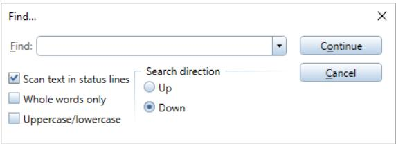
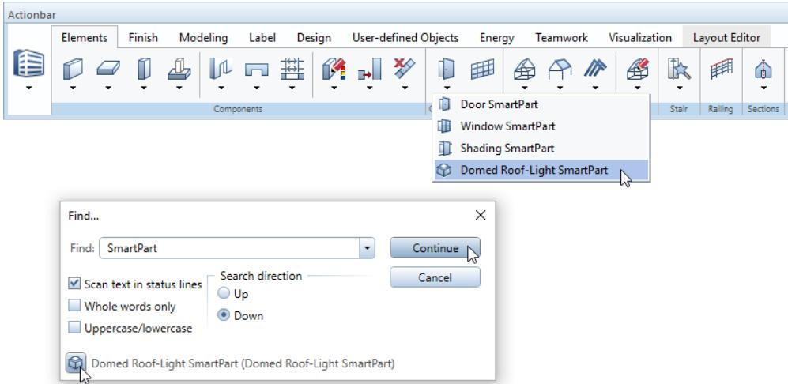

# Actionbar - finding tools

By selecting the $\mathcal { P }$ Find tool in the upper-right corner of the Actionbar, you can find tools across tasks and roles on the Actionbar.

Enter the name of the tool or parts thereof in the Find: box. If you want, you can select options and define the search direction. Click Continue. If Allplan has found the text you entered in the box in the name of a tool, you can see the result in the lower part of the Find... dialog box. At the same time, the Actionbar opens the role and task with this tool and highlights the tool. Click Continue to find more tools whose names contain the text entered. Once again, the Actionbar opens the role and task that contain the tool, highlighting the tool.

You can access the tool found straight from the Find... dialog box by clicking the icon of the tool. Of course, you can also click the tool on the Actionbar.

# Actionbar Configurator

You can find Actionbar Configurator on the right side of the Actionbar.

By using Actionbar Configurator, you can customize the Actionbar to suit your needs and requirements or define a new Actionbar. You can also export and import Actionbar configurations.

Click

to open the Actionbar Configuration dialog box.

Use the Configure tab to specify whether you want to create a new role or select and modify a role you have already configured.

Click Create new role to open the Create new role dialog box. You can choose between creating the new role based on a template (in line with the roles coming with the program) and clicking Empty template to get an empty role you can design yourself.